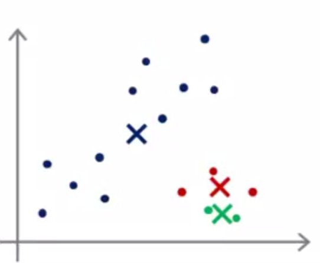

# 如何初始化聚类中心

通常，我们会随机选取$$K$$个样本作为$$K$$个聚类中心（$$K<m$$）。但是，如下图所示，不同的初始化有可能引起不同的聚类结果，能达到全局最优（global optimal）固然是好的，但是，往往得到的是局部最优（local optimal）。

现在，想要提前避免不好的聚类结果仍是困难的，我们只能尝试不同的初始化：

for $$i=1$$ to $$100$$：

1. 随机初始化，执行K-Means，得到每个所属的簇$$c^{(i)}$$，以及各聚类的中心位置$$\mu$$：
$$

c^{(1)},c^{(2)},...,c^{(m)},\mu_1,\mu_2,...,\mu_k

$$
2. 计算失真函数$$J$$

选择这100次中，$$J$$最小的作为最终的聚类结果。

> 显然，该方法计算量较大，所以只适用于$$K$$值较小的场景。

