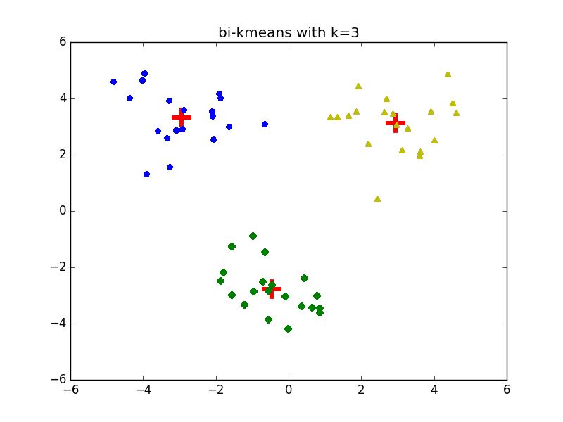

程序示例--二分 K-Means
--------------

仍然是在 `kmeans.p` 中，我们又添加了二分 K-Means 算法：

```python
# coding: utf-8
# kmeans/kmeans.py

# ...
def biKmeans(dataSet, k):
    """
    Args:
        dataSet: 数据集
        k: 聚类数
    Returns:
        centroids: 聚类中心
        clusterAssment: 点分配结果
    """
    # 随机初始化聚类中心
    centroids = randCent(dataSet, k)
    m, n = np.shape(dataSet)
    # 点分配结果： 第一列指明样本所在的簇，第二列指明该样本到聚类中心的距离
    clusterAssment = np.mat(np.zeros((m, 2)))
    # 标识聚类中心是否仍在改变
    clusterChanged = True
    # 直至聚类中心不再变化
    while clusterChanged:
        clusterChanged = False
        # 分配样本到簇
        for i in range(m):
            # 计算第i个样本到各个聚类中心的距离
            minIndex = 0
            minDist = np.inf
            for j in range(k):
                dist = distEclud(dataSet[i, :],  centroids[j, :])
                if(dist < minDist):
                    minIndex = j
                    minDist = dist
            # 判断cluster是否改变
            if(clusterAssment[i, 0] != minIndex):
                clusterChanged = True
            clusterAssment[i, :] = minIndex, minDist**2
        # 刷新聚类中心: 移动聚类中心到所在簇的均值位置
        for cent in range(k):
            # 通过数组过滤获得簇中的点
            ptsInCluster = dataSet[np.nonzero(
                clusterAssment[:, 0].A == cent)[0]]
            # 计算均值并移动
            centroids[cent, :] = np.mean(ptsInCluster, axis=0)
    return centroids, clusterAssment
# ...
```

测试
---------

```python
# coding: utf-8
# kmeans/test_bi_kmeans.py

import kmeans
import numpy as np
import matplotlib.pyplot as plt

if __name__ == "__main__":
    dataMat = np.mat(kmeans.loadDataSet('data/testSet2.txt'))
    centroids, clusterAssment = kmeans.biKmeans(dataMat, 3)
    clusterCount = centroids.shape[0]
    m = dataMat.shape[0]
    # 绘制散点图
    patterns = ['o', 'D', '^']
    colors = ['b', 'g', 'y']
    fig = plt.figure()
    title = 'bi-kmeans with k=3'
    ax = fig.add_subplot(111, title=title)
    for k in range(clusterCount):
        # 绘制聚类中心
        ax.scatter(centroids[k,0], centroids[k,1], color='r', marker='+', linewidth=20)
        for i in range(m):
            # 绘制属于该聚类中心的样本
            ptsInCluster = dataMat[np.nonzero(clusterAssment[:, 0].A==k)[0]]
            ax.scatter(ptsInCluster[:, 0].flatten().A[0], ptsInCluster[:, 1].flatten().A[0], marker=patterns[k], color=colors[k])
    plt.show()
```

运行结果如下：

<div style="text-align: center">
</img>
</div>
