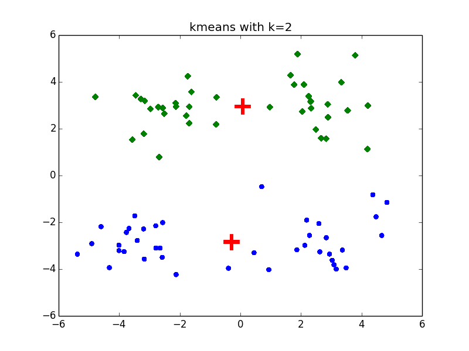
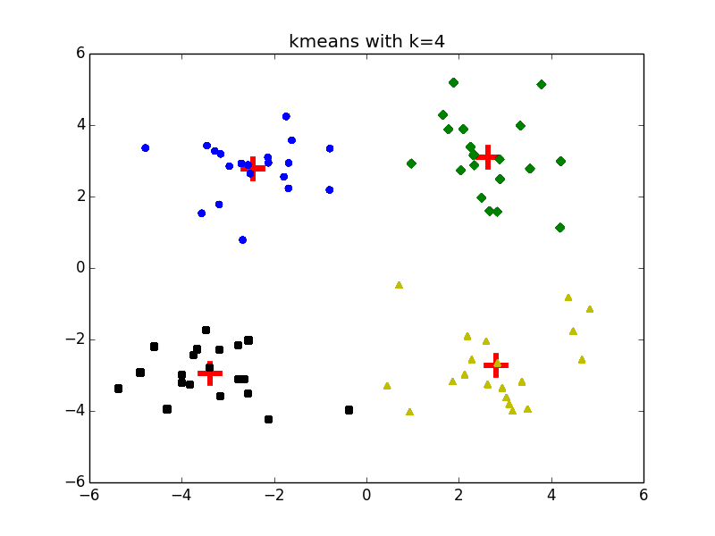
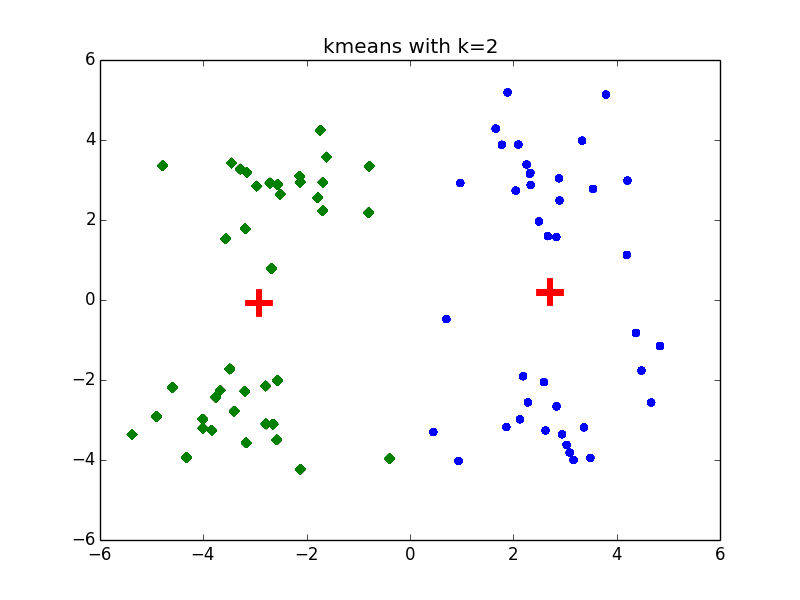

# 程序示例-Kmeans
__kmeans.py__：
```python
# coding: utf-8

import numpy as np


def loadDataSet(filename):
    """
    读取数据集

    Args:
        filename: 文件名
    Returns:
        dataMat: 数据样本矩阵
    """
    dataMat = []
    fr = open(filename)
    for line in fr.readlines():
        curLine = line.strip().split('\t')
        # 通过map函数批量转换
        fitLine = map(float, curLine)
        dataMat.append(fitLine)
    return dataMat


def distEclud(vecA, vecB):
    """
    计算两向量的欧氏距离

    Args:
        vecA: 向量A
        vecB: 向量B
    Returns:
        欧式距离
    """
    return np.sqrt(np.sum(np.power(vecA - vecB, 2)))


def J():
    """
    计算失真函数

    Args:

    Returns:
        失真函数
    """


def randCent(dataSet, k):
    """
    随机生成k个聚类中心

    Args:
        dataSet: 数据集
        k: 簇数目
    Returns:
        centroids: 聚类中心矩阵
    """
    n = np.shape(dataSet)[1]
    centroids = np.mat(np.zeros((k, n)))
    for j in range(n):
        # 随机聚类中心落在数据集的边界之内
        minJ = np.min(dataSet[:, j])
        maxJ = np.max(dataSet[:, j])
        rangeJ = float(maxJ - minJ)
        centroids[:, j] = minJ + rangeJ * np.random.rand(k, 1)
    return centroids

def kMeans(dataSet, k):
    """
    K-Means

    Args:
        dataSet: 数据集
        k: 聚类数
    Returns:
        centroids: 聚类中心
        clusterAssment: 点分配结果
    """
    # 随机初始化聚类中心
    centroids = randCent(dataSet, k)
    m, n = np.shape(dataSet)
    # 点分配结果： 第一列指明样本所在的簇，第二列指明该样本到聚类中心的距离
    clusterAssment = np.mat(np.zeros((m, 2)))
    # 标识聚类中心是否仍在改变
    clusterChanged = True
    # 直至聚类中心不再变化
    while clusterChanged:
        clusterChanged = False
        # 分配样本到簇
        for i in range(m):
            # 计算第i个样本到各个聚类中心的距离
            minIndex = 0
            minDist = np.inf
            for j in range(k):
                dist = distEclud(dataSet[i, :],  centroids[j, :])
                if(dist < minDist):
                    minIndex = j
                    minDist = dist
            # 判断cluster是否改变
            if(clusterAssment[i, 0] != minIndex):
                clusterChanged = True
            clusterAssment[i, :] = minIndex, minDist**2
        # 刷新聚类中心: 移动聚类中心到所在簇的均值位置
        for cent in range(k):
            # 通过数组过滤获得簇中的点
            ptsInCluster = dataSet[np.nonzero(
                clusterAssment[:, 0].A == cent)[0]]
            # 计算均值并移动
            centroids[cent, :] = np.mean(ptsInCluster, axis=0)
    return centroids, clusterAssment
```

__测试__：

```python
# coding: utf-8
import kmeans
import numpy as np
import matplotlib.pyplot as plt

if __name__ == "__main__":
    dataMat = np.mat(kmeans.loadDataSet('data/testSet.txt'))
    centroids, clusterAssment = kmeans.kMeans(dataMat, 2)
    clusterCount = np.shape(centroids)[0]
    m = np.shape(dataMat)[0]
    # 绘制散点图
    patterns = ['o', 'D', '^', 's']
    colors = ['b', 'g', 'y', 'black']
    fig = plt.figure()
    title = 'kmeans with k=2'
    ax = fig.add_subplot(111, title=title)
    for k in range(clusterCount):
        # 绘制聚类中心
        ax.scatter(centroids[k, 0], centroids[k, 1], color='r', marker='+', linewidth=20)
        for i in range(m):
            # 绘制属于该聚类中心的样本
            ptsInCluster = dataMat[np.nonzero(clusterAssment[:, 0].A==k)[0]]
            ax.scatter(ptsInCluster[:, 0].flatten().A[0], ptsInCluster[:, 1].flatten().A[0], marker=patterns[k], color=colors[k])
    plt.show()
```

我分别测试了$$k=2$$以及$$k=4$$时的聚类效果：

- $$k=2$$



- $$k=4$$



值得一体的是，在$$k=2$$的情况下，还会引起不同的聚类结果：

