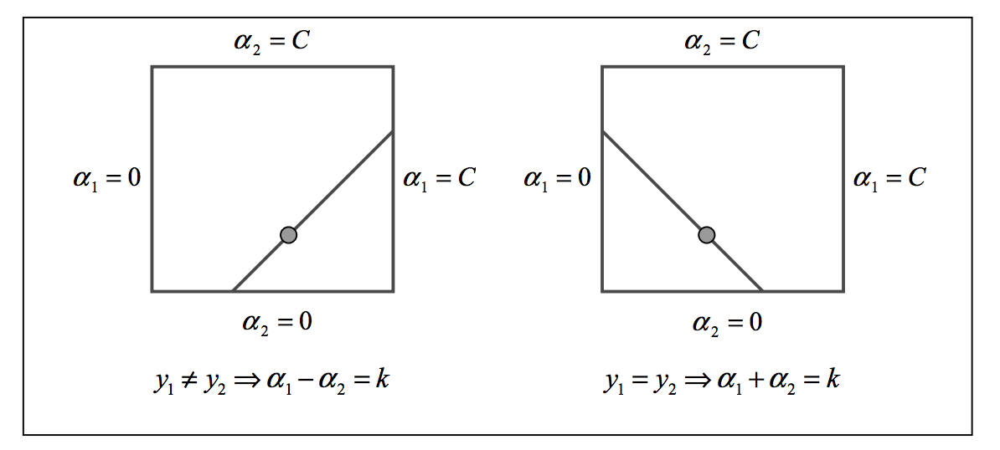

SMO(Sequential minimal optimization)
=============

引子
-------

前面章节中，我们使用了核函数的软间隔支持向量机的优化模型为：

$$

\begin{align*}
& \max_{\alpha} \sum_{i=1}^m\alpha^{(i)}
- \frac{1}{2}\sum_{i=1}^m\sum_{j=1}^m \alpha^{(i)} \alpha^{(j)} y^{(i)} y^{(j)} \kappa(x^{(i)}, x^{(j)}) \\
\mbox{s.t.} \quad & \sum_{i=1}^m \alpha^{(i)} y^{(i)} = 0, \\
& 0 \leq \alpha^{(i)} \leq C, \quad i=1,2,3,...,m
\end{align*}
\tag{1}

$$

式 (1) 需要满足的 KKT 条件为：

$$

\begin{equation}
\alpha^{(i)}=0\Leftrightarrow y^{(i)}f(x^{(i)})\geq1,\\
0<\alpha^{(i)}<C\Leftrightarrow y^{(i)}f(x^{(i)})=1,\\
\alpha^{(i)}=C\Leftrightarrow y^{(i)}f(x^{(i)})\leq 1.
\end{equation}
\tag{2}

$$

在 SMO（序列最小化）方法出现之前，人们依赖于二次规划求解工具来解决上述的优化问题，训练 SVM。这些工具需要具有强大计算能力的计算机进行支撑，实现也比较复杂。1998年，微软研究院的 [John Platt](https://www.gitbook.com/book/yoyoyohamapi/undersercore-analysis/discussions?state=closed) 提出了 SMO 算法将优化问题分解为容易求解的若干小的优化问题，来训练 SVM。简言之，SMO 仅关注 **$$alpha$$ 对** 和 ** 偏置 $$b$$ **  的求解更新，进而求解出权值向量 $$w$$，得到决策边界（分割超平面），从而大大减少了运算复杂度。

算法介绍
----------

SMO 会选择一对 $$\alpha^{(i)}$$ 及 $$\alpha^{(j)}$$，并固定住其他参数，即将其他参数认为是常数，则式 （1）中的约束条件就可写为：

$$

\begin{align*}
& \alpha^{(i)} y^{(i)} + \alpha^{(j)} y^{(j)} = k, \\
& 0 \leq \alpha^{(i)} \leq C, \\
& 0 \leq \alpha^{(j)} \leq C,
\end{align*}
\tag{3}

$$

其中：

$$

k = -\sum_{k \neq i,j}\alpha^{(k)}y^{(k)} \tag{4}

$$

那么，式 (1) 的优化问题可以推导：

$$

\begin{align*}
& \max_{\{\alpha^{(i)}, \alpha^{(j)}\}}
(\alpha^{(i)} + \alpha^{(j)}) -
[\frac{1}{2}K_{ii}(\alpha^{(i)})^2 + \frac{1}{2}K_{jj}(\alpha^{(j)})^2 + y^{(i)}y^{(j)}K_{ij}\alpha^{(i)}\alpha^{(j)}]  \\
& \quad - [y^{(i)}\alpha^{(i)}\sum_{k=3}^my^{(k)}\alpha^{(k)}K_{ki} + y^{(j)}\alpha^{(j)}\sum_{k=3}^my^{(k)}\alpha^{(k)}K_{kj}] \\
\mbox{s.t.} \quad & \alpha^{(i)} y^{(i)} + \alpha^{(j)} y^{(j)} = -\sum_{k \neq i,j}\alpha^{(k)}y^{(k)} = k, \\
& 0 \leq \alpha^{(i)} \leq C, 0 \leq \alpha^{(j)} \leq C \\
\end{align*}
\tag{5}

$$

</img>

- 由 $$ 0 \leq \alpha^{(i)} \leq C, 0 \leq \alpha^{(j)} \leq C $$ 知，$$\alpha^{(i)}$$ 及 $$\alpha^{(j)}$$ 的取值需要落在正方形中。
- 由 $$\alpha^{(i)} y^{(i)} + \alpha^{(j)} y^{(j)} = k$$ 知，$$\alpha^{(i)}$$ 及 $$\alpha^{(j)}$$ 的取值需要落在正方形中取值还需要落到图示的斜线段上。

假设我们放缩了 $$\alpha^{(i)}$$的取值：

$$

L \leq \alpha^{(i)} \leq H \tag{6}

$$

我们可以确定出 $$\alpha^{(j)}$$ 的上下界为：

- $$y^{(i)} \neq y^{(j)}$$时：

$$

L = max(0, \alpha^{(j)} - \alpha^{(i)}), H = min(C, C+\alpha^{(j)} - \alpha^{(i)}) \tag{7}

$$

- $$y^{(i)} = y^{(j)}$$时：

$$

L = max(0, \alpha^{(j)} + \alpha^{(i)} - C), H = min(C, \alpha^{(j)} + \alpha^{(i)}) \tag{8}

$$

我们将优化函数定义为：

$$

\Psi  = (\alpha^{(i)} + \alpha^{(j)}) -
[\frac{1}{2}K_{ii}(\alpha^{(i)})^2 + \frac{1}{2}K_{jj}(\alpha^{(j)})^2 + y^{(i)}y^{(j)}K_{ij}\alpha^{(i)}\alpha^{(j)}] \tag{9}

$$

由于 $$\alpha^{(i)}$$ 与 $$\alpha^{(j)}$$ 有线性关系，所以式 (9) 可以消去 $$\alpha^{(i)}$$，进而令 $$\Psi$$ 对 $$\alpha^{j}$$ 求二阶导，并令二阶导为 0 可得（中间过程省略）：

$$

\alpha^{(jnew)}(2K_{ij} - K_{ii} - K_{jj}) = \alpha^{(jold)}(2K_{ij} - K_{ii} - K_{jj})
 - y^{(j)}(E^{(i)} - E^{(j)})
\tag{10}

$$

其中：

$$

\begin{align*}
E^{(i)} = f(x^{(i)}) - y^{(i)} \tag{11}
\end{align*}

$$

令：

$$

\eta = 2K_{ij} - K_{ii} - K_{jj} \tag{12}

$$

式 (10) 两边除以 $$\eta$$ 就得 $$\alpha^{(j)}$$ 的更新式：

$$

\alpha^{(jnew)}=\alpha^{(jold)}- \frac{y^{(j)}(E^{(i)}-E^{(j)})}{\eta} \tag{13}

$$

但是，更新还要考虑上下界截断：

$$

\alpha^{(jnewclipped)}=
\begin{cases} H, & \mbox{if $\alpha^{(jnew)} \geq H$} \\
\alpha^{(jnew)}, & \mbox{if $L<\alpha^{(jnew)} < H$} \\
L, & \mbox{if $\alpha^{(jnew)}\leq L$}
\end{cases}
\tag{14}

$$

从而得到 $$\alpha^{(i)}$$ 的更新：

$$

\alpha^{(inew)}=\alpha^{(iold)}+y^{(i)}y^{(j)}(\alpha^{(jold)}-\alpha^{(jnewclipped)}) \tag{15}

$$

令：

$$

\begin{align*}
b_1 &= b^{old}-E^{(i)}-y^{(i)}K_{ii}(\alpha^{(inew)}-\alpha^{(iold)})-y^{(j)}K_{ij}(\alpha^{(jnewclipped)}-\alpha^{(jold)}) \\
b_2 &=b^{old}-E^{(j)}-y^{(i)}K_{ij}(\alpha^{(inew)}-\alpha^{(old)})-y^{(j)}K_{jj}(\alpha^{(jnewclipped)}-\alpha^{(jold)})
\end{align*}
\tag{16}

$$

则 $$b$$ 的更新为：

$$

b^{new}=
\begin{cases} b_1, & \mbox{if $0<\alpha^{(inew)}<C$}; \\
b_2, & \mbox{if $0<\alpha^{(jnewclipped)}<C$};\\
\frac{b_1+b_2}{2}, & \mbox{otherwise}.
\end{cases}
\tag{17}

$$

启发式选择
----------

根据 [Osuna](http://webmail.svms.org/training/OsFG97.pdf) 提出的理论，如果两个拉格朗日乘子其中之一违背了 KKT 条件，此时，每一次乘子对的选择，都能使得优化目标函数减小。

- 若 $$\alpha^{(i)} = 0$$，可知样本 $$x^{(i)}$$ 不会对模型 $$f(x)$$ 产生影响。
- 若 $$\alpha^{(i)} = C$$，样本 $$x^{(i)}$$ 不会是支持向量。
- 若 $$0 < \alpha^{(i)} < C$$，则 $$\alpha^{(i)}$$ 没有落在边界上，当下式满足时，$$\alpha^{(i)}$$ 会违反 KKT 条件：

$$

\mbox{$\alpha^{(i)} < C$ and $y^{(i)}f(x^{(i)}) -1 < 0$} \\
\mbox{$\alpha^{(i)} > 0$ and $y^{(i)}f(x^{(i)}) -1 > 0$}
\tag{18}

$$

通常，式 (18) 过于严苛，因此考虑设置一个容忍区间 $$[-\tau, \tau]$$，并考虑令:

$$

R^{(i)} = y^{(i)} E^{(i)} = y^{(i)} (f(x^{(i)}) - y^{(i)}) = y^{(i)}f(x^{(i)}) -1 \tag{19}

$$

可以将违反 KKT 条件的表达式写为：

$$

\mbox{$\alpha^{(i)} < C$ and $R^{(i)} < -\tau$} \\
\mbox{$\alpha^{(i)} > 0$ and $R^{(i)} > \tau$}
\tag{20}

$$

SMO 以编程的眼光，将启发式选择 $$(\alpha^{(i)}, \alpha^{(j)})$$ 描述为了两层循环：

- **外层循环**：外层循环中，如果当前没有 $$alpha$$ 对 的变化，意味着所有 $$alpha^{(i)}$$ 都遵从了 KKT 条件，需要在整个样本集进行迭代；否则，只需要选择在处在边界内（即 $$0 < \alpha^{(i)} < C$$）、并且违反了 KKT 条件（即满足了式 (20) ）的 $$\alpha^{(i)}$$。
- **内层循环**：选出使得 $$|E^{(i)} - E^{(j)}|$$ 达到最大的 $$alpha^{(j)}$$。

算法流程
-------------

综上，我们可以概括出 SMO 的算法流程：

1. 在整个训练集或者非边界样本中选择违反了 KKT 条件的 $$\alpha^{(i)}$$。
2. 在剩下的 $$\alpha$$ 中，选择 $$|E^{(i)} - E^{(j)}|$$ 达到最大的 $$alpha^{(j)}$$。
3. 重复以上过程直到达到收敛精度或最大迭代次数。

参考资料
----------

- [Platt, John (1998), Sequential Minimal Optimization: A Fast Algorithm for Training Support Vector Machines](https://www.microsoft.com/en-us/research/wp-content/uploads/2016/02/tr-98-14.pdf)
- [Wiki-SMO](https://en.wikipedia.org/wiki/Sequential_minimal_optimization)
- [支持向量机通俗导论（理解 SVM 的三层境界）](http://blog.csdn.net/v_july_v/article/details/7624837)
- [《机器学习实战》](https://item.jd.com/11242112.html)
- [《机器学习》](https://item.jd.com/11867803.html)
- [Sequential Minimal Optimization for SVM](http://web.cs.iastate.edu/~honavar/smo-svm.pdf)
