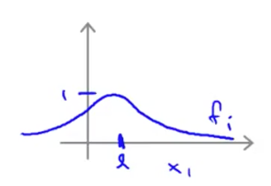
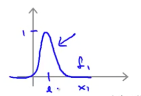
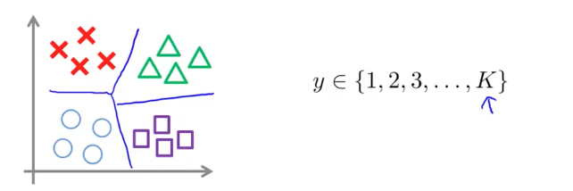

SVM的使用建议
=================

使用流行库
---------

作为当今最为流行的分类算法之一，SVM 已经拥有了不少优秀的实现库，如 [libsvm](https://www.csie.ntu.edu.tw/~cjlin/libsvm/%E2%80%A0) 等，因此，我们不再需要自己手动实现 SVM（要知道，一个能用于生产环境的 SVM 模型并非课程中介绍的那么简单）。

在使用这些库时，我们通常需要声明 SVM 需要的两个关键部分：

1. 参数 $$C$$
2. 核函数（Kernel）

由于 $$C$$ 可以看做与正规化参数 $$\lambda$$ 作用相反，则对于 $$C$$ 的调节：

- **低偏差**，**高方差**，即遇到了**过拟合**时：**减小** $$C$$ 值。
- **高偏差**，**低方差**，即遇到了**欠拟合**时：**增大** $$C$$ 值。

而对于核函数的选择有这么一些 tips：

- 当特征维度 $$n$$ 较高，而样本规模 $$m$$ 较小时，**不宜使用核函数**，否则容易引起过拟合。
- 当特征维度 $$n$$ 较低，而样本规模 $$m$$ 足够大时，考虑使用**高斯核函数**。不过在使用高斯核函数前，需要进行特征缩放（feature scaling）。另外，当核函数的参数 $$\delta$$ **较大**时，特征 $$f_i$$ 较为平缓，即各个样本的特征差异变小，此时会造成**欠拟合（高偏差，低方差）**：

</img>

当 $$\delta$$ **较小**时，特征 $$f_i$$ 曲线变化剧烈，即各个样本的特征差异变大，此时会造成**过拟合（低偏差，高方差）**：

</img>

> 不是所有的相似度评估手段都能被用作SVM核函数，他们需要满足[ Mercer 理论](https://en.wikipedia.org/wiki/Mercer%27s_theorem)

多分类问题
-------------

通常，流行的SVM库已经内置了多分类相关的 api，如果其不支持多分类，则与逻辑回归一样，使用 One-vs-All 策略来进行多分类：

1. 轮流选中某一类型 $$i$$ ，将其视为正样本，即 “1” 分类，剩下样本都看做是负样本，即 “0” 分类。
2. 训练 SVM 得到参数 $$\theta^{(1)}, \theta^{(2)}, ..., \theta^{(K)}$$ ，即总共获得了 $$K-1$$ 个决策边界。

</img>

分类模型的选择
--------------

目前，我们学到的分类模型有：（1）逻辑回归；（2）神经网络；（3）SVM。怎么选择在这三者中做出选择呢？我们考虑特征维度 $$n$$ 及样本规模 $$m$$：

- 如果 $$n$$ 相对于 $$m$$ 非常大，例如 $$n=10000$$，而 $$m \in (10,1000)$$：此时选用**逻辑回归**或者**无核**的 SVM。
- 如果 $$n$$ 较小，$$m$$ 适中，如 $$n \in (1,1000)$$，而 $$m \in (10,10000)$$：此时选用核函数为**高斯核函数**的 SVM。
- 如果 $$n$$ 较小，$$m$$ 较大，如 $$n \in (1,1000)$$，而 $$m > 50000$$：此时，需要创建更多的特征（比如通过多项式扩展），再使用**逻辑回归**或者**无核**的 SVM。

神经网络对于上述情形都有不错的适应性，但是计算性能上较慢。
