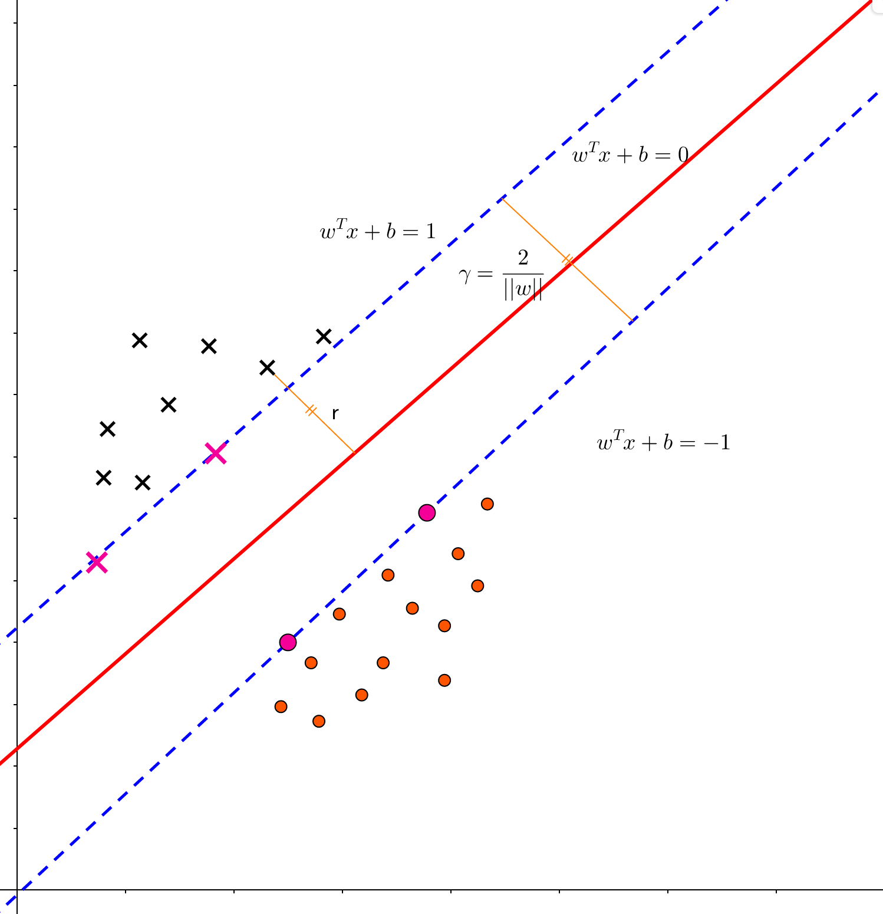
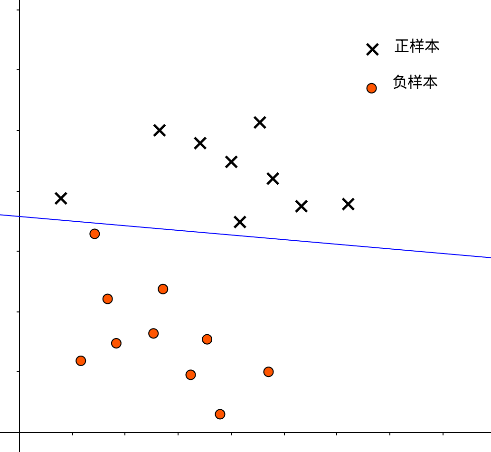
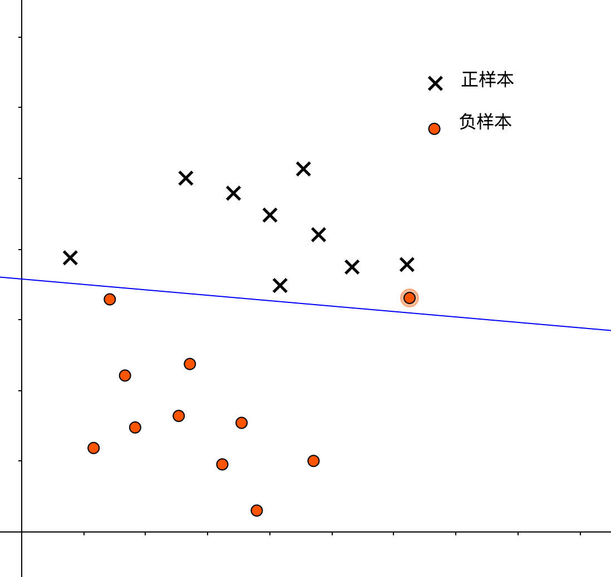
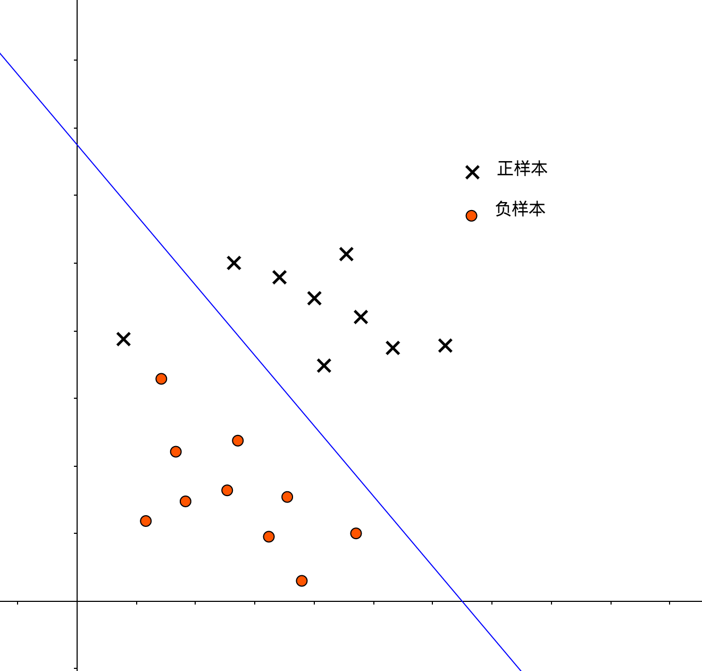
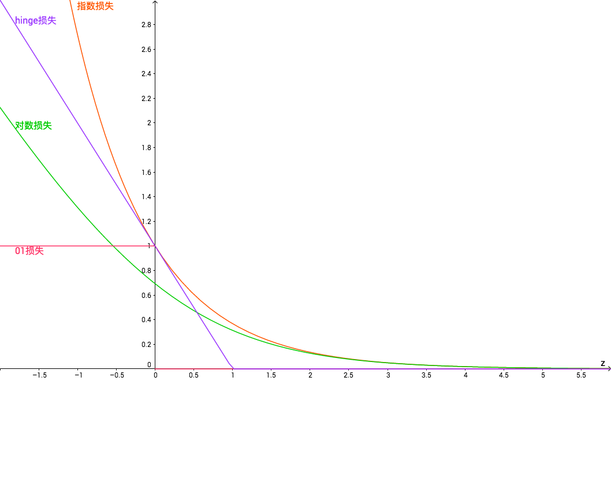
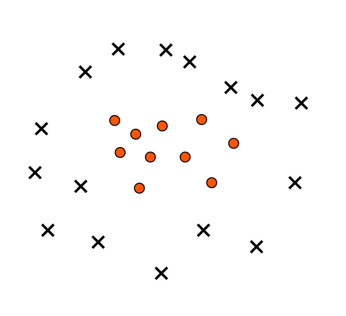

SVM补充
=========

决策边界
---------

Coursera 上 ML 的课程对 SVM 介绍有限，参看了周志华教授的[《机器学习》](https://item.jd.com/11867803.html)一书后，补充了当中对于 SVM 的介绍。

首先，我们考虑用更传统的**权值定义式**来描述我们的 SVM 决策边界（划分超平面）：

$$

w^Tx + b = 0 \tag{1}

$$

其中，$$w$$ 表示权值向量，权值向量对应了决策边界的法向量。$$b$$ 则表示偏置，也称**位移项**，表示了决策边界距坐标原点的距离。我们可以将决策边界记为 $$(w,b)$$ ，那么，样本 $$x$$ 到决策边界的距离为：

$$

r = \frac{|w^Tx + b|}{||w||} \tag{2}

$$

我们将正样本标识为 1，负样本标识为 -1， 则 SVM 的期望预测可以重新描述为：

$$

\begin{cases}
w^Tx^{(i)} + b \geq +1, \quad \mbox{if $y^{(i)} = +1$} \\
w^Tx^{(i)} + b \leq -1, \quad \mbox{if $y^{(i)} = -1$}
\end{cases}
\tag{3}

$$

亦即：

$$

y^{(i)} (w^Tx^{(i)} + b) \geq 1 \tag {4}

$$

使等号成立的样本称之为“支持向量（Support Vectors）”，两个异类的支持向量到决策边界的距离之和为：

$$

\gamma = \frac{2}{||w||} \tag{5}

$$

$$\gamma$$ 被称之为间隔。

在之前的篇章中我们知道，SVM 就是力图是 $$\gamma$$ 足够大，从而获得更好的泛化能力：

$$

\begin{align*}
& \max_{w, b} \frac{2}{||w||} \\
\mbox{s.t}. \quad & y^{(i)}(w^Tx^{(i)} + b) \geq 1, \quad i = 1,2,...,m
\end{align*}
\tag{6}

$$

我们可以转化为如下的二次优化问题：

$$

\begin{align*}
& \min_{w,b} \frac{1}{2} ||w||^2 \\
\mbox{s.t.} \quad & y^{(i)}(w^Tx^{(i)} + b) \geq 1, \quad i = 1,2,...,m
\end{align*}
\tag{7}

$$

硬间隔与软间隔
------------

下图中，红色的决策边界表示了一种较**硬**的间隔划分，这种划分，能将所有正、负样本区分开来：

硬间隔并不一定好，就像我们在回归问题中提到的那样，这只是对于训练样本作出了极佳的拟合，但容易造成**过度拟合**。比如我们现在有了一个新的负样本，他被错误地分类为了正样本：

而下图则展示了一种较**软**的间隔，这样的决策边界允许了一部分分类异常，避免了**过拟合**问题，但如果过软，也容易造成**欠拟合**问题：

鉴于此，我们在优化过程中，添加一个参数 $$C$$ 来控制间隔的“软硬”：

$$

\begin{align*}
& \min_{w,b}\frac{1}{||w||^2} + C\sum_{i=1}^m \ell(y^{(i)}(w^Tx^{(i)})-1) \\
\mbox{s.t.} \quad & y^{(i)}(w^Tx^{(i)} + b) \geq 1, \quad i = 1,2,...,m
\end{align*}
\tag{8}

$$

其中，$$\ell(z)$$ 是损失函数，其衡量了样本 $$x$$ 与真实值 $$y^{(i)}$$ 的近似程度，当 $$C$$ 取值越大时，为了最优化问题，需要 $$\ell(z)$$ 越小，即各个样本都要尽可能分类正确，这提高了训练准确率，但也面临过拟合的问题。

| $$C$$ 取值 | 优势           | 可能面临问题 |
|:-----------|:---------------|:-------------|
| 大         | 提高训练精度   | 过拟合       |
| 小         | 解决过拟合问题 | 欠拟合       |

故而，$$C$$ 扮演了回归问题中正则化参数 $$\frac{1}{\lambda}$$ 的角色。当 $$C$$ 的取值趋于 $$\infty$$ 时，模型就变为了硬间隔支持向量机。

常见的损失函数有：

| 名称      | 函数式                                                                                       |
|:----------|:---------------------------------------------------------------------------------------------|
| 0/1损失   | $$ \ell(z) = \begin{cases} 1, \quad \mbox{if $z \lt 0$} \\ 0, \mbox{otherwise} \end{cases}$$ |
| hinge损失 | $$ \ell(z) = max(0, 1-z) $$                                                                  |
| 指数损失  | $$\ell(z) = exp(-z)$$                                                                        |
| 对数损失  | $$ \ell(z) = log(1+exp(-z)) $$                                                               |

若采用hinge损失函数，则式 (8) 可以具体为：

$$

\min_{w,b} \frac{1}{2}||w||^2 + C\sum_{i=1}^m max(0, 1- y^{(i)}(w^Tx^{(i)} + b)) \tag{9}

$$

引入 **“松弛变量（slack variables）”** $$\xi^{(i)} \geq 0$$，可以将式 (9) 改写为：

$$

\begin{align*}
& \min_{w,b,\xi^{(i)}} \frac{1}{2}||w||^2 +C\sum_{i=1}^m\xi^{(i)} \\
\mbox{s.t.} \quad & y^{(i)}(w^Tx^{(i)} + b) \geq 1 - \xi^{(i)} \\
& \xi^{(i)} \geq 0, i=1,2,3,...,m
\end{align*}
\tag{10}

$$

这就构成 “软间隔支持向量机”。

松弛变量，顾名思义，就是控制每个样本受到约束的程度。$$\xi^{(i)}$$ 越大，则受约束程度越小（越松弛）。

- 当 $$\xi^{(i)} > 1$$，则 $$max(0, 1- y^{(i)}(w^Tx^{(i)} + b)) > 1$$，即 $$y^{(i)}$$ 与 $$(w^Tx^{(i)} + b))$$ 异号，分类错误。
- 当 $$\xi^{(i)}=0$$，则 $$max(0, 1- y^{(i)}(w^Tx^{(i)} + b)) = 0$$，即 $$ 1- y^{(i)}(w^Tx^{(i)} + b) = 0$$ ，样本落在了最大间隔边界上。
- 当 $$ 0 \lt \xi^{(i)} \leq 1$$，则 $$max(0, 1- y^{(i)}(w^Tx^{(i)} + b)) \leq 1$$，即 $$ 0 \leq 1- y^{(i)}(w^Tx^{(i)} + b) \ 1$$，样本落在了最大间隔与决策边界之间。

对偶问题
------------

对于式 (10) 的优化模型，应用[拉格朗日乘子法](https://en.wikipedia.org/wiki/Lagrange_multiplier)获得的拉格朗日函数如下：

$$

\begin{align*}
L(w,b,\alpha,\xi,\mu) =& \frac{1}{2}||w||^2 + C\sum_{i=1}^m\xi^{(i)} \\
& +\sum_{i=1}^m\alpha^{(i)}(1-\xi^{(i)}-y_i(w^Tx_i + b)) - \sum_{i=1}^m \mu^{(i)} \xi^{(i)}
\end{align*}
\tag{11}

$$

其中，$$\alpha^{(i)} \geq 0$$，$$\mu^{(i)} \geq 0$$ 是拉格朗日乘子。

令 $$L(w,b,\alpha,\xi,\mu)$$ 对 $$w$$，$$b$$，$$\xi^{(i)}$$ 的偏导为 0 可得：

$$

\begin{align*}
w &= \sum_{i=1}^m \alpha^{(i)} y^{(i)} x^{(i)} \tag{12} \\
0 &= \sum_{i=1}^m \alpha^{(i)} y^{(i)} \tag{13} \\
C &= \alpha^{(i)} + \mu^{(i)} \tag{14}
\end{align*}

$$

将其带入 (1) 式中，得：

$$

\begin{align*}
f(x) &= w^Tx + b \\
    &= \sum_{i=1}^m\alpha^{(i)} y^{(i)} (x^{(i)})^T x + b
\end{align*}
\tag{15}

$$

将式 (12) - (14) 代入式 (11) 中，就得到了式 (10) 的 **对偶问题**：

$$

\begin{align*}
& \max_{\alpha} \sum_{i=1}^m\alpha^{(i)} - \frac{1}{2}\sum_{i=1}^m\sum_{j=1}^m \alpha^{(i)} \alpha^{(j)} y^{(i)} y^{(j)} (x^{(i)})^T x^{(j)} \\
\mbox{s.t.} \quad & \sum_{i=1}^m \alpha^{(i)} y^{(i)} = 0, \\
& 0 \leq \alpha^{(i)} \leq C, i=1,2,...,m
\end{align*}
\tag{16}

$$

对于软间隔支持向量机，[KKT条件](https://en.wikipedia.org/wiki/Karush%E2%80%93Kuhn%E2%80%93Tucker_conditions)要求：

$$

\begin{cases}
\alpha^{(i)} \geq 0, \mu^{(i)} \geq 0, \\
y^{(i)}f(x^{(i)}) - 1 + \xi_i \geq 0, \\
\alpha^{(i)}(y^{(i)}f(x^{(i)})-1+\xi^{(i)})) = 0, \\
\xi^{(i)} \geq 0, \mu^{(i)}\xi^{(i)} = 0
\end{cases}
\tag{17}

$$

由式 $$\alpha^{(i)}(y^{(i)}f(x^{(i)}-1+\xi^{(i)})) = 0$$ 可得，对于任意训练样本 $$(x^{(i)}, y^{(i)})$$，总有 $$\alpha^{(i)} = 0$$ 或者 $$y^{(i)}f(x^{(i)}) = 1 - \xi^{(i)}$$。

- 若 $$\alpha^{(i)} = 0 $$，由 $$C = \mu^{(i)} + \alpha^{(i)}$$ 得 $$\mu^{(i)} = C$$，进而知 $$\xi^{(i)} = 0$$：

$$

y^{(i)}f(x^{(i)}) - 1 \geq 0 \tag{18}

$$

> 此时，$$x^{(i)}$$ 不会对模型 $$f(x)$$ 产生影响。

- 若 $$ 0 < \alpha^{(i)} < C $$，则有 $$y^{(i)}f(x^{(i)}) -1 + \xi^{(i)} = 0$$ ，由 $$C = \mu^{(i)} + \alpha^{(i)}$$ 得，$$\mu^{(i)} > 0$$，则$$ \xi^{(i)} = 0$$，综合得：

$$

y^{(i)}f(x^{(i)}) - 1 = 0 \tag{19}

$$

> 此时，样本 $$x^{(i)}$$ 为支持向量。

- 若 $$\alpha^{(i)} = C$$，则有 $$y^{(i)}f(x^{(i)}) -1 + \xi^{(i)} = 0$$，由 $$C = \mu^{(i)} + \alpha^{(i)}$$ 得，$$\mu^{(i)} = 0$$，此时 $$\xi^{(i)} \geq 0$$，得：

$$

y^{(i)}f(x^{(i)}) - 1 \leq 0 \tag{20}

$$

> 此时，样本 $$x^{(i)}$$ 落在最大间隔与决策边界之间（$$\xi^{(i)} \leq 1$$），或者分类错误（$$\xi^{(i)} > 1$$）。亦即，样本异常，仍然不会被模型 $$f(x)$$ 考虑。

综上，我们不但可以将 KKT 条件写为：

$$

\begin{align*}
& \alpha^{(i)}=0\Leftrightarrow y^{(i)}f(x^{(i)})\geq1,\\
& 0<\alpha^{(i)}<C\Leftrightarrow y^{(i)}f(x^{(i)})=1,\\
& \alpha^{(i)}=C\Leftrightarrow y^{(i)}f(x^{(i)})\leq 1.
\end{align*}
\tag{21}

$$

并且，还能够知道，采用了 hinge 损失函数的最终模型 $$f(x)$$ 仅与支持向量有关。

核函数
----------

假定我们面临的数据呈现下面这样的分布：

显然，这不是一个线性可分的问题，在逻辑回归中，我们会通过多项式扩展来创建新的高维特征，从而将低维度的线性不可分问题转换为了高维度的线性可分问题。

在 SVM 中，仍然是考虑将低维不可分问题转换到高纬度可分问题：

$$

f(x) = w^T\phi(x)+b \tag{22}

$$

$$\phi(x)$$ 对应了 $$x$$ 的高纬度特征向量。

此时，SVM 优化模型的对偶问题为：

$$

\begin{align*}
& \max_{\alpha} = \sum_{i=1}^m\alpha^{(i)}
- \frac{1}{2}\sum_{i=1}^m\sum_{j=1}^m \alpha^{(i)} \alpha^{(j)} y^{(i)} y^{(j)} \phi(x^{(i)})^T \phi(x^{(i)}) \\
\mbox{s.t.} \quad & \sum_{i=1}^m \alpha^{(i)} y^{(i)} = 0, \\
& 0 \leq \alpha^{(i)} \leq C, \quad i=1,2,3,...,m
\end{align*}
\tag{23}

$$

令 $$\kappa(x^{(i)}, x^{(j)})$$ 表示 $$x^{(i)}$$ 与 $$x^{(j)}$$ 的内积：

$$

\kappa(x^{(i)}, x^{(j)}) = \langle \phi(x^{(i)}, \phi(x^{(j)})) \rangle = \phi(x^{(i)})^T \phi(x^{(j)}) \tag{24}

$$

函数 $$\kappa$$ 即表示了核函数（kernel function），引入核函数后，优化模型可以写为：

$$

\begin{align*}
& \max_{\alpha} = \sum_{i=1}^m\alpha^{(i)}
- \frac{1}{2}\sum_{i=1}^m\sum_{j=1}^m \alpha^{(i)} \alpha^{(j)} y^{(i)} y^{(j)} \kappa(x^{(i)}, x^{(j)}) \\
\mbox{s.t.} \quad & \sum_{i=1}^m \alpha^{(i)} y^{(i)} = 0, \\
& 0 \leq \alpha^{(i)} \leq C, \quad i=1,2,3,...,m
\end{align*}
\tag{26}

$$

求解后，得到模型：

$$

\begin{align*}
f(x)  &= w^T\phi(x) + b \\
&= \sum_{i=1}^m\alpha^{(i)}y^{(i)}\phi(x^{(i)})^T\phi(x) + b \\
&= \sum_{i=1}^m\alpha^{(i)}y^{(i)}\kappa(x, x^{(i)}) + b
\end{align*}
\tag{27}

$$

| 核函数     | 表达式（$$\kappa(x^{(i)}, x^{(j)})$$）     | 参数                                                                                          |
|:-----------|:-------------------------------------------|:----------------------------------------------------------------------------------------------|
| 线性核     | $$(x^{(i)})^T x^{(j)}$$                    |                                                                                               |
| 高斯核     | $$exp(-\frac{                              | |x^{(i)} - x^{(j)}||^2}{2\delta^2})$$ | $$\delta$$ 为高斯核带宽                               |
| 多项式核   | $$((x^{(i)})^T x^{(j)})^d$$                | $$ d \geq 1$$ 为多项式次数                                                                    |
| 拉普拉斯核 | $$exp(-\frac{                              | |x^{(i)} - x^{(j)}||^2}{\delta})$$                                      |     $$\delta > 0 $$ |
| Sigmoid核  | $$tanh(\beta(x^{(i)})^Tx^{(j)} + \theta)$$ | $$tanh$$为双曲正切函数，$$\beta > 0, \theta < 0$$                                             |

参考资料
---------------

- [《机器学习》](https://item.jd.com/11867803.html)
- [支持向量机通俗导论（理解 SVM 的三层境界）](http://blog.csdn.net/v_july_v/article/details/7624837)
- [支持向量机](http://www.cnblogs.com/jerrylead/archive/2011/03/13/1982639.html)
