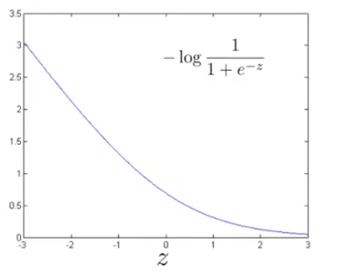
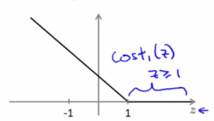
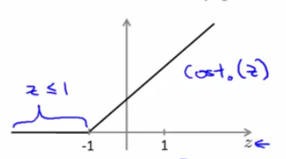

代价函数
==========

在逻辑回归中，我们的预测函数为：

$$

h_{\theta}(x) = \frac{1}{1+e^{-\theta^T x}}

$$

代价函数为：

$$

cost = -ylogh_{\theta}(x)+(1-y)log(1-h_{\theta}(x))

$$

当 $$y=1$$ 时，代价函数就为：

$$

\begin{align*}
cost &= -logh_{\theta}(x) \\
&= -log\frac{1}{1+e^{-z}}, \quad z=\theta^T x
\end{align*}

$$

此时，代价函数随 $$z$$ 的变化曲线如下图：

</img>

不难看出，当 $$y=1$$ 时，随着 $$z$$ 取值变大，预测代价变小，因此，逻辑回归想要在面对正样本 $$y=1$$ 时，获得足够高的预测精度，就希望 $$z=\theta^T x \gg 0$$。而 SVM 则将上图的曲线拉直为下图中的折线，构成了 $$y=1$$ 时的代价函数曲线 $$cost_1(z)$$：

</img>

当 $$y=1$$ 时，为了预测精度足够高，SVM 希望 $$\theta^T x \geq 1$$。

同样，在 $$y=0$$ 时，SVM 定义了代价函数 $$cost_0(z)$$，为了预测精度足够高，SVM 希望 $$\theta^T x \leq -1$$：

</img>

最小化预测代价
---------------

SVM定义其最小化预测代价的过程为：

$$

\min\limits_{\theta}C[\sum\limits_{i=1}^{m}y^{(i)}cost_1(\theta^Tx^{(i)})+(1-y^{(i)})cost_0(\theta^Tx^{(i)})]+\frac{1}{2}\sum\limits_{j=1}^{n}\theta_j^2

$$

而在逻辑回归中，最小化预测代价的过程为：

$$

\min\limits_{\theta}\frac{1}{m}[\sum\limits_{i=1}^{m}y^{(i)}(-logh_\theta(x^{(i)}))+(1-y^{(i)})(-log(1-h_\theta(x^{(i)})))] + \frac{\lambda}{2m}\sum\limits_{j=1}^{n}\theta_j^2

$$

事实上，我们可以将逻辑回归的代价函数简要描述为：

$$

cost = A+\lambda B

$$

而 SVM 的代价函数描述为：

$$

cost = CA+B

$$

即，在逻辑回归中，我们通过正规化参数 $$\lambda$$ 调节 $$A$$、$$B$$ 所占的权重，且 $$A$$ 的权重与 $$\lambda$$ 取值成**反比**。而在 SVM 中，则通过参数 $$C$$ 调节 $$A$$、$$B$$ 所占的权重，且 $$A$$ 的权重与 $$C$$ 的取值成反比。亦即，参数 $$C$$ 可以被认为是扮演了 $$\frac{1}{\lambda}$$ 的角色。

预测函数
----------

当我们训练得到 $$\theta$$ 之后，可以代入下面的 SVM 预测函数进行预测：

$$

h_\theta(x) =
\begin{cases}
1,\quad \mbox{if $\theta^T x \geq 0$} \\
0,\quad \mbox{otherwise}
\end{cases}

$$
