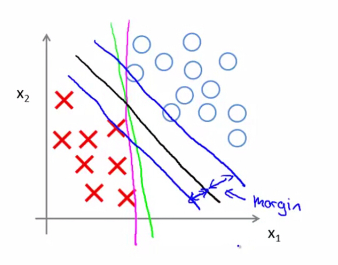
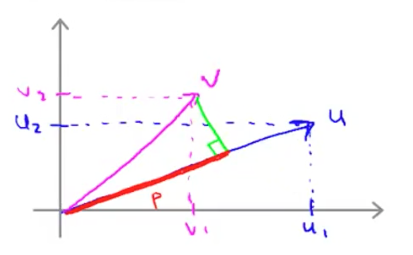
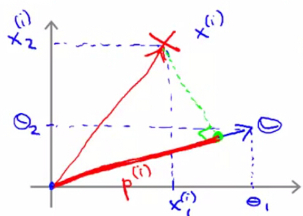
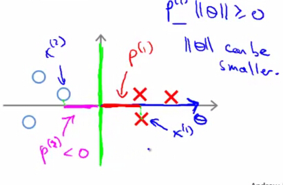

大间距分类器
========

在上节中，我们了解到了SVM最小化代价函数过程为：

$$

\min\limits_{\theta}C[\sum\limits_{i=1}^{m}y^{(i)}cost_1(\theta^Tx^{(i)})+(1-y^{(i)})cost_0(\theta^Tx^{(i)})]+\frac{1}{2}\sum\limits_{j=1}^{n}\theta_j^2

$$

并且，当$$y^{(i)}=1$$时，SVM希望$$\theta^Tx^{(i)} \geq 1$$；而当$$y^{(i)}=0$$时，SVM希望$$\theta^Tx^{(i)} \leq -1$$。则最小化代价函数的过程就可以描述为：

$$

\begin{align*}
& \min\frac{1}{2}\sum\limits_{j=1}^{n}\theta_j^2 \\
& \mbox{约束条件为：}
\begin{cases}
\theta^T x^{(i)} \geq 1 &\mbox{if $y^{(i)}=1$} \\ \theta^T x^{(i)} \leq -1 &\mbox{if $y^{(i)}=0$}
\end{cases}
\end{align*}

$$

SVM最终找出的决策边界会是下图中黑色直线所示的决策边界，而不是绿色或者紫色的决策边界。该决策边界保持了与正、负样本都足够大的距离，因此，SVM是典型的大间距分类器（Large margin classifier）。

推导
-----------

假定有两个2维向量：

$$

u=\left(\begin{matrix}u_1 \\ u_2\end{matrix}\right),v=\left(\begin{matrix}v_1 \\ v_2\end{matrix}\right)

$$

令$$p$$为$$v$$投影到$$u$$的线段长（该值可正可负），如下图所示：

则$$u$$、$$v$$的内积为：

$$

\begin{align*}
u^Tv &= p \cdot ||u|| \\
    &= u_1v_1+u_2v_2
\end{align*}

$$

其中，$$||u||$$为$$u$$的范数，也是$$u$$的长度。

假定我们的$$\theta=\left(\begin{matrix}\theta_1 \\ \theta_2\end{matrix}\right)$$，且令$$\theta_0 = 0$$，以使得向量$$\theta$$过原点，则：

$$

\begin{align*}
\min\limits_\theta\frac{1}{2}\sum\limits_{j=1}^{2}\theta_j^2 &=\min\limits_\theta\frac{1}{2}(\theta_1+\theta_2)^2 \\
&=\min\limits_\theta\frac{1}{2}(\sqrt{\theta_1^2+\theta_2^2})^2 \\
&=\min\limits_\theta\frac{1}{2}||\theta||^2
\end{align*}

$$

由向量内积公式可得：

$$

\theta^T x^{(i)} = p^{(i)}\cdot||\theta||

$$

其中，$$p^{(i)}$$为特征向量$$x^{(i)}$$在$$\theta$$上的投影：

当$$y^{(i)}=1$$时，我们希望$$\theta^T x^{(i)} \geq 1$$，亦即希望$$p^{(i)}\cdot||\theta|| \geq q$$，此时考虑两种情况：

1. $$p^{(i)}$$很小，则需要$$||\theta||$$很大，这与我们$$\min\limits_\theta\frac{1}{2}||\theta||^2$$矛盾。
2. $$p^{(i)}$$很大，如下图所示，即样本与决策边界的距离足够大，此时我们才能在既要$$||\theta||$$足够小的情况下，又能有$$\theta^tx^{(i)} \geq 1$$，保证预测精度够高。这就解释了为什么SVM的模型会具有大间距分类器的性质了。

