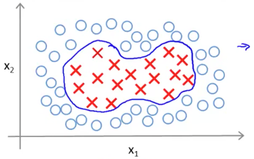
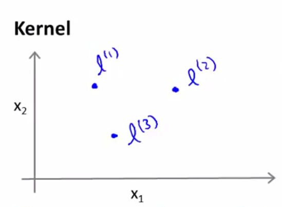

核函数
============

定义
--------

</img>

在逻辑回归中，我们会通过多项式扩展来处理**非线性**分类问题：

$$

h_\theta(x) = \theta_0+\theta_1x_1+\theta_2x_2+\theta_3x_1x_2+\theta_4x_1^2+\theta_5x_2^2+\cdots

$$

假设我们令：

$$

f_1=x_1,f_2=x_2,f_3=x_1x_2,f_4=x_1^2,f_5=x_2^2

$$

则预测函数为：

$$

h_\theta(x) = \theta_0+\theta_1f_1+\theta_2f_2+\theta_3f_3+\cdots

$$

但多项式回归所带来的高阶项不一定作用明显，针对这一问题，SVM 不会引入高阶项来作为新的特征，而是会选择一些**标记点（landmark）**，并将样本 $$x$$ 与标记点 $$l^{(i)}$$ 的**相似程度**作为新的训练特征 $$f_i$$：

$$

f_i = similarity(x, l^{(i)})

$$

</img>

距离度量的方式就称之为**核函数（Kernel）**，最常见的核函数是**高斯核函数（Gaussian Kernel）**：

$$

f_i = exp(-\frac{||x-l^{(i)}||^2}{2\delta^2})

$$

在高斯核中，注意到：

- 如果样本与标记点足够接近，即 $$x \approx l^{(i)}$$，则：
$$

f \approx exp(-\frac{0^2}{2\delta^2}) \approx 1

$$

- 如果样本远离标记点，则：
$$

f \approx exp(-\frac{(\mbox{large number})^2}{2\delta^2}) \approx 0

$$

这一关系可以被如下的热力图所反映：

</img>

> 在使用高斯核函数前，需要做特征缩放（feature scaling），以使 SVM 同等程度地关注到不同的特征。

标记点选取
--------------

假定我们有如下的数据集：

$$

(x^{(1)},y^{(1)}),(x^{(2)},y^{(2)})，(x^{(3)},y^{(3)}) \cdots (x^{(m)},y^{(m)})

$$

我们就将每个样本作为一个标记点：

$$

l^{(1)}=x^{(1)}，l^{(2)}=x^{(2)}，l^{(3)}=x^{(3)} \cdots l^{(m)}=x^{(m)}

$$

则对于样本 $$(x^{(i)}, y^{(i)})$$，我们计算其与各个标记点的距离：

$$

f_1^{(i)}=sim(x^{(i)},l^{(1)}) \\
f_2^{(i)}=sim(x^{(i)},l^{(2)}) \\
\vdots \\
f_m^{(i)}=sim(x^{(i)},l^{(3)}) \\

$$

得到新的特征向量：$$f \in R^{m+1}$$

$$

f=\left(\begin{matrix}f_0 \\ f_1 \\ f_2 \\ \vdots \\ f_m  \end{matrix}\right) \quad \mbox{其中 $f_0=1$}

$$

则具备核函数的 SVM 的训练过程如下：

$$

\min\limits_{\theta}C\big[\sum\limits_{i=1}^{m}y^{(i)}cost_1(\theta^Tf^{(i)})+(1-y^{(i)})cost_0(\theta^Tf^{(i)})\big]+\frac{1}{2}\sum\limits_{j=1}^{n}\theta_j^2

$$
