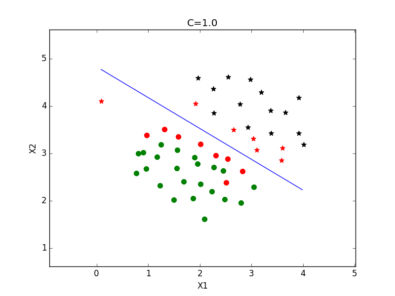
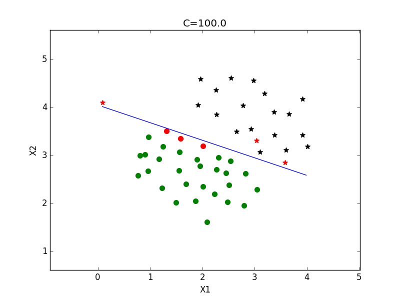

程序示例--线性分类
=================

首先，我们使用**线性核函数**来训练线性可分问题，这里，我们使用的是**简化版 SMO** 算法：

```python
# coding: utf8
# svm/test_linear
import smo
import numpy as np
from sklearn import datasets
from scipy.io import loadmat
import matplotlib.pyplot as plt

data = loadmat('data/ex6data1.mat')

X = np.mat(data['X'])
y = np.mat(data['y'], dtype=np.float)
y[y==0] = -1

m, n = X.shape
tol = 1e-3
maxIter = 20
C = 1.0
# C = 100.0

trainSimple, train, predict = smo.getSmo(X, y, C, tol, maxIter)
alphas, w, b, supportVectorsIndex, supportVectors, iterCount = trainSimple()
print w
print b
print len(supportVectorsIndex)
print 'iterCount:%d'%iterCount

predictions = predict(X, alphas, b, supportVectorsIndex, supportVectors)
errorCount = (np.multiply(predictions, y).A  < 0 ).sum()
print 'error rate: %.2f'%(float(errorCount)/m)

# 绘制数据点
x1Min = X[:, 0].min()
x1Max = X[:, 0].max()
x2Min = X[:, 1].min()
x2Max = X[:, 1].max()
plt.xlabel('X1')
plt.ylabel('X2')
plt.xlim(x1Min - 1, x1Max + 1)
plt.ylim(x2Min - 1, x2Max + 1)
plt.title('C=%.1f'%C)
for i in range(m):
    x = X[i].A[0]
    if y[i] == 1:
        color = 'black'
        if i in supportVectorsIndex:
            color = 'red'
        plt.scatter(x[0], x[1], marker='*', color=color, s=50)
    else:
        color = 'green'
        if i in supportVectorsIndex:
            color = 'red'
        plt.scatter(x[0], x[1], marker='o', color=color, s=50)

# 绘制决策边界
x = np.arange(x1Min, x1Max, 0.1)
h = (-w[0,0] * x - b[0,0]) / w[1,0]
plt.plot(x, h)
plt.show()
```

- $$C=1$$ 时，可以看到，左侧的一个正样本被误分为负样本：

<div style="text-align: center">
</img>
</div>

- $$C=100$$ 时，可以看到，所有样本都被正确分类，但是，多少有点过拟合，新来的样本很有可能被误分：

<div style="text-align: center">
</img>
</div>

> 红色样本为支持向量
