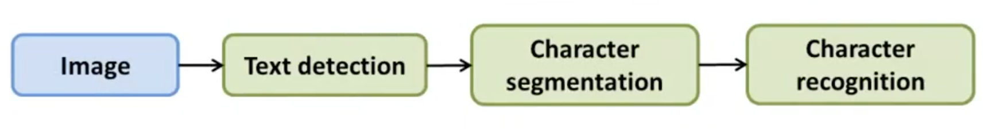

上限分析（Ceiling analysis）
=========

光学字符识别并不是一个单一的过程，而是由若干过程构成的流水线。我们知道，字符识别作为该流水线的出口，其将是衡量光学字符识别准确率的依据。工程浩瀚，我们不可能在流水线的每一步都花费巨额的精力来作出改善，因此，我们需要一种手段来知道去改善**哪一步**是最值得的，**上限分析（Ceiling analysis）**就是手段之一。

</img>

所谓上限分析，就是我们假定某个组件及其前面组件的精度都达到了 100%，即该组件完美地完成了任务，达到了上限，那么此时整个系统的精度能提升多少 。例如，假定整个系统的精度是 72%，我们令文本检测的精度是 100%（比如人工利用 PS 来定位图片中的文本框），此时，整个系统的精度能提升到 89%。即，如果我们付出足够多的精力来优化文本检测，那么理想情况下，能将系统的精度提升 17%：

| 组件     | 流水线精度 | 精度提升 |
|:---------|:-----------|:---------|
| 整个系统 | 72%        |  --        |
| 文本检测 | 89%        | 17%      |
| 字符分割 | 90%        | 1%       |
| 字符识别 | 100%       | 10%      |

完成上限分析后，我们得到上面的表格，可以看出，最值得花费精力的步骤是文本检测，最不值得花费精力的是字符分割，即便我们完成了 100% 的分割，最多也就对系统提升 1%。
