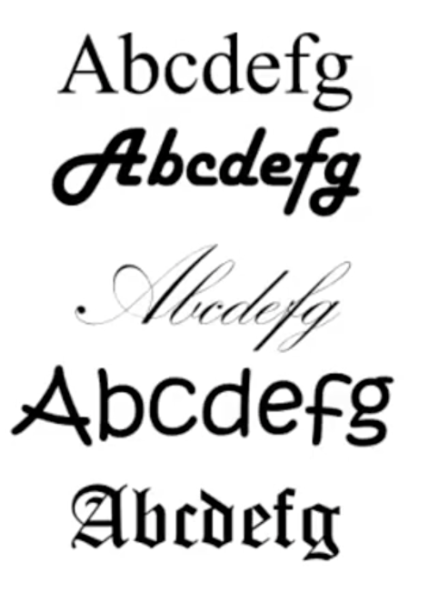
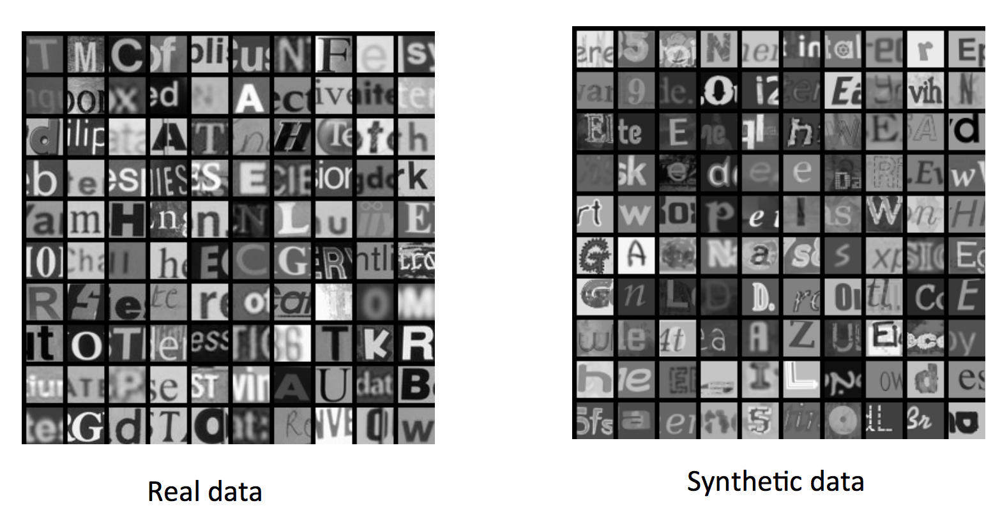
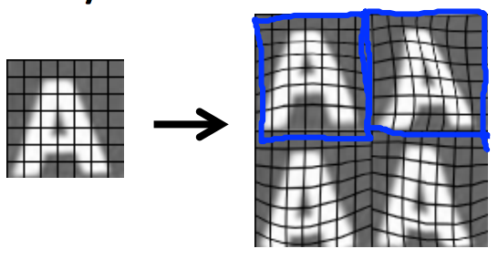
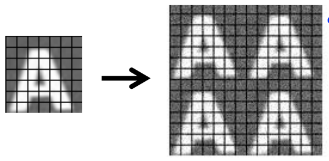

人工合成数据
=============

在**字符识别**阶段，为了更好的完成分类识别任务，我们就需要给系统提供尽可能多的训练图像，如果我们手头上拥有的图像不多，就需要人工合成更多的数据。例如，我们可以收集不同的字体，并为每种字体的每个字符加上随机背景，这样就可以人工扩展大量的字符图像：

</img>

</img>

另外，也可以通过扭曲字符形状来合成新数据，这也会帮助机器更好地处理发生过形态变化的图像：

</img>

但是，为数据加上随机噪声一般不会提升模型训练质量：

</img>

