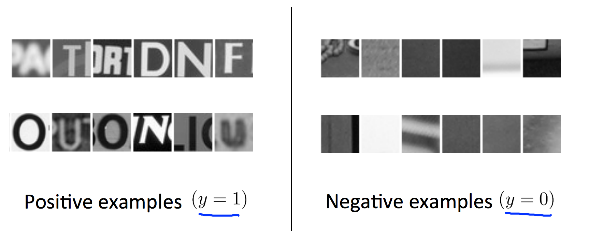
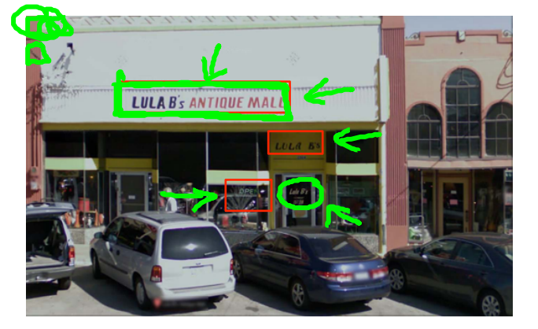
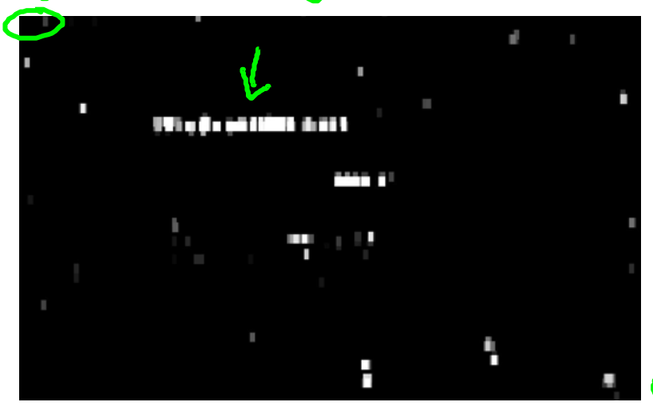
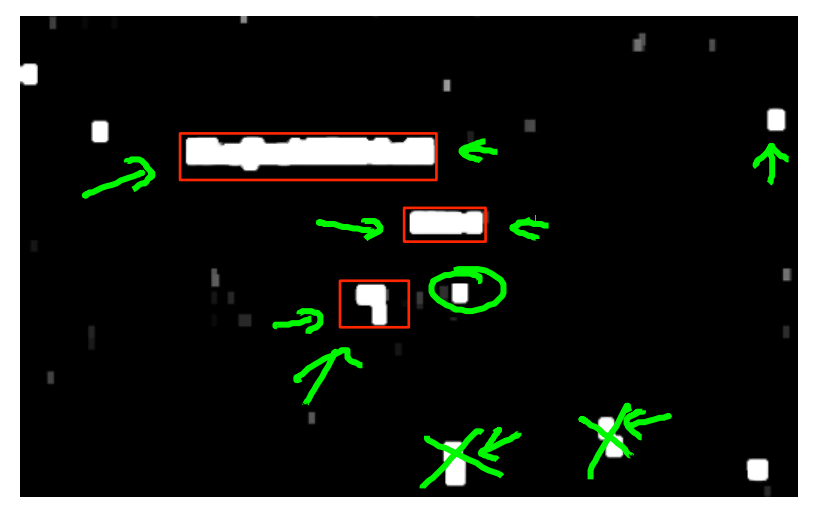
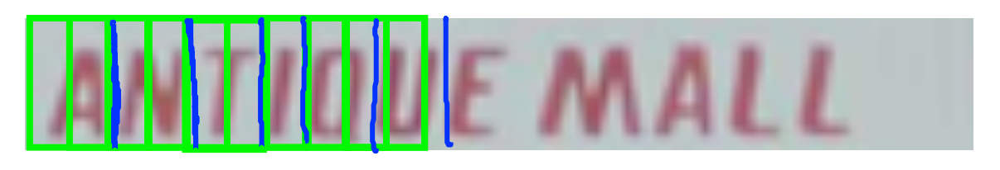
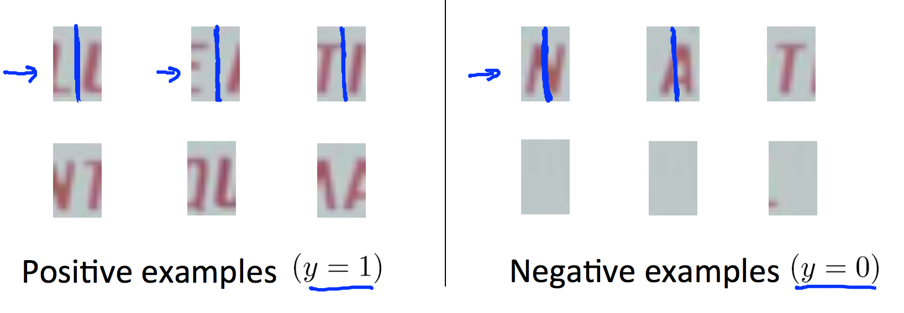

滑动窗口（Sliding window）
=================

文本检测中的滑动窗口
------------

滑动窗口是检测图像中目标对象的最常用手段，在**文本检测**阶段，我们首先定义正、负样本，正样本图像描述了含有文本的图像，负样本描述了不含文本的图像：

</img>

通过在原图像沿行、列滑动我们定义好的窗口，并让窗口内图像与正负样本进行比较：

</img>

当窗口遍历过整幅图像后，获得原图像对应的掩膜，高亮度的区域都为疑似文本框的区域：

</img>

掩膜中的文本框断断续续的，因此还考虑使用[形态学膨胀](https://zh.wikipedia.org/wiki/%E6%95%B0%E5%AD%A6%E5%BD%A2%E6%80%81%E5%AD%A6#.E8.86.A8.E8.83.80)操作来让文本框更加完整：

</img>

字符分割中的滑动窗口
------------

在文本检测阶段，我们的滑动窗口是分别沿着行、列进行扫描的，因此是 2 维的扫描过程。而在**字符分割**过程中，同样将使用到滑动窗口技术，只是这次我们将窗口的高度设置为与文本框等高，只进行 1 维的行扫描：

</img>

我们同样需要定义正负样本，来让窗口知道哪些是字符，哪些包含了字符的分界：

</img>

