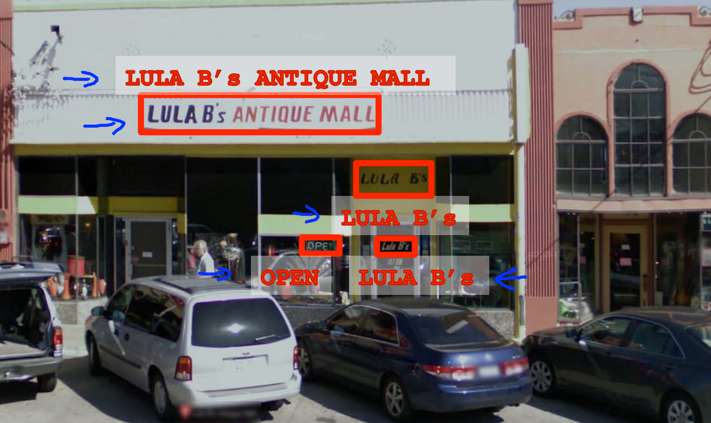
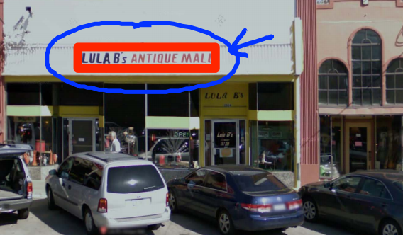
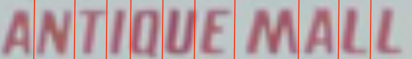
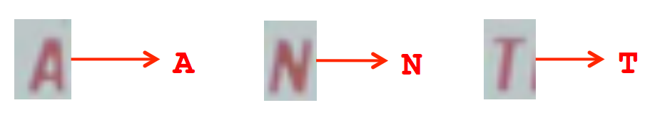

问题描述及流程
============

假定我们有下面一张图片，光学字符识别要解决的问题就是识别图片中的所有字符：

</img>

光学字符识别的工作流程为：

1. 文本检测：获得包含了文本的文本框。

</img>

2. 字符分割：从文本框中分割出各个字符

</img>

3. 字符分类（识别）：字符分割中得到的只是一个个字符图形，在字符分类阶段，才能真正知道该字符类别。

</img>

