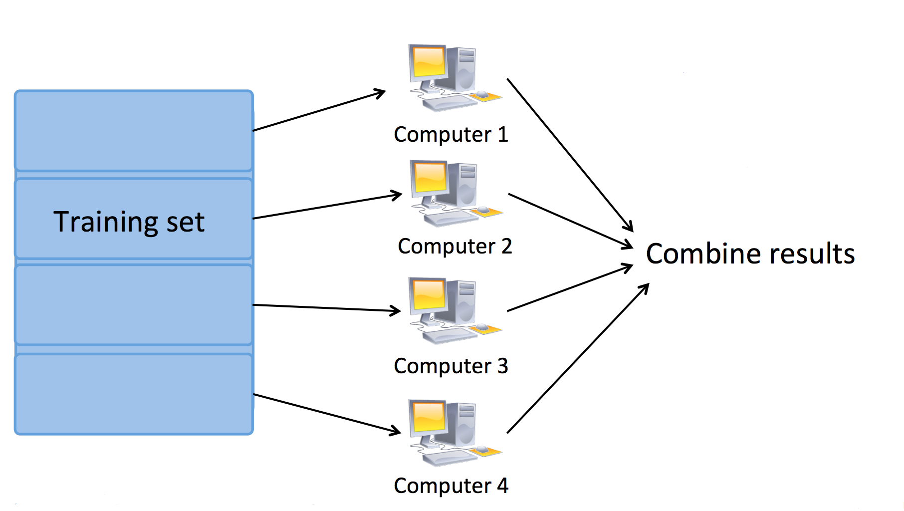
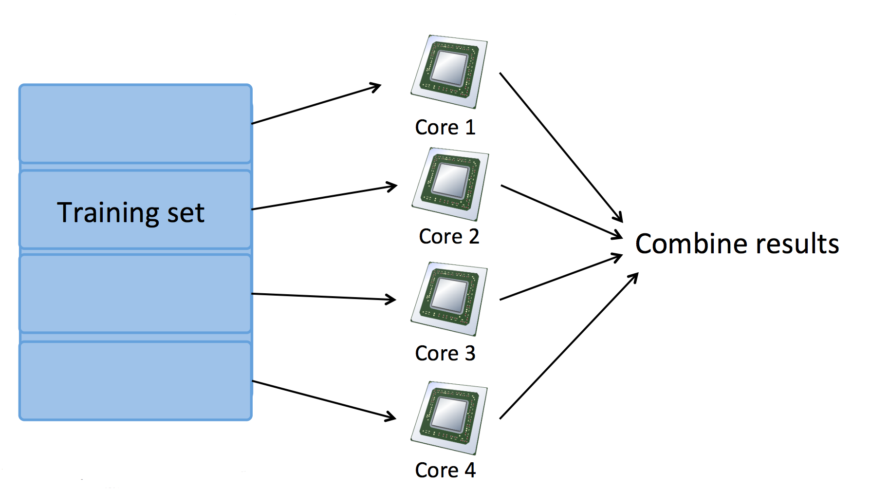

在线学习与 MapReduce
==============

在线学习
-------------

用户登录了某提供货运服务的网站，输入了货运的发件地址和收件地址，该网站给出了货运报价，用户决定是购买该服务（$$y=1$$）或者是放弃购买该服务（$$y=0$$）。

特征向量 $$x$$ 包括了收发地址，报价信息，我们想要学习 $$p(y=1|x;\theta)$$ 来最优化报价：

$$

\begin{align*}
& \mbox{重复直到收敛：} \\
& \quad \mbox{获得关于该用户的样本 $(x,y)$，使用该样本更新 $\theta$：} \\
& \quad \quad \theta_j= \theta_j - \alpha(h_\theta(x)-y) x_j, \quad \mbox{for $j=0,..,n$}
\end{align*}

$$

这就是**在线学习（Online learning）**，与前面章节提到的机器学习过程不同，在线学习并不需要一个固定的样本集进行学习，而是不断接收样本，不断通过接收到的样本进行学习。因此，在线学习的前提是：我们面临着流动的数据。

MapReduce
--------------

前面，我们提到了 Mini 批量梯度下降法，假定 $$b=400, m=400,000,000$$，我们对 $$\theta$$ 的优化就为：

$$

\theta_j = \theta_j - \alpha\frac{1}{400}\sum{i=1}^{400}(h_\theta(x^{i})-y^{(i)})x_j^{(i)}

$$

假定我们有 4 个机器（Machine），我们首先通过 Map （映射）过程来并行计算式中的求和项，每个机器被分配到 100 个样本进行计算：

$$

temp_j^{(1)} =  \sum_{i=1}^{100}(h_\theta(x^{(i)} - y^{(i)})x_j^{(i)} \\
temp_j^{(2)} =  \sum_{i=101}^{200}(h_\theta(x^{(i)} - y^{(i)})x_j^{(i)} \\
temp_j^{(3)} =  \sum_{i=201}^{300}(h_\theta(x^{(i)} - y^{(i)})x_j^{(i)} \\
temp_j^{(4)} =  \sum_{i=301}^{400}(h_\theta(x^{(i)} - y^{(i)})x_j^{(i)}

$$

最后，通过 Reduce（规约）操作进行求和：

$$

\theta_j = \theta_j - \alpha\frac{1}{400}(temp_j^{(1)}+temp_j^{(2)}+temp_j^{(3)}+temp_j^{(4)})

$$

我们可以使用多台机器进行 MapReduce，此时，Map 任务被分配到多个机器完成：

</img>

也可以使用单机多核心进行 MapReduce，此时，Map 任务被分配到多个 CPU 核心完成：

</img>

