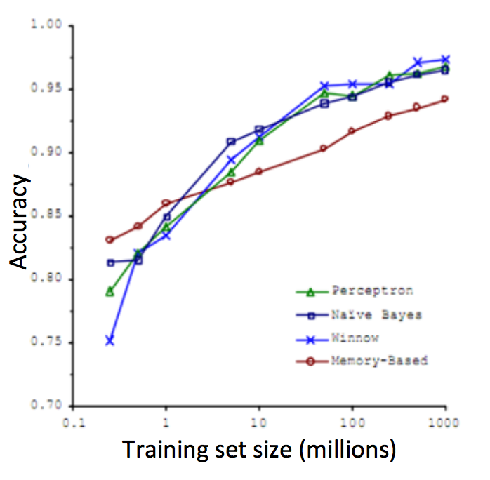

掌握大数据
===================

在[算法分析与优化](../../算法分析与优化/articles/大数据集)一节中，我们就提到，在机器学习界流传着这样一句话：

> It's not who has the best algorithm that wins. It's who has the most data.

在识别易混淆词汇一例中，我们分别使用了四种算法：（1）Perceptron；（2）Naive Bayes；（3）Winnow；（4）Memory-Based。通过下图可以看淡，这四种算法都随着数据规模的增长获得了更高的精度：

</img>

所以，在机器学习中，除了构建算法模型，为模型提供足够大，足够多的数据也成为了关键。同时，我们也需要做好准备，以更快速的方式处理、消化大数据。拥有了大数据，也就意味着在算法模型中，我们面临着一个很大的 $$m$$ 值。
