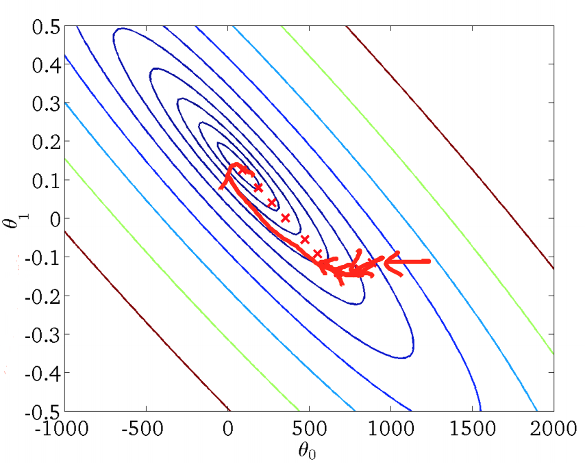
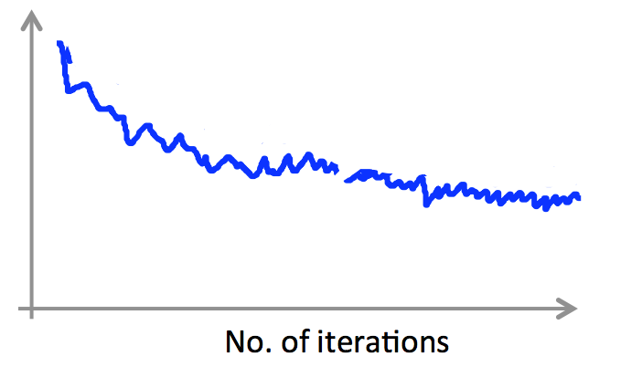
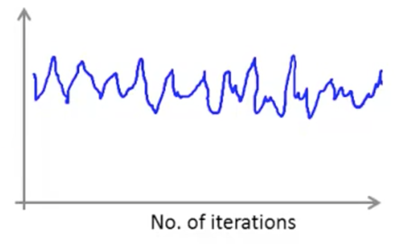
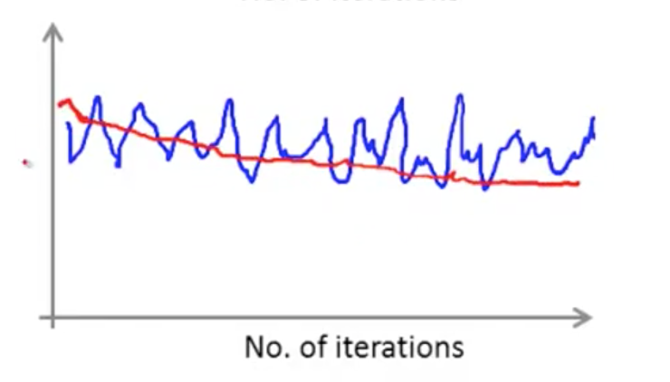
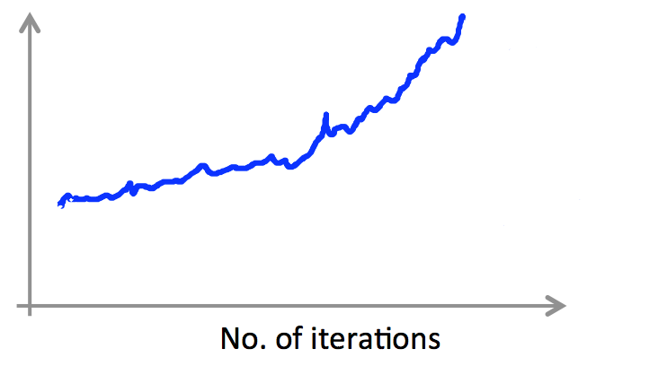
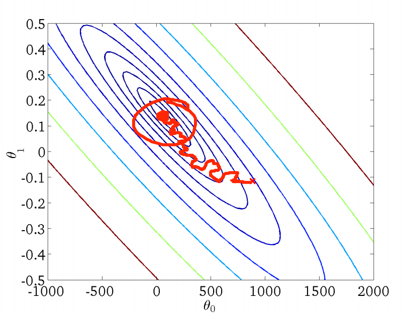

梯度下降
================

批量梯度下降法（Batch gradient descent）
----------------

拥有了大数据，就意味着，我们的算法模型中得面临一个很大的 $$m$$ 值。回顾到我们的批量梯度下降法：

$$

\begin{align*}
&\mbox{重复直到收敛：} \\
& \quad \theta_j = \theta_j - \alpha\frac{1}{m}\sum_{i=1}^m(h_\theta(x^{(i)})-y^{(i)})x_j^{(i)},
\quad \mbox{for $j=0,...,n$}
\end{align*}

$$

可以看到，没更新一个参数 $$\theta_j$$，我们都不得不遍历一遍样本集，在 $$m$$ 很大时，该算法就显得比较低效。但是，批量梯度下降法能找到全局最优解：

</img>

随机梯度下降法（Stochastic gradient descent）
----------------

针对大数据集，又引入了随机梯度下降法，该算法的执行过程为：

$$

\begin{align*}
&\mbox{重复直到收敛：} \\
& \quad \mbox{for $i=1,...,m$：} \\
& \quad \quad \theta_j = \theta_j - \alpha(h_\theta(x^{(i)})-y^{(i)})x_j^{(i)},
\quad \mbox{for $j=0,...,n$}
\end{align*}

$$

相较于批量梯度下降法，随机梯度下降法每次更新 $$\theta_j$$ 只会用当前遍历的样本。虽然外层循环仍需要遍历所有样本，但是，往往我们能在样本尚未遍历完时就已经收敛，因此，面临大数据集时，随机梯度下降法性能卓越。

</img>

上图反映了随机梯度下降法找寻最优解的过程，相较于批量梯度下降法，随机梯度下降法的曲线就显得不是那么平滑，而是很曲折了，其也倾向于找到局部最优解而不是全局最优解。因此，我们通常需要绘制调试曲线来监控随机梯度的工作过程是否正确。例如，假定误差定义为 $$cost(\theta, (x^{(i)}, y^{(i)})) = \frac{1}{2}(h_\theta(x^{(i)})-y^{(i)})^2$$，则每完成 1000 次迭代，即遍历了 1000 个样本，我们求取平均误差并进行绘制，得到误差随迭代次数的变化曲线：

</img>

</img>

如果，我们每进行 5000 次迭代才进行绘制，那么曲线将更加平滑：

</img>

如果我们面临明显上升态势的曲线，就要考虑降低学习率 $$\alpha$$ 了：

</img>

另外，学习率 $$\alpha$$ 还可以随着迭代次数进行优化

$$

\alpha = \frac{constant1} {iterationNumber + constant2}

$$

这样，随着迭代次数的增多，我们的下降步调就会放缓，避免出现抖动：

</img>

> 随机梯度下降法工作前，需要先乱序数据集，是的遍历样本的过程更加分散。

Mini 批量梯度下降法（Mini-batch gradient descent）
--------------------

Mini 批量梯度下降法是批量梯度下降法和随机梯度下降法的折中，通过参数 $$b$$ 指明了每次迭代中，用于更新 $$\theta$$ 的样本数。假定 $$b=10,m=1000$$，Mini 批量梯度下降法的工作过程如下：

$$

\begin{align*}
&\mbox{重复直到收敛：} \\
& \quad \mbox{for $i=1,11,21,...,991$：} \\
& \quad \quad \theta_j = \theta_j - \alpha\frac{1}{10}\sum_{k=i}^{i+9}(h_\theta(x^{(i)})-y^{(i)})x_j^{(i)},
\quad \mbox{for $j=0,...,n$}
\end{align*}

$$
