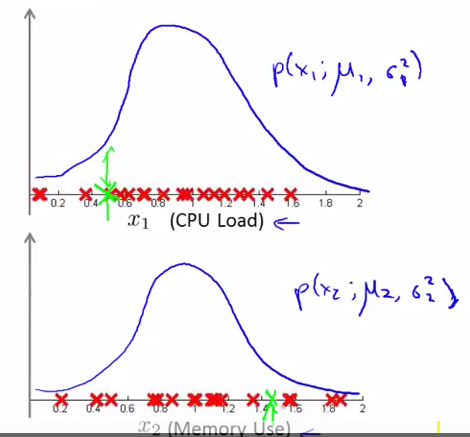
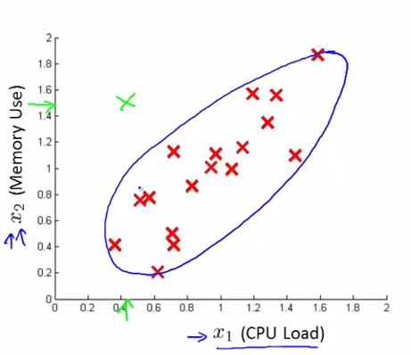
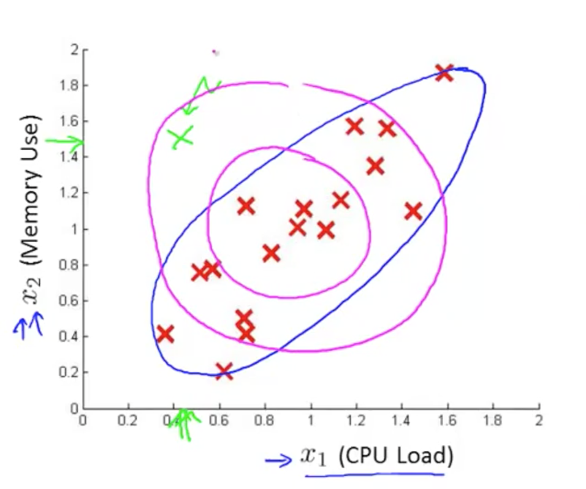
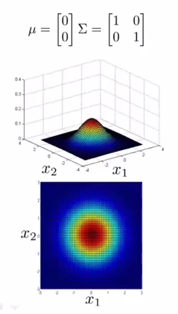
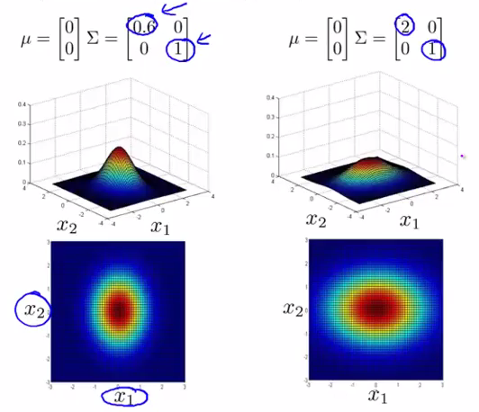
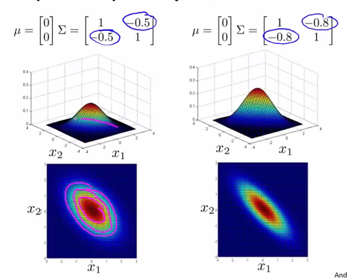
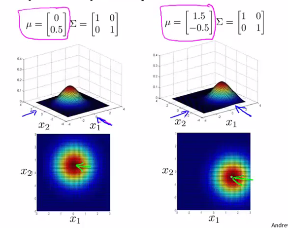
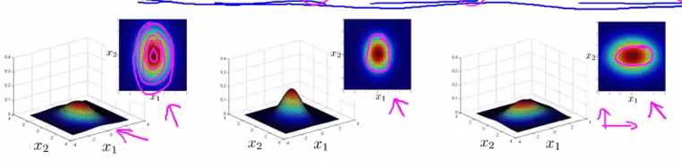

多元高斯分布模型
=========

引子
-----------------

在服务器运转监控的问题中，我们获得一个服务器样本 $$x$$，并且，计算了 $$p(x_1;\mu_1,\delta_1^2)$$ 及 $$p(x_2;\mu_2\delta_2^2)$$ ，认为该服务器的 CPU 负载和内存使用都在正常范围内，也就认为该服务器运转正常：

</img>

但是，截断边界却将该样本截在了正常样本之外，认为服务器发生异常：

</img>

可以看到，出现错误截端的原因在于，我们的高斯分布模型形成的截断边界太固定。试想，如果我们原有的决策边界能经放缩，旋转等操作，变换到下图的紫色边界位置，该服务器就不会被错分为异常了：

</img>

为此，引入了多元高斯分布模型。

定义
--------------

多元高斯分布模型被定义为：

$$

p(x;\mu,\Sigma)=\frac{1}{(2\pi)^{\frac{n}{2}}|\Sigma|^\frac{1}{2}}exp(-\frac{1}{2}(x-\mu)^T\Sigma^{-1}(x-\mu))

$$

其中，$$\mu$$ 表示**样本均值**，$$\Sigma$$ 表示**样本协方差矩阵**。

多元高斯分布模型的热力图如下：

</img>

参数
---------------

- 改变 $$\Sigma$$ **主对角线**的数值可以进行不同方向的宽度拉伸：

</img>

- 改变 $$\Sigma$$ **次对角线**的数值可以旋转分布图像：

</img>

</img>

- 改变 $$\mu$$ 可以对分布图像进行位移：

</img>

参数估计
---------------

多元高斯分布模型的参数估计如下：

$$

\begin{align*}
\mu &= \frac{1}{m}\sum\limits_{i=1}^mx^{(i)} \\
\Sigma &= \frac{1}{m}\sum\limits_{i=1}^m(x^{(i)}-\mu)(x^{(i)}-\mu)^T
\end{align*}

$$

算法流程
---------------

采用了**多元高斯分布**的异常检测算法流程如下：

1. 选择一些足够反映异常样本的特征 $$x_j$$。
2. 对各个**样本**进行参数估计：
$$

\begin{align*}
\mu &= \frac{1}{m}\sum\limits_{i=1}^mx^{(i)} \\
\Sigma &= \frac{1}{m}\sum\limits_{i=1}^m(x^{(i)}-\mu)(x^{(i)}-\mu)^T
\end{align*}

$$
3. 当新的样本 $$x$$ 到来时，计算 $$p(x)$$：
$$

p(x)=\frac{1}{(2\pi)^{\frac{n}{2}}|\Sigma|^\frac{1}{2}}exp(-\frac{1}{2}(x-\mu)^T\Sigma^{-1}(x-\mu))

$$
如果 $$p(x) < \epsilon$$，则认为样本 $$x$$ 是异常样本。

多元高斯分布模型与一般高斯分布模型的差异
----------------------------

实际上，一般的高斯分布模型只是多元高斯分布模型的一个**约束**，它将多元高斯分布的等高线约束到了如下所示同轴分布（概率密度的等高线是沿着轴向的）：

</img>

| 一般高斯模型     | 多元高斯模型 |
|:-----------------|:-------------|
| $$\begin{align*}
p(x) &= p(x_1;\mu_1, \delta^2_1)p(x_2;\mu_2, \delta^2_2) \cdots p(x_n;\mu_n, \delta^2_n) \\
&= \prod\limits_{j=1}^np(x_j;\mu_j,\delta_j^2) \\
&= \prod\limits_{j=1}^n\frac{1}{\sqrt{2\pi}\delta_j}exp(-\frac{(x_j-\mu_j)^2}{2\delta_j^2})
\end{align*}$$|$$p(x)=\frac{1}{(2\pi)^{\frac{n}{2}}|\Sigma|^\frac{1}{2}}exp(-\frac{1}{2}(x-\mu)^T\Sigma^{-1}(x-\mu))$$|
|需要手动创建一些特征来描述某些特征的相关性|利用协方差矩阵 $$\Sigma$$ 获得了各个特征相关性|
|计算复杂度低，适用于高维特征|计算复杂|
|在样本数目 $$m$$ 较小时也工作良好|需要 $$\Sigma$$ 可逆，亦即需要 $$m > n$$，且各个特征不能线性相关，如不能存在 $$x_2 = 3x_1$$ 或者 $$x_3 = x_1 + 2x_2$$|

由此可以看出，基于多元高斯分布模型的异常检测应用十分有限。
