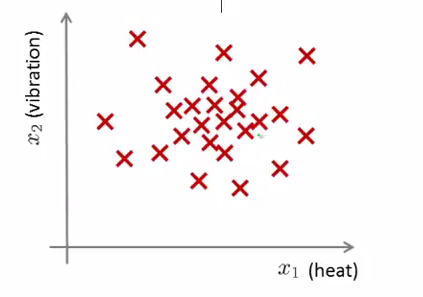
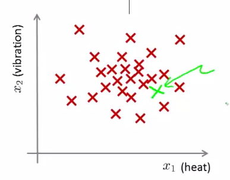
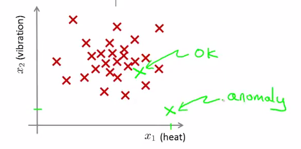

概述
=========

异常检测（Anomaly Detection）是机器学习里面的一个常见应用，机器被训练知道什么样的样本是正常样本，从而具备识别异常样本的能力。

飞机制造商在飞机引擎从生产线上流入市场前，会考虑进行**异常检测**，以防止不合格引擎造成恶劣结果。而为了进行异常检测，通常就需要采集一些引擎特征，如：

$$

\begin{align*}
x_1 &= \mbox{引擎运转时的热量} \\
x_2 &= \mbox{引擎的振荡频率}
\end{align*}

$$

假定现在有引擎的数据集：$${x^{(1)},x^{(2)},\cdots,x^{(m)}}$$, 这些数据都是正常样本，我们将其绘制到二维平面上：

</img>

现在，新来了一个引擎样本（以绿色标志），它落到了正常样本中间，亦即，它表现了和正常样本类似的特征，所以，我们希望，新来的样本也会被当做是正常样本，从而让它顺利流入市场：

</img>

与此同时，又来了一个引擎，由于他偏离正常样本汇集的位置过远，其理所当然被认为是异常样本，从而被回炉重造：

</img>

综上我们知道，我们需要根据已有数据集构建一个**概率模型**，如果某一样本被是正常样本的概率足够小，它就该被当做是异常：

$$

x=
\begin{cases} 异常样本, \mbox{if $p(x)< \epsilon$} \newline
正常样本, \mbox{otherwise}
\end{cases}

$$
