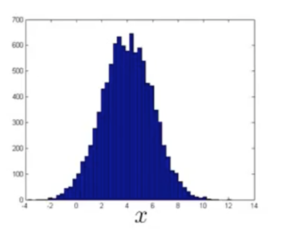
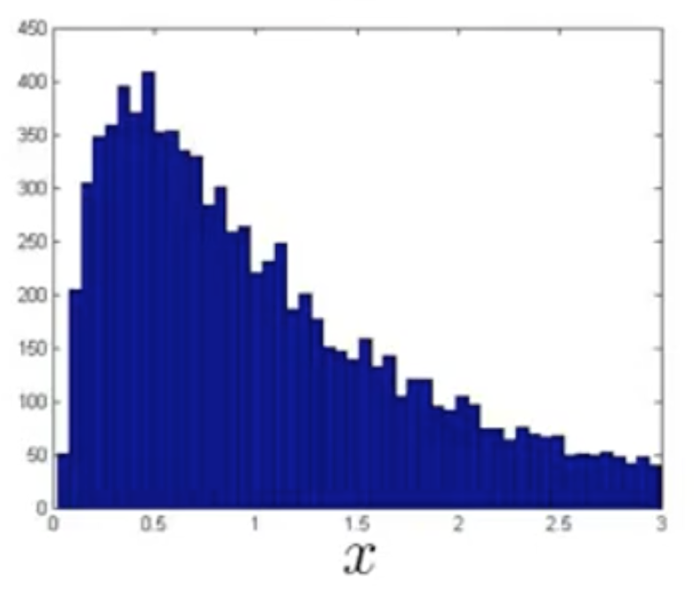
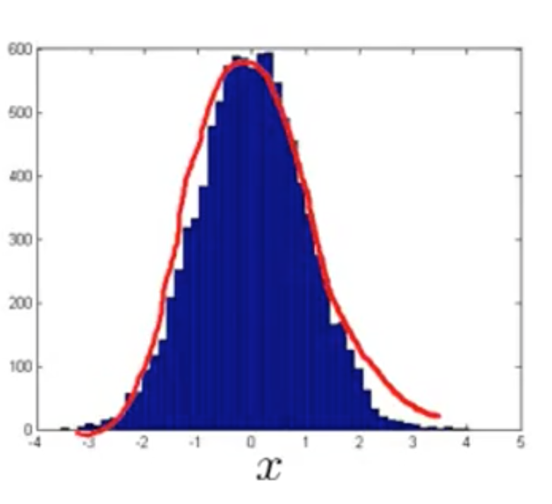

特征选择
=========

使得特征服从高斯分布
------------------

为了构建异常检测模型，我们就希望特征能服从高斯分布：

</img>

但是，我们一开始拿到的特征的分布可能是这样的：

</img>

我们可以同过对数操作或者其他操作将他转化为高斯分布，例如，上面的特征经对数操作后形成的分布就非常接近于高斯分布：

</img>

构建新特征
-----------

我们知道，在异常检测中，样本特征要尽可能区分正常样本和异常样本。例如，为了监测机房中的服务器异常状况，我们选定了如下特征：

$$

\begin{align*}
x_1 &= 内存使用率 \\
x_2 &= 每秒磁盘访问次数 \\
x_3 &= CPU负载 \\
x_4 &= 网络流量
\end{align*}

$$

当异常发生时，这些值都会非常大。但是，我们遇到一个新的异常：程序执行时进入了某个死循环，此时 CPU负载 很高，而网络流量很低（业务全部卡死在服务器，而没有和客户端通信），亦即，一个特征过大，而一个特征过小，要去识别这样一种情况，我们考虑创建新的特征：

$$

x_5= \frac{CPU 负载}{网络流量}

$$

当上述异常发生时，该特征将会变得异常的大，有助于标识出异常发生。

这个例子说明，我们可以通过组合现有特征，来产生标识度更明显的特征。
