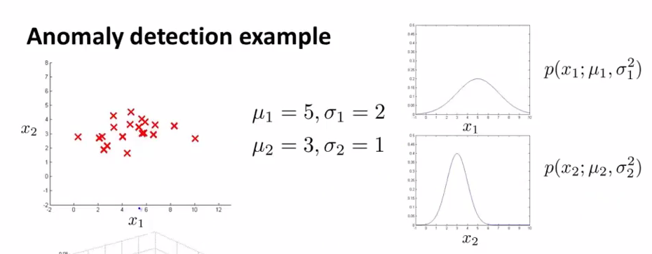
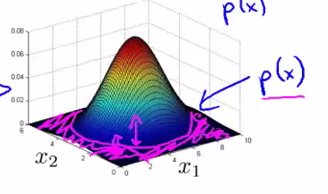
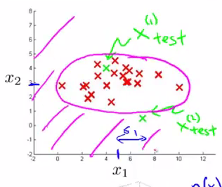

算法流程与评估
===============

算法流程
------------

有了前面的知识，我们可以得到，采用了**高斯分布**的异常检测算法流程如下：

1. 选择一些足够反映异常样本的特征 $$x_j$$。
2. 对各个特征进行参数估计：
$$

\begin{align*}
\mu_j &= \frac{1}{m}\sum\limits_{i=1}^mx_j^{(i)} \\
\delta^2_j &= \frac{1}{m}\sum\limits_{i=1}^m(x_j^{(i)}-\mu)^2
\end{align*}

$$
3. 当新的样本 $$x$$ 到来时，计算 $$p(x)$$：
$$

p(x)=\prod\limits_{j=1}^np(x_j;\mu_j,\delta_j^2)=\prod\limits_{j=1}^n\frac{1}{\sqrt{2\pi}\delta_j}exp(-\frac{(x_j-\mu_j)^2}{2\delta_j^2})

$$
如果 $$p(x) < \epsilon$$，则认为样本 $$x$$ 是异常样本。

举个栗子
------------

假定我们有两个特征 $$x_1$$、$$x_2$$，它们都服从于高斯分布，并且通过参数估计，我们知道了分布参数：

</img>

则模型 $$p(x)$$ 能由如下的热力图反映，热力图越热的地方，是正常样本的概率越高，参数 $$\epsilon$$ 描述了一个截断高度，当概率落到了截断高度以下（下图紫色区域所示），则为异常样本：

</img>

将 $$p(x)$$ 投影到特征 $$x_1$$、$$x_2$$ 所在平面，下图紫色曲线就反映了 $$\epsilon$$ 的投影，它是一条截断曲线，落在截断曲线以外的样本，都会被认为是异常样本：

</img>

数据集划分
-------------

假定我们的引擎数据集被标注了是否为异常样本：

$$

y^{(i)}=
\begin{cases}
0, \mbox{如果 $x^{(i)}$ 为正常样本} \\
1, \mbox{otherwise}
\end{cases}

$$

并且，含有正常样本 $$10000$$ 个，异常样本 $$20$$ 个。那么，我们可以这样划分数据集：
- **训练集**含 $$6000$$ 个正常样本。
- **交叉验证集**含 $$2000$$ 个正常样本，$$10$$ 个异常样本。
- **测试集**含 $$2000$$ 个正常样本，$$10$$ 个异常样本。

算法评估
-----------

由于异常样本是非常少的，所以整个数据集是非常**偏斜**的，我们不能单纯的用预测准确率来评估算法优劣，因此，可以考虑使用我们在**算法分析与优化**一节中提过的评价手段：
- 真阳性、假阳性、真阴性、假阴性
- 查准率（Precision）与 召回率（Recall）
- $$F_1Score$$
