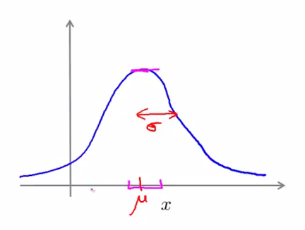
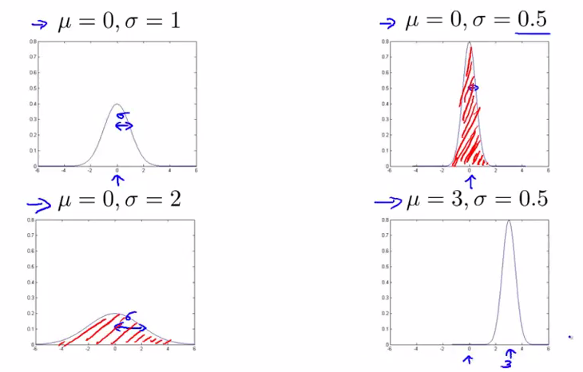
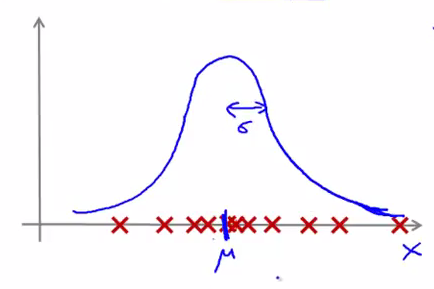

高斯分布模型
=============

我们已经知道，异常检测的核心就在于找到一个概率模型，帮助我们知道一个样本落入正常样本中的概率，从而帮助我们区分正常和异常样本。**高斯分布（Gaussian Distribution）**模型就是异常检测算法最常使用的概率分布模型。

定义
----------
我们称 $$X \sim N(\mu,\delta^2)$$ 为： $$X$$ 服从均值为 $$\mu$$，方差为 $$\delta^2$$ 的高斯分布（也称正态分布）。高斯分布的[概率密度函数](https://zh.wikipedia.org/wiki/%E6%A9%9F%E7%8E%87%E5%AF%86%E5%BA%A6%E5%87%BD%E6%95%B8)为：

$$

f(x)=\frac{1}{\sqrt{2\pi}\delta}e^{-\frac{(x-\mu)^2}{2}}

$$

概率密度函数的图像为：

</img>

此时，概率模型可以描述为：

$$

p(x; \mu, \delta^2)=\frac{1}{\sqrt{2\pi}\delta}e^{-\frac{(x-\mu)^2}{2}}

$$

参数
-----------

均值 $$\mu$$ 决定了高斯分布概率密度函数的**对称轴位置**，方差 $$\delta$$ 衡量了各样本与平均位置的差异，决定了概率密度函数的**宽窄**。$$\delta^2$$ 越大，各个样本的差异越大（各个样本偏离均值位置很远），即样本取 $$\mu$$ 附近位置的概率越低，亦即，概率 $$P(\mu-\epsilon<x<\mu+\epsilon)$$ 很小，此时，概率密度函数很**宽**。下图展示了几组不同参数取值下的高斯分布的概率密度函数：

</img>

参数估计
------------

假定特征 $$x_j$$ 分布如下：

</img>

我们发现，该分布中间稠密，越向两边越稀疏，我们就认为数据服从高斯分布，即：

$$

x_j \sim N(\mu,\delta^2)

$$

但我们不知道该分布的 $$\mu_j$$ 和 $$\delta_j$$ 参数，但如果学过概率论，我们知道，可以根据这有限个样本进行**参数估计**：

$$

\begin{align*}
\mu_j &= \frac{1}{m}\sum\limits_{i=1}^mx_j^{(i)} \\
\delta^2_j &= \frac{1}{m}\sum\limits_{i=1}^m(x_j^{(i)}-\mu_j)^2
\end{align*}

$$

这里对参数 $$\mu$$ 和参数 $$\delta^2$$ 的估计就是二者的[极大似然估计](https://zh.wikipedia.org/wiki/%E6%9C%80%E5%A4%A7%E4%BC%BC%E7%84%B6%E4%BC%B0%E8%AE%A1)。

假定我们有数据集：

$$

{x^{(1)},x^{(2)},\cdots,x^{(m)}}, x \in R^n

$$

并且，各个特征服从于高斯分布：

$$

x_j \sim N(\mu,\delta^2)

$$

我们完成了对于各个特征服从分布的参数估计后，可以得到：

$$

\begin{align*}
p(x) &= p(x_1;\mu_1, \delta^2_1)p(x_2;\mu_2, \delta^2_2) \cdots p(x_n;\mu_n, \delta^2_n) \\
&= \prod\limits_{j=1}^np(x_j;\mu_j,\delta_j^2) \\
&= \prod\limits_{j=1}^n\frac{1}{\sqrt{2\pi}\delta_j}exp(-\frac{(x_j-\mu_j)^2}{2\delta_j^2})
\end{align*}

$$
