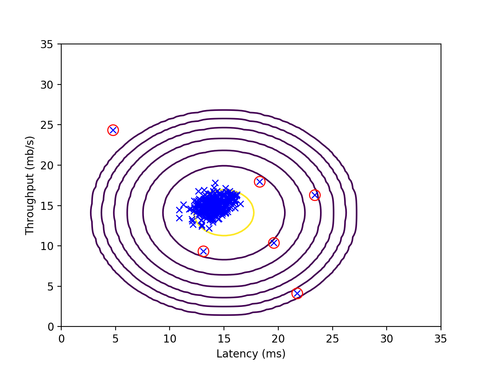

程序示例--异常检测
=================

异常检测模型
-----------

提供了**一般高斯分布模型**和**多元高斯分布模型**。其中，多元高斯分布模型被限制到了同轴分布：

```python
# coding: utf8
# anomaly_detection/anomaly.py

import numpy as np

def F1(predictions, y):
    """F_1Score

    Args:
        predictions 预测
        y 真实值
    Returns:
        F_1Score
    """
    TP = np.sum((predictions == 1) & (y == 1))
    FP = np.sum((predictions == 1) & (y == 0))
    FN = np.sum((predictions == 0) & (y == 1))
    if TP + FP == 0:
        precision = 0
    else:
        precision = float(TP) / (TP + FP)
    if TP + FN == 0:
        recall = 0
    else:
        recall = float(TP) / (TP + FN)
    if precision + recall == 0:
        return 0
    else:
        return (2.0 * precision * recall) / (precision + recall)


def gaussianModel(X):
    """高斯模型

    Args:
        X 样本集
    Returns:
        p 模型
    """
    # 参数估计
    m, n = X.shape
    mu = np.mean(X, axis=0)
    delta2 = np.var(X, axis=0)
    def p(x):
        """p(x)

        Args:
            x x
            mu mu
            delta2 delta2
        Returns:
            p
        """
        total = 1
        for j in range(x.shape[0]):
            total *= np.exp(-np.power((x[j, 0] - mu[0, j]), 2) / (2 * delta2[0, j]**2)
                            ) / (np.sqrt(2 * np.pi * delta2[0, j]))
        return total
    return p


def multivariateGaussianModel(X):
    """多元高斯模型

    Args:
        X 样本集
    Returns:
        p 模型
    """
    # 参数估计
    m, n = X.shape
    mu = np.mean(X.T, axis=1)
    Sigma = np.var(X, axis=0)
    Sigma = np.diagflat(Sigma)
    # Sigma = np.mat(np.cov(X.T))
    detSigma = np.linalg.det(Sigma)

    def p(x):
        """p(x)

        Args:
            x x
            mu mu
            delta2 delta2
        Returns:
            p
        """
        x = x - mu
        return np.exp(-x.T * np.linalg.pinv(Sigma) * x / 2).A[0] * \
            ((2*np.pi)**(-n/2) * (detSigma**(-0.5) ))
    return p


def train(X, model=gaussianModel):
    """训练函数

    Args:
        X 样本集
    Returns:
        p 概率模型
    """
    return model(X)
```

测试
---------------

```python
# coding: utf8
# anomaly_detection/test_anomaly_detection.py

import numpy as np
from scipy.io import loadmat
import matplotlib.pyplot as plt
import anomaly

def selectEpsilon(XVal, yVal, p):
    # 通过交叉验证集，选择最好的 epsilon 参数
    pVal = np.mat([p(x.T) for x in XVal]).reshape(-1, 1)
    step = (np.max(pVal) - np.min(pVal)) / 1000
    bestEpsilon = 0
    bestF1 = 0
    for epsilon in np.arange(np.min(pVal), np.max(pVal), step):
        predictions = pVal < epsilon
        F1 = anomaly.F1(predictions, yVal)
        if F1 > bestF1:
            bestF1 = F1
            bestEpsilon = epsilon
    return bestEpsilon, bestF1

# 小维度测试......
data = loadmat('data/ex8data1.mat')
X = np.mat(data['X'])
XVal = np.mat(data['Xval'])
yVal = np.mat(data['yval'])

# p = anomaly.train(X)
p = anomaly.train(X, model=anomaly.multivariateGaussianModel)
pTest = np.mat([p(x.T) for x in X]).reshape(-1, 1)

# 绘制数据点
plt.xlabel('Latency (ms)')
plt.ylabel('Throughput (mb/s)')
plt.plot(X[:, 0], X[:, 1], 'bx')
epsilon, F1 = selectEpsilon(XVal, yVal, p)

print 'Best epsilon found using cross-validation: %e\n'%epsilon
print 'Best F1 on Cross Validation Set:  %f\n'%F1
print '# Outliers found: %d' % np.sum(pTest < epsilon)

# 获得训练集的异常点
outliers = np.where(pTest < epsilon, True, False).ravel()
plt.plot(X[outliers, 0], X[outliers, 1], 'ro', lw=2, markersize=10, fillstyle='none', markeredgewidth=1)
n = np.linspace(0, 35, 100)
X1 = np.meshgrid(n,n)
XFit = np.mat(np.column_stack((X1[0].T.flatten(), X1[1].T.flatten())))
pFit = np.mat([p(x.T) for x in XFit]).reshape(-1, 1)
pFit = pFit.reshape(X1[0].shape)
if not np.isinf(np.sum(pFit)):
    plt.contour(X1[0], X1[1], pFit, 10.0**np.arange(-20, 0, 3).T)
plt.show()


# 大维度测试......
data = loadmat('data/ex8data2.mat')
X = np.mat(data['X'])
XVal = np.mat(data['Xval'])
yVal = np.mat(data['yval'])

# p = anomaly.train(X)
p = anomaly.train(X, model=anomaly.multivariateGaussianModel)
pTest = np.mat([p(x.T) for x in X]).reshape(-1, 1)

epsilon, F1 = selectEpsilon(XVal, yVal, p)

print 'Best epsilon found using cross-validation: %e\n'%epsilon
print 'Best F1 on Cross Validation Set:  %f\n'%F1
print '# Outliers found: %d' % np.sum(pTest < epsilon)
```

我们使用多元高斯分布模型测试了一个**小维度（$$n=2$$）**数据集，发现了 $$6$$ 个异常点，获得使得交叉验证集表现最好的  $$\epsilon=8.990 \times 10^{-05}$$，此时交叉验证集的 $$F_1Score=0.875$$。下图标注了异常点，以及模型的的等高线：

<div style="text-align:center">
</img>
</div>

同样地，使用多元高斯分布模型测试了一个**大维度（$$n=11$$）**数据集，发现了 $$117$$ 个异常点，获得使得交叉验证集表现最好的  $$\epsilon=5.494 \times 10^{-19}$$，此时交叉验证集的 $$F_1Score=0.615$$。
