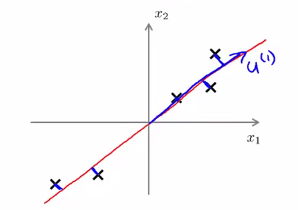
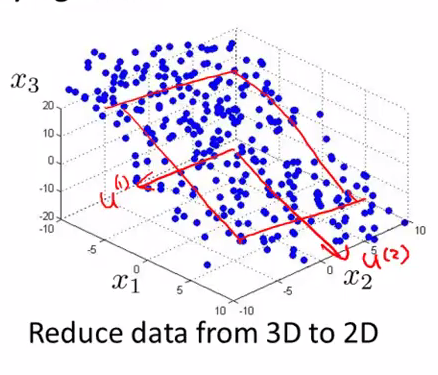
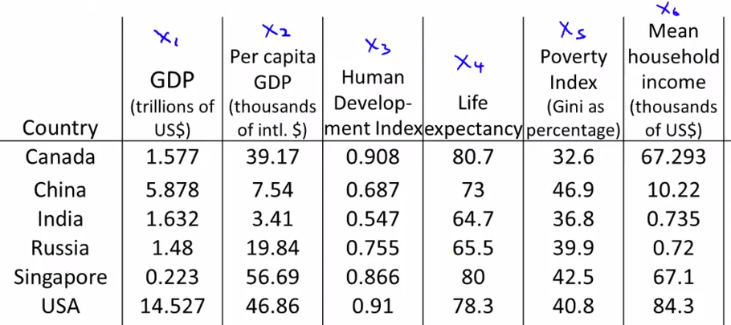
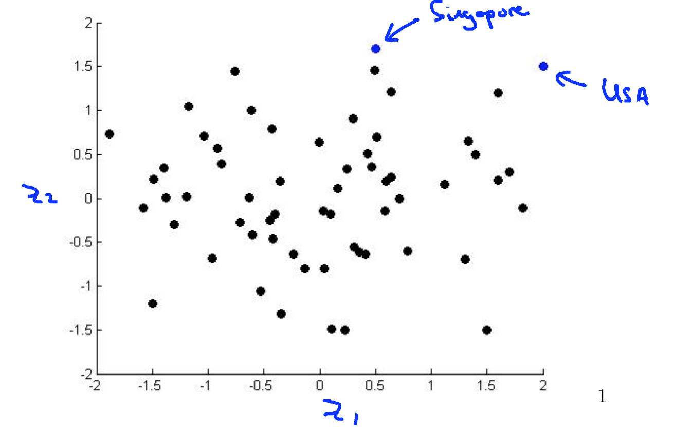

PCA（主成分分析）
===========

PCA，Principle Component Analysis，即主成分分析法，是特征降维的最常用手段。顾名思义，PCA 能从冗余特征中提取主要成分，在不太损失模型质量的情况下，提升了模型训练速度。

</img>

如上图所示，我们将**样本到红色向量的距离**称作是投影误差（Projection Error）。以二维投影到一维为例，PCA 就是要找寻一条直线，使得各个特征的投影误差足够小，这样才能尽可能的保留原特征具有的信息。

假设我们要将特征从 $$n$$ 维度降到 $$k$$ 维：PCA 首先找寻 $$k$$ 个 $$n$$ 维向量，然后将特征投影到这些向量构成的 $$k$$ 维空间，并保证投影误差足够小。下图中中，为了将特征维度从三维降低到二位，PCA 就会先找寻两个三维向量 $$u^{(1)}, u^{(2)}$$，二者构成了一个二维平面，然后将原来的三维特征投影到该二维平面上：

</img>

算法流程
--------------

假定我们需要将特征维度从 $$n$$ 维降到 $$k$$ 维。则 PCA 的执行流程如下：

1. **特征标准化**，平衡各个特征尺度：
$$

x_j^{(i)}=\frac{x_j^{(i)}-\mu_j}{s_j}, \mbox{$\mu_j$ 为特征 $j$ 的均值，$s_j$ 为特征 $j$ 的标准差。}

$$
2. 计算**协方差矩阵** $$\Sigma$$：
$$

\Sigma = \frac{1}{m}\sum\limits_{i=1}^{m}(x^{(i)})(x^{(i)})^T = \frac{1}{m} \cdot X^TX

$$
3. 通过**奇异值分解（SVD）**，求取 $$\Sigma$$ 的特征向量（eigenvectors）：
$$

(U,S,V^T) = SVD(\Sigma)

$$
4. 从 $$U$$ 中取出前 $$k$$ 个左奇异向量，构成一个约减矩阵 $$U{reduce}$$:
$$

U_{reduce} = (u^{(1)},u^{(2)},\cdots,u^{(k)})

$$
5. 计算新的特征向量：$$z^{(i)}$$
$$

z^{(i)}=U_{reduce}^T \cdot x^{(i)}

$$

特征还原
------------------

因为PCA仅保留了特征的主成分，所以PCA是一种有损的压缩方式，假定我们获得新特征向量为：

$$

z = U_{reduce}^Tx

$$

那么，还原后的特征 $$x_{approx}$$ 为：

$$

x_{approx}=U_{reduce}z

$$

</img>

降到多少维才合适？
---------------

从 PCA 的执行流程中，我们知道，需要为 PCA 指定目的维度 $$k$$。如果降维不多，则性能提升不大；如果目标维度太小，则又丢失了许多信息。通常，使用如下的流程的来评估 $$k$$ 值选取优异：

1. 求各样本的**投影均方误差**:
$$

\min\frac{1}{m}\sum\limits_{j=1}^{m}||x^{(i)}-x_{approx}^{(i)}||^2

$$
2. 求数据的**总变差**：
$$

\frac{1}{m}\sum\limits_{j=1}^{m}||x^{(i)}||^2

$$
3. 评估下式是否成立:
$$

\frac{\min\frac{1}{m}\sum\limits_{j=1}^{m}||x^{(i)}-x_{approx}^{(i)}||^2}{\frac{1}{m}\sum\limits_{j=1}^{m}||x^{(i)}||^2} \leq \epsilon

$$

其中，$$\epsilon$$ 的取值可以为 $$0.01,0.05,0.10,⋯0.01,0.05,0.10,⋯$$，假设 $$\epsilon=0.01=0.01$$，我们就说“特征间 99% 的差异性得到保留”。

不要提前优化
------------

由于 PCA 减小了特征维度，因而也有可能带来过拟合的问题。PCA 不是必须的，在机器学习中，一定谨记不要提前优化，只有当算法运行效率不尽如如人意时，再考虑使用 PCA 或者其他特征降维手段来提升训练速度。

不只是加速学习
---------------

降低特征维度不只能加速模型的训练速度，还能帮我们在低维空间分析数据，例如，一个在三维空间完成的聚类问题，我们可以通过 PCA 将特征降低到二维平面进行可视化分析。

例如下表中，我们有将近几十个特征来描述国家的经济水平，但是你仔细观察发现，我们很难直观的看出各个国家的经济差异。

</img>

借助于 PCA，我们将特征降低到了二维，并在二维空间进行观察，很清楚的就能发现美国和新加坡具有很高的经济水平：

</img>

参考资料
-----------
- [强大的矩阵奇异值分解(SVD)及其应用](http://www.cnblogs.com/LeftNotEasy/archive/2011/01/19/svd-and-applications.html)
