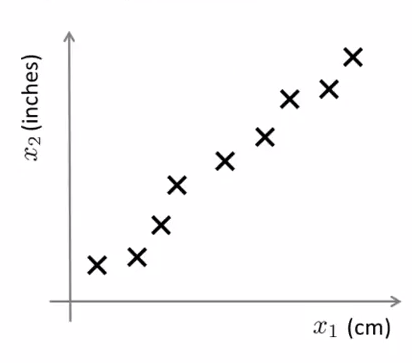
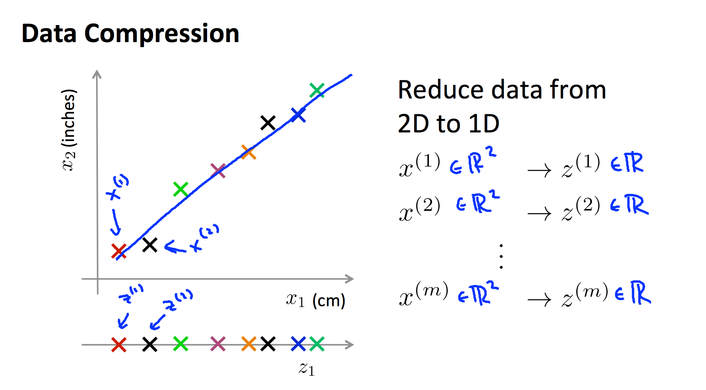
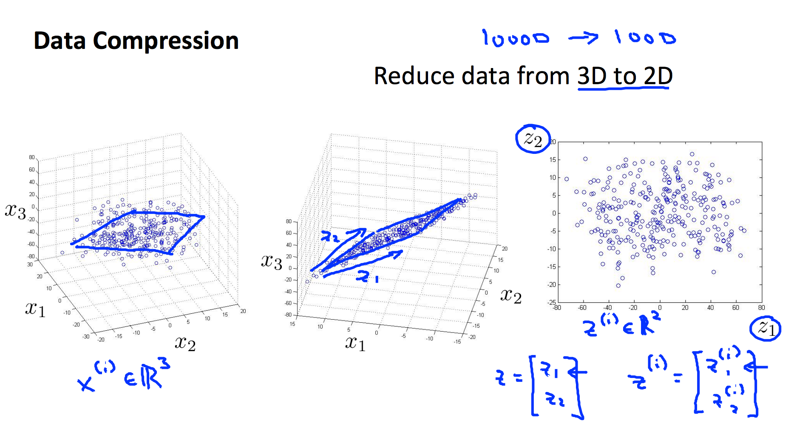

概述
==========

我们很希望有足够多的特征（知识）来保准学习模型的训练效果，尤其在图像处理这类的任务中，高维特征是在所难免的，但是，高维的特征也有几个如下不好的地方：

1. 学习性能下降，知识越多，吸收知识（输入），并且精通知识（学习）的速度就越慢。
2. 过多的特征难于分辨，你很难第一时间认识某个特征代表的意义。
3. 最大的问题：特征冗余，如下例子所示，厘米和英尺就是一对冗余特征，他们本身代表的意义是一样的，并且能够相互转换。

下图中，厘米和英尺就是一对冗余特征：

</img>

我们使用现在使用了一条绿色直线，将各个样本投影到该直线，那么，原来二维的特征 $$x = {厘米，英尺}$$ 就被降低为了一维 $$x = {直线上的相对位置}$$

</img>

而在下面的例子中，我们又将三维特征投影到二位平面，从而将三维特征降到了二维：

</img>

综上，不难发现，特征降维的一般手段就是将高维特征投影到低维空间。
