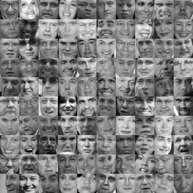
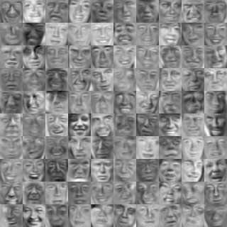

PCA for 加速学习
=============

现在，我们手上有一个人脸数据集，每张图片大小为 $$32 \times 32$$，以像素为特征，则每个特征向量的维度就为 $$1024$$ 维：

<div style="text-align:center">
</img>
</div>

考虑使用 PCA 进行降低特征维度到 $$100$$ 维：

```python
# coding: utf8
# pca/test_pca4visualization.py

import pca
import numpy as np
import matplotlib.pyplot as plt
from scipy.io import loadmat

def display(images, width, height):
    """展示图片

    Args:
        images 图像样本
        width 图像宽
        height 图像高
    """
    m, n = images.shape
    rows = int(np.floor(np.sqrt(m)))
    cols = int(np.ceil(m / rows))
    # 图像拼接
    dstImage = images.copy()
    dstImage = np.zeros((rows * height, cols * width))
    for i in range(rows):
        for j in range(cols):
            idx = cols * i + j
            image = images[idx].reshape(height, width)
            dstImage[i * height:i * height + height,
                     j * width: j * width + width] = image
    plt.imshow(dstImage.T, cmap='gray')
    plt.axis('off')
    plt.show()

data = loadmat('data/ex7faces.mat')
X = np.mat(data['X'],dtype=np.float32)
m, n = X.shape

# 展示原图
display(X[0:100, :], 32, 32)

XNorm, Z, U, UReduce, S, V = pca.PCA(X, k=100)
XRec = pca.recover(UReduce, Z)

# 显示修复后的图，可以看出，PCA 损失了一部分细节
display(XRec[0:100, :], 32, 32)
```

现在，我们的人脸数据变得模糊，但是眼睛，鼻子，嘴唇等特征仍然可辨识：

<div style="text-align:center">
</img>
</div>
