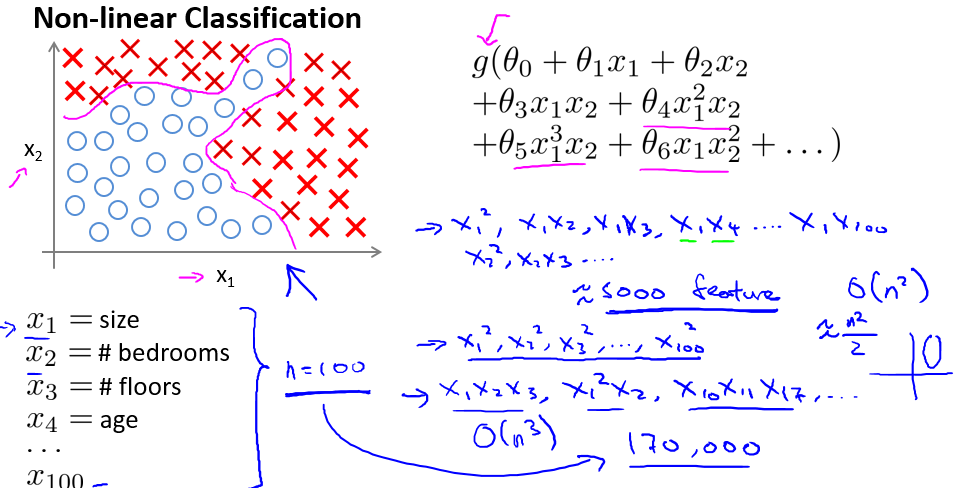
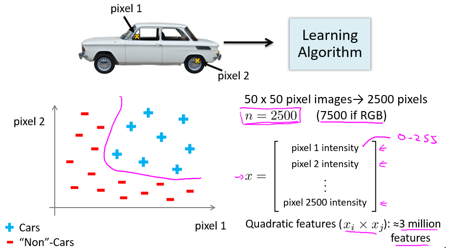

再论 0/1 分类问题
=============

在逻辑回归一章中，我们讨论了 0/1 分类问题，并且知道，通过对特征进行多项式展开，可以让逻辑回归支持非线性的分类问题。假定我们现在有 $$n$$ 维特征，需要进行非线性分类，采用二次多项式扩展特征后，特征个数就为 $$n+C_n^2 \approx \frac{n^2}{2}$$ 个特征，特征的空间复杂度就为 $$O(n^2)$$，如果扩展到三次多项式，则空间复杂度能达到 $$O(n^3)$$。下图中，房屋的特征由原来的 2 维增加到了 100 维，进行二次多项式扩展后，特征个数达到了约 5000 维，对计算机的性能提出了很大的挑战：

</img>

也许上例略显夸张，但并不是高维特征不会出现，在计算机视觉（CV）领域，图像的特征往往都是高维的。下图中，我们想要区分一幅图像是否是汽车图像，假定图像分辨率为 $$50 \times 50$$，且每个像素的灰度都为一个特征，那么一副图像的特征维度就高达 2500 维，进行二次多项式扩展后，特征维度更是达到了约 3000000：

</img>

因此，就需要考虑用新的机器学习模型来处理高维特征的非线性分类问题，神经网络是典型的不需要增加特征数目就能完成非线性分类问题的模型。
