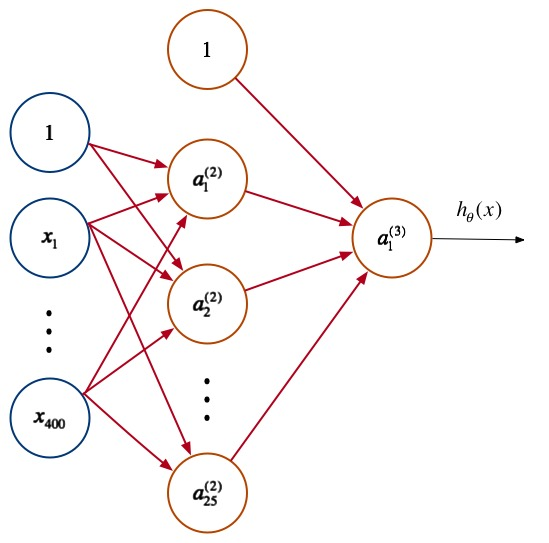
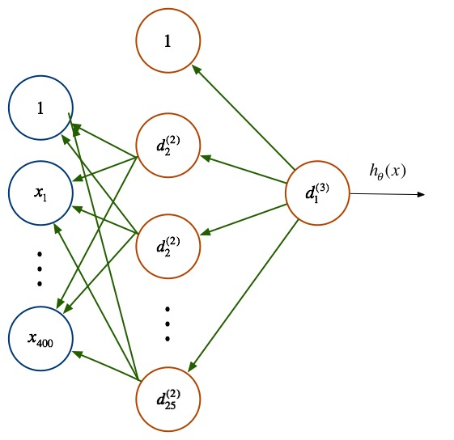

前向传播与反向传播
=================

前向传播过程（Forward Propagation）
---------

神经网络每层都包含有若干神经元，层间的神经元通过**权值矩阵 $$\Theta^{l}$$ **连接。一次信息传递过程可以如下描述：

1. 第$$j$$层神经元接收上层传入的**刺激（神经冲动）**：
$$

z^{(j)} = \Theta^{(j-1)}a^{(j-1)}

$$
2. 该刺激经**激励函数（activation function）$$g$$ **作用后，会产生一个激活向量 $$a^{j}$$，$$a_i^{j}$$ 表示的就是 $$j$$ 层第 $$i$$ 个神经元获得的**激活值（activation）**：
$$

a^{(j)} = g(z^{(j)})

$$

这个过程，因为发生顺序是不断地将刺激由前一层传向下一层，故而称之为**前向传递**（Forward Propagation）。

假定我们的神经网络只含有一层隐含层（添加了偏移量 $$x_0$$ ）：

$$

\begin{bmatrix}
x_0
\newline x_1 \newline x_2 \newline x_3
\end{bmatrix}
\rightarrow
\begin{bmatrix}
a_1^{(2)} \newline a_2^{(2)} \newline a_3^{(2)} \newline
\end{bmatrix}
\begin{bmatrix}
a_1^{(3)}
\end{bmatrix}
\rightarrow
h_\theta(x)

$$

那么前向传播的过程可表示为如下：

$$

\begin{align*}
a^{(1)} &= x \newline
z^{(2)} &= \Theta^{(1)}a^{(1)} \newline
a^{(2)} &= g(z^{(2)}) \newline
z^{(3)} &= \Theta^{(3)}a^{(3)} \newline
a^{(3)} &= g(z^{(3)}) \newline
h_\Theta(x) &= a^{(3)}
\end{align*}

$$

对于非线性分类问题，逻辑回归会使用多项式扩展特征，导致维度巨大的特征向量出现，而在神经网络中，并不会增加特征的维度，即不会扩展神经网络输入层的规模，而是通过增加隐含层，矫正隐含层中的权值，来不断优化特征，前向传播过程每次在神经元上产出的**激励值**都可看做是优化后的特征。

</img>

代价函数
-----------------
我们令：

$$

\begin{align*}
L &= \mbox{神经网络总共包含的层数} \\
s_l &= \mbox{第$l$层的神经元数目} \\
K &= \mbox{输出层的神经元数，亦即分类的数目}
\end{align*}

$$

神经网络的层与层之间都可以看做构成了一个多个逻辑回归问题（根据神经元的数量），因此，其代价函数与逻辑回归的代价函数类似，其中 $$K$$ 代表类别，$$l$$ 表示层级，并且考虑了正规化：

$$

\begin{gather*}
J(\Theta) = - \frac{1}{m} \sum_{i=1}^m \sum_{k=1}^K \left[y^{(i)}_k \log ((h_\Theta (x^{(i)}))_k) + (1 - y^{(i)}_k)\log (1 - (h_\Theta(x^{(i)}))_k)\right] + \frac{\lambda}{2m}\sum_{l=1}^{L-1} \sum_{i=1}^{s_l} \sum_{j=1}^{s_{l+1}} ( \Theta_{j,i}^{(l)})^2
\end{gather*}

$$

矩阵的表示为：

$$

\begin{gather*}
J(\Theta) = - \frac{1}{m}\sum(Y^{T} .* log(\Theta A)) + log(1-\Theta A).*(1-Y^{T}))
\end{gather*}

$$

其中，$$.*$$ 代表点乘操作，$$A \in R^{K \times m}$$ 为所有样本对应的输出矩阵，其每一列对应一个样本的输出，$$Y \in R^{m \times K}$$ 为标签矩阵，其每行对应一个样本的类型。

反向传播过程（Back Propagation）
-------------------

与回归问题一样，我们也需要通过最小化代价函数 $$J(\Theta)$$ 来优化预测精度的，但是，由于神经网络允许多个隐含层，即，各层的神经元都会产出预测，因此，就不能直接利用传统回归问题的梯度下降法来最小化 $$J(\Theta)$$，而需要逐层考虑预测误差，并且逐层优化。为此，在多层神经网络中，使用反向传播算法（Backpropagation Algorithm）来优化预测，首先定义各层的预测误差为向量 $$\delta^{(l)}$$：

$$

\delta^{(l)} =
\begin{cases}
a^{(l)} - y & \mbox{$l=L$}\\
(\Theta^{(l)}\delta^{(l+1)})^T .*g'(z^{(l)}) & \mbox{$l=2,3,...,L-1$}
\end{cases}

$$

其中：

$$

g'(z^{(l)}) = a^{(l)} .* (1-a^{(l)})

$$

反向传播中的反向二字也正是从该公式中得来，本层的误差 $$\delta^{l}$$ 需要由下一层的误差 $$\delta^{(l+1)}$$ **反向**推导。

</img>

完整训练过程
------------

假定有训练集 $${(x^{(1)}, y^{(1)}),...,(x^{(m)},y^{(m)})}$$，使用了反向传播的神经网络训练过程如下：

1. for all l,i,j，初始化权值梯度 $$\Delta^{(l)}$$:
$$

\Delta_{ij}^{(l)} = 0

$$
2. for $$i=1$$ to $$m$$:
$$

\begin{align*}
& \mbox{令 $a^{(1)} = x^{i}$} \\
& \mbox{执行前向传播算法，计算各层的激活向量：$a^{(l)}$} \\
& \mbox{通过标签向量 $y^{(i)}$，计算输出层的误差向量：$\delta^{(L)} = a^{(L)} - y^{(i)}$} \\
& \mbox{反向依次计算其他层误差向量：$\delta^{(L-1)},\delta^{(L-2)},...,\delta^{(2)}$} \\
& \mbox{求 $\Delta_{ij}^{(l)} = a_j^{(l)}\delta_i^{(l+1)}$，即：$\Delta^{(l)} = \delta^{(l+1)}(a^{(l)})^T$} \\
\end{align*}

$$
3. 求各层权值的更新增量 $$D^{(l)}$$，连接偏置的权值不进行正规化：
$$

D^{(l)}_{i,j} =
\begin{cases}
\dfrac{1}{m}(\Delta^{(l)}_{i,j} + \lambda\Theta^{(l)}_{i,j}), \mbox{if $j \neq 0$} \\
\frac{1}{m}\Delta_{ij}^{(l)}, \mbox{if $j=0$}
\end{cases}

$$
4. 更新各层的权值矩阵 $$\Theta^{(l)}$$，其中 $$\alpha$$ 为学习率：
$$

\Theta^{(l)} = \Theta^{(l)} + \alpha D^{(l)}

$$
