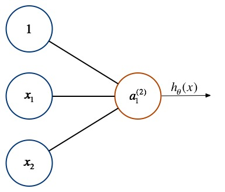

感知器
============

[感知器](https://zh.wikipedia.org/wiki/%E6%84%9F%E7%9F%A5%E5%99%A8)是最简单的神经网络结果，其不包含隐含层：

</img>

数学的简单表单为：

$$

\begin{bmatrix}
x_0
\newline x_1 \newline x_2 \newline x_3
\end{bmatrix}
\rightarrow
\begin{bmatrix}
a_1^{(2)}
\end{bmatrix}
\rightarrow
h_\theta(x)

$$

其输出为：

$$

h_\theta(x) = a_1(2) = \Theta^{(1)}a^{(1)} = \Theta^{(1)}x

$$

这个预测函数是不是和之前学习的回归问题类似，实际上回归问题算是感知器的非网络表达形式。
