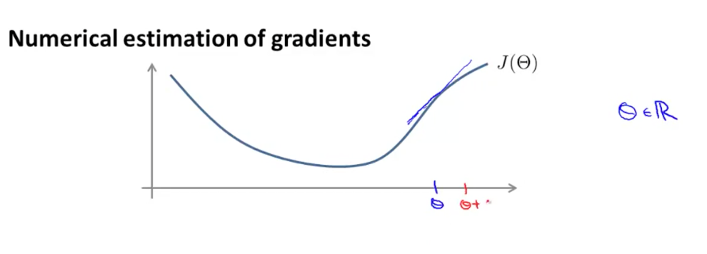
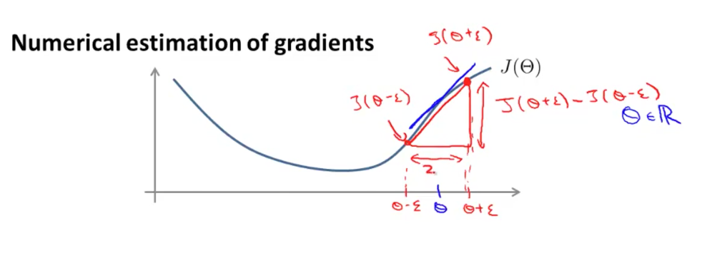

梯度校验（Gradient Checking）
==============

通常，直接使用BP算法可能会出现许多 bug，因此，需要使用称为**梯度校验（Gradient Checking）**的手段。我们知道，$$J(\Theta)$$ 在 $$\Theta$$ 处的倒数 $$\frac{d}{d\Theta}J(\Theta)$$ 为该点的斜率，如下图蓝色线段所示：

</img>

我们可以在点 $$\Theta$$ 附近的小区间 $$[\Theta-\epsilon,\Theta+\epsilon]$$（$$\epsilon$$ 足够小），构造下图所示的红色直角三角形：

</img>

则斜边的斜率可以近似等于蓝色线段的斜率，亦即，可以通过求取红色斜边的斜率来近似 $$\frac{d}{d\Theta}J(\Theta)$$：

$$

\frac{d}{d\Theta}J(\Theta) \approx \frac{J(\Theta+\epsilon)-J(\Theta-\epsilon)}{2\epsilon}

$$

> 通常，$$\epsilon$$ 取较小值，如 $$0.01$$。

包含有梯度校验的 BP 算法如下：

1. 首先由反向传播算法获得展开的 $$DVec$$:
$$

DVec = [D^{(1)},D^{(2)},D^{(3)},...D^{(n)}]

$$
2. 计算梯度近似 $$gradApprox$$，$$\theta_j$$ 是 $$\Theta^{j}$$ 的展开：
$$

\begin{align*}
& \dfrac{\partial}{\partial\theta_j}J(\theta) \approx \dfrac{J(\theta_1, \dots, \theta_j + \epsilon, \dots, \theta_n) - J(\theta_1, \dots, \theta_j - \epsilon, \dots, \theta_n)}{2\epsilon},\mbox{for $j=1$ to $n$} \\

& gradApprox = [\dfrac{\partial}{\partial\theta_1}J(\theta), \dfrac{\partial}{\partial\theta_2}J(\theta), ..., \dfrac{\partial}{\partial\theta_n}J(\theta)]
\end{align*}

$$
3. 比较 $$gradApprox$$ 与 $$DVec$$ 的相似程度（比如可以用[欧氏距离](https://zh.wikipedia.org/wiki/%E6%AC%A7%E5%87%A0%E9%87%8C%E5%BE%97%E8%B7%9D%E7%A6%BB)）：

$$

gradApprox \approx DVec

$$

如果上式成立，则证明网络中BP算法有效，此时关闭梯度校验算法（因为梯度的近似计算效率很慢），继续网络的训练过程。
