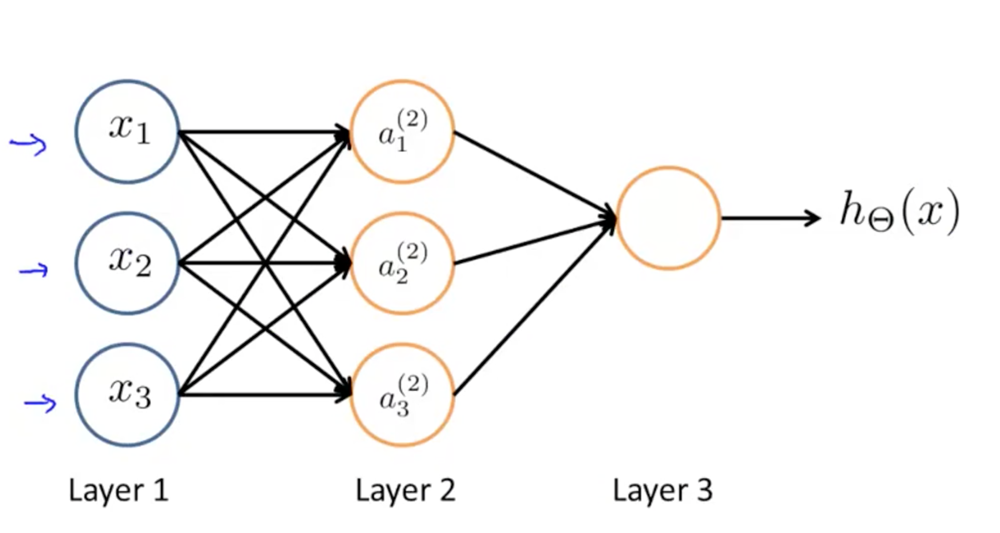

神经网络概述
=============

人体神经元模型
-----------

</img>

神经元的可以分为四个区域：

- **接收区（receptive zone）**：树突接收到输入信息。
- **触发区（trigger zone）**：位于轴突和细胞体交接的地方，决定是否产生神经冲动。
- **传导区（conducting zone）**：由轴突进行神经冲动的传递。
- **输出区（output zone）**：神经冲动的目的就是要让神经末梢，突触的神经递质或电力释出，才能影响下一个接受的细胞（神经元、肌肉细胞或是腺体细胞），此称为突触传递。

人工神经网络
------------

人工神经网络（ANN：Artificial Neural Network），简称神经网络（NN：Neural Network）。迄今为止，人工神经网络尚无统一定义，其实一种模拟了人体神经元构成的数学模型，依靠系统的复杂程度，通过调整内部大量节点之间相互连接的关系，从而达到处理信息的目的。

</img>

上图显示了人工神经网络是一个分层模型，逻辑上可以分为三层：

- **输入层**：输入层接收特征向量 $$x$$。
- **输出层**：输出层产出最终的预测 $$h$$。
- **隐含层**：隐含层介于输入层与输出层之间，之所以称之为隐含层，是因为当中产生的值并不像输入层使用的样本矩阵 $$X$$ 或者输出层用到的标签矩阵 $$y$$ 那样直接可见。

参考资料
------------

[维基百科-神经元](https://zh.wikipedia.org/wiki/%E7%A5%9E%E7%B6%93%E5%85%83)
