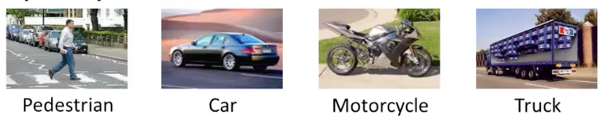
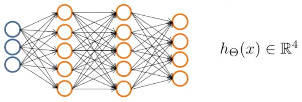

神经网络解决多分类问题
==============

假定我们需要将图像分为四类：

1. 行人图像
2. 车辆图像
3. 摩托车图像
4. 卡车图像

</img>

这是一个多分类问题，由于图像特征较多，因此我们可以考虑设计含有多个隐含层的神经网络来完成特征优化（扩展）：

</img>

注意，我们设计了一个含有多个输出的神经网络，亦即，我们会用01的组合来定义不同的分类：

$$

y^{(i)} =
\begin{bmatrix}
1 \\ 0 \\ 0 \\0
\end{bmatrix},
\begin{bmatrix}
0 \\ 1 \\ 0 \\0
\end{bmatrix},
\begin{bmatrix}
0 \\ 0 \\ 1 \\0
\end{bmatrix},
\begin{bmatrix}
0 \\ 0 \\ 0 \\1
\end{bmatrix},

$$

而不是使用标量来定义分类，这样使得我们容易利用上简单的 sigmoid 函数来进行预测：

$$

y^{(i)} = 1,2,3,4

$$

整个网络的数学表达就可描述为

$$

\begin{align*}
\begin{bmatrix}
x_0 \\ x_1 \\ x_2 \\ \cdots x_n
\end{bmatrix}
\rightarrow
\begin{bmatrix}
a_0^{(2)} \\ a_1^{(2)} \\ a_2^{(2)} \\ \cdots
\end{bmatrix}
\rightarrow
\begin{bmatrix}
a_0^{(3)} \\ a_1^{(3)} \\ a_2^{(3)} \\ \cdots
\end{bmatrix}
\cdots
\begin{bmatrix}
h_\Theta(x)_1 \\ h_\Theta(x)_2 \\ h_\Theta(x)_3 \\ h_\Theta(x)_4
\end{bmatrix}
\end{align*}

$$
