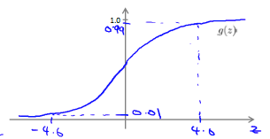
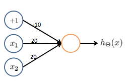

神经网络解决逻辑运算问题
==============

神经网络通过不同的架构设置，来完成不同的任务，比如我们看到一半的逻辑**与**运算：

$$

\begin{cases}
x_1 AND x_2 =
1 & \mbox{if $x_1=1$ and $x_2=1$}\\
0 & \mbox{otherwise}
\end{cases}

$$

可以发现，逻辑运算可以转换为一个**01分类问题**。在sigmoid函数中:

$$

g(4) \approx 1 \\
g(-4) \approx 0

$$

因此，我们采用感知器神经网络：

$$

\begin{align*}
\begin{bmatrix}
x_0 \newline x_1 \newline x_2
\end{bmatrix}
\rightarrow
\begin{bmatrix}
g(z^{(2)})
\end{bmatrix}
\rightarrow
h_\Theta(x)
\end{align*}

$$

并令：

$$

\Theta^{(1)} =
\begin{bmatrix}
-30 & 20 & 20
\end{bmatrix}

$$

生成的神经网络如下图所示：

得到的逻辑运算结果：

$$

\begin{align*}
& h_\Theta(x) = g(-30 + 20x_1 + 20x_2) \newline \newline
& x_1 = 0 \ \ and \ \ x_2 = 0 \ \ then \ \ g(-30) \approx 0 \newline
& x_1 = 0 \ \ and \ \ x_2 = 1 \ \ then \ \ g(-10) \approx 0 \newline
& x_1 = 1 \ \ and \ \ x_2 = 0 \ \ then \ \ g(-10) \approx 0 \newline
& x_1 = 1 \ \ and \ \ x_2 = 1 \ \ then \ \ g(10) \approx 1
\end{align*}

$$

当然，这是手动进行定义的参数，我们也可以初始化如下样本对神经网络进行训练：

$$

X =
\begin{bmatrix}
0 & 0 & 0 \\
1 & 0 & 0 \\
0 & 1 & 0 \\
0 & 0 & 1
\end{bmatrix}

$$

代码及实现可以参看[程序示例](../codes/逻辑运算.html)
