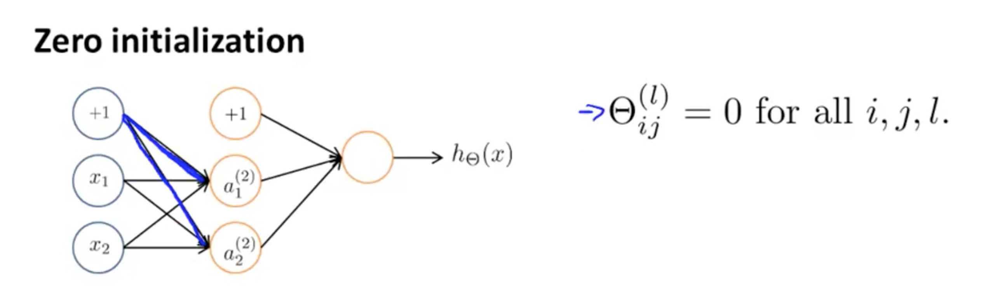

权值初始化
============

0 值初始化
--------------

在逻辑回归中，我们通常会初始化所有权值为 $$0$$，假如在如下的神经网络也采用 0 值初始化：

<div style="text-align: center">
</img>
</div>

则可以得到：

$$

\begin{align*}
& a_1^{(1)} = a_2^{(2)} \\
& \mbox{则 $\delta_1^{(1)} = \delta_2^{(1)}$} \\
& \mbox{则 $\frac{\partial}{\partial \Theta_{01}^{(1)}J(\Theta)}$} = \frac{\partial}{\partial \Theta_{02}^{(1)}}J(\Theta) \\
& \mbox{则更新后的权值：$\Theta_{01}^{(1)}$} = \Theta_{02}^{(1)}
\end{align*}

$$

亦即，每次迭代，所有权值的数值都一样，这意味着，隐含层的神经元激活值也将一样，也就是无论隐含层层数有多少，各层的神经元有多少，由于各层的神经元激活值大小一样，也就相当于各层只有一个有效神经元（特征），这就失去了神经网络进行特征扩展和优化的本意了。

随机初始化
--------------------

我们看到了固定值初始化将会是神经网络丧失其特性，因此，对于各层的权值矩阵，采用随机初始化策略。随机值产生的区间我们定义为 $$[-\epsilon, +\epsilon]$$，并假定：

$$

\Theta^{(1)} \in R^{10 \times 11}, \Theta^{(2)} \in R^{1 \times 11}

$$

在 matlab 中，随机初始化权值的代码如下：

```matlab
Theta1 = rand(10,11) * (2 * INIT_EPSILON) - INIT_EPSILON;
Theta2 = rand(10,11) * (2 * INIT_EPSILON) - INIT_EPSILON;
```

在 python 中，随机初始化权值的代码如下：

```python
import numpy as np
# ...
Theta1 = np.random.rand(10,11) * (2 * INIT_EPSILON) - INIT_EPSILON
Theta2 = np.random.rand(1,11) * (2 * INIT_EPSILON) - INIT_EPSILON
````
