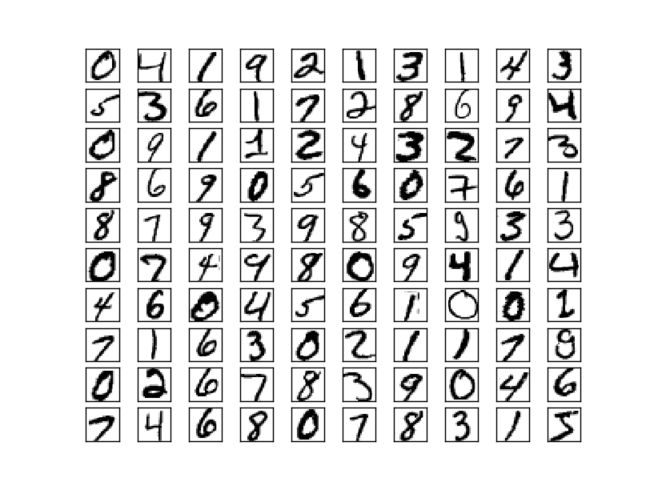
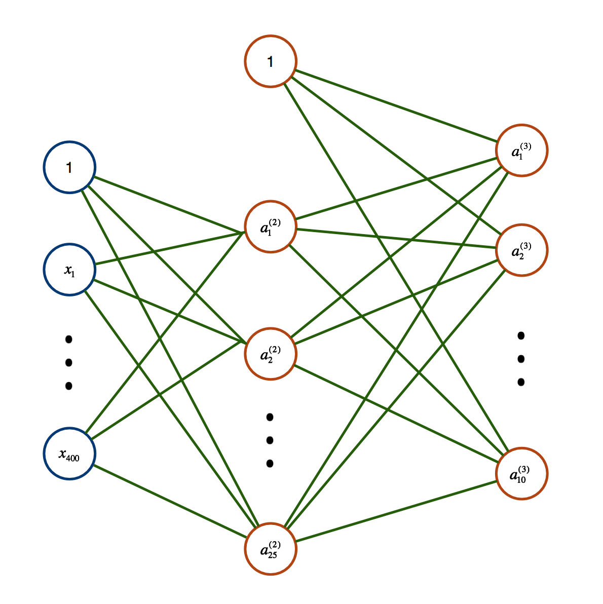

程序示例--多分类问题
===========

我们手上包含有手写字符的数据集，该数据集来自斯坦福机器学习的课后作业，每个字符图片大小为 $$20\times20$$，总的样本规模为 $$5000 \times 400$$，

<div style="text-align: center">
</img>
</div>

我们的神经网络设计如下，包含 1 个隐含层，隐层含 25 个神经元，：

<div style="text-align: center">
</img>
</div>

```python
# coding: utf-8
# neural_network/test_handwritten_digits.py
"""手写字符集
"""
import nn
import numpy as np
from sklearn import datasets
from scipy.io import loadmat

data = loadmat('data/handwritten_digits.mat')
Thetas = loadmat('data/ex4weights.mat')
Thetas = [Thetas['Theta1'], Thetas['Theta2']]

X = np.mat(data['X'])
y = np.mat(data['y'])

res = nn.train(X,y,hiddenNum=1,unitNum=25,Thetas=Thetas, precision = 0.5)
print 'Error is: %.4f'%res['error']
```

> 初始化的权值矩阵来自斯坦福课后作业提供的初始化权值

运行结果如下：

```sh
Doing Gradient Checking....
Error is: 0.2876
```
