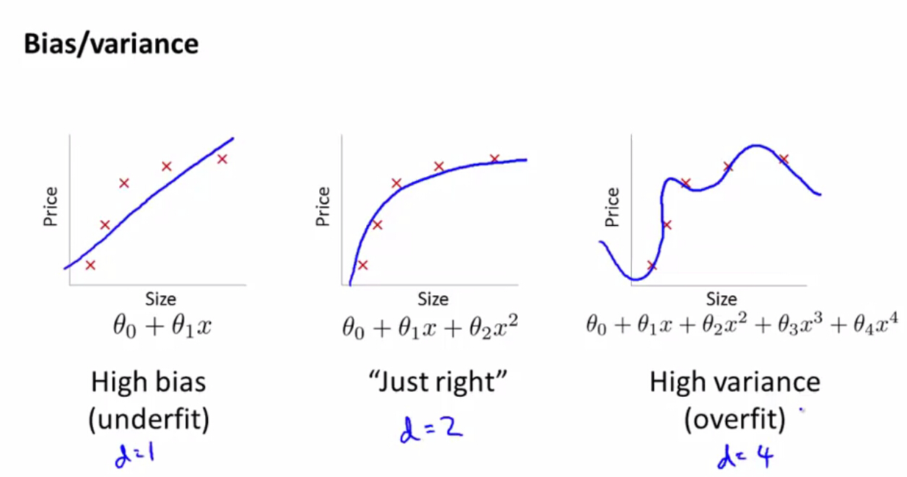
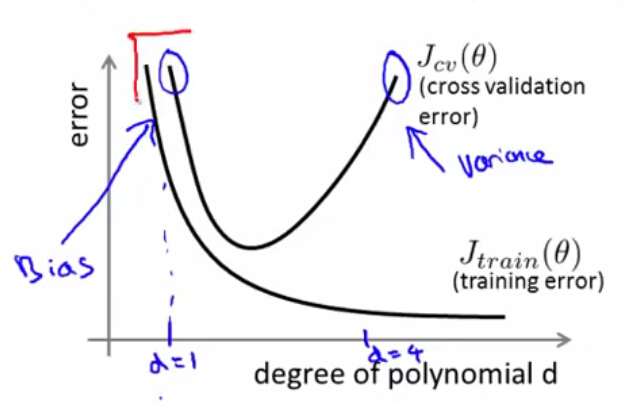
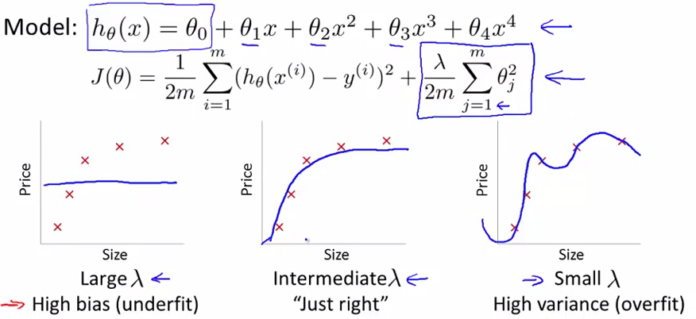
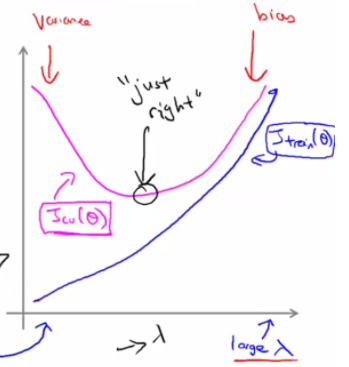
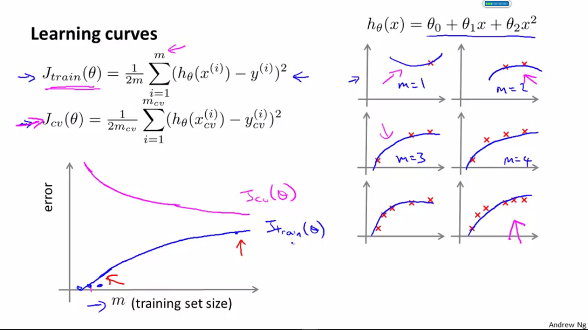
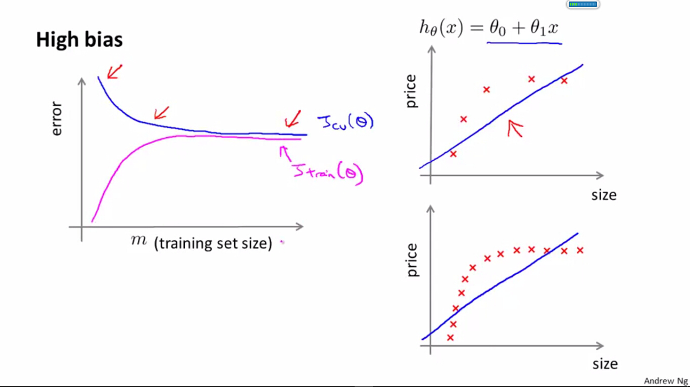
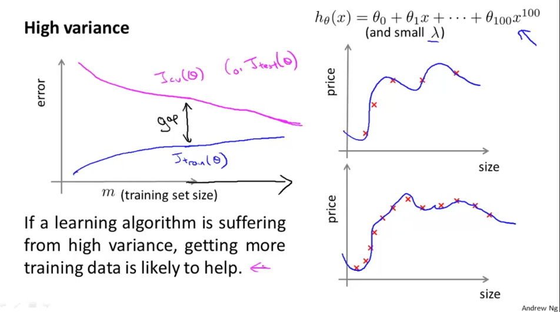
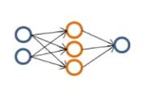
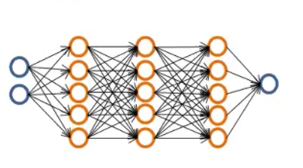

偏差与方差
==============

在机器学习中，**偏差（bias）**反映了模型无法描述数据规律，而**方差（variance）**反映了模型对训练集过度敏感，而丢失了数据规律，高偏差和高方差都会造成新数据到来时，模型给出错误的预测。

通过**诊断（Diagnose）**模型是出现了高偏差问题还是高方差问题，我们能对症下药，采取不同的解决策略。

多项式回归中偏差与方差
-----------------

</img>

在前面的章节中，我们知道，多项式回归中，如果多项式次数较高，则容易造成过拟合，此时训练误差很低，但是对于新数据的泛化能力较差，导致交叉验证集和测试集的误差都很高，此时模型出现了**高方差**：

$$

\begin{align*}
& \mbox{$J_{train}(\theta)$ is small} \\
& J_{cv}(\theta) >> j_{test}(\theta)
\end{align*}

$$

而当次数较低时，又易出现欠拟合的状况，此时无论是训练集，交叉验证集，还是测试集，都会有很高的误差，此时模型出现了**高偏差**：

$$

\begin{align*}
& \mbox{$J_{train}(\theta)$ is large} \\
& J_{cv}(\theta) \approx j_{test}(\theta)
\end{align*}

$$

下图反映了训练集、交叉验证集误差随多项式次数 $$d$$ 的变化规律：

</img>

正规化过程的偏差与方差
------------------

正规化（Regularization）能帮我们解决过拟合问题，$$\lambda$$ 取值越大，对参数 $$\theta$$ 的惩罚力度就越大，能够帮助解决过拟合问题，但是，如果惩罚过重，也会造成欠拟合问题，即会出现**高偏差**。如果 $$\lambda$$ 取值较小，则意味着没有惩罚 $$\theta$$，也就不能解决过拟合问题，会出校**高方差**：

</img>

下图反映了正规化过程中，训练集、交叉验证集误差随 $$\lambda$$ 变化的曲线：

</img>

样本数目对与偏差方差的影响
---------------

当训练样本的数目$$m$$较小时，意味着可供学习的知识较少，则模型在训练阶段不容易犯错误（训练集误差极低），但也发现不了数据的规律（交叉验证集误差极高）；而当样本数目增多时，意味着需要学习的知识增多，则模型虽然在训练阶段容易犯一些错（训练集误差开始增高），但也更容易探测出数据规律（交叉验证集误差降低）：

</img>

如果模型出现了**高偏差**，即出现了欠拟合，学习曲线随样本数目的变化曲线如下图所示，即增加样本数目，仍无法显著降低交叉验证集误差，即无法提高模型的泛化能力：

</img>

如果模型出现了**高方差**，即出现了过拟合，学习曲线随着样本数目变化的曲线如下图所示，即增加样本数目，可以显著降低交叉验证集的误差，提高模型的泛化能力：

</img>

神经网络结构对偏差方差的影响
----------------

当神经网络的结构**简单**时，则易出现高偏差：

</img>

当神经网络的结构过于**复杂**时，则易出现高方差，此时可以通过增大 $$\lambda$$ 来解决：

</img>

总结
---------------

现在，通过诊断模型是出现了高偏差还是高方差问题，我们对于在[陷入不归路的调试](./陷入不归路的调试.html)中提到算法优化手段有了各自的使用场景：

| 手段                   | 使用场景   |
|:-----------------------|:-----------|
| 采集更多的样本       | **高方差** |
| 降低特征维度         | **高方差** |
| 采集更多的特征       | **高偏差** |
| 进行高次多项式回归   | **高偏差** |
| 降低参数 $$\lambda$$ | **高方差** |
| 增大参数 $$\lambda$$ | **高偏差** |
