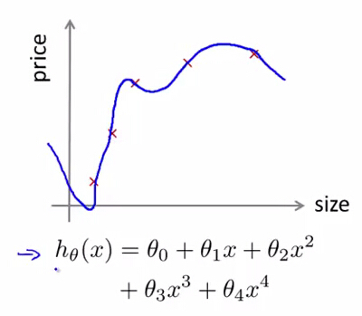

数据集划分
=============

测试集
---------

在线性回归的章节中，我们已经知道，仅仅具备一个很小的训练误差并不能保证我们的预测函数就是优秀的，因为这种“优秀”仅仅体现在了对于已知的训练样本的假设上，而无法保证见到新的样本时候还能做出足够好的预测，过拟合就是当中的典型例子：

</img>

因此，预测准不准应当反映在对于新样本的泛化（generalize）能力。我们考虑将数据集划分为：

- **训练集**：70%
- **测试集**：30%

> 在对数据集进行训练集和测试集的划分前，最好先对数据集进行乱序，防止类似样本聚到一起

引入如下符号：

- $$(x^{(1)},y^{(1)})$$：训练样本
- $$(x_{test}^{(1)},y_{test}^{(1)})$$：测试样本
- $$m$$：训练集样本容量
- $$m_{test}$$：测试集样本容量

### 线性回归的测试误差

在线性回归中，我们就通过计算测试集的代价函数来评估参数 $$\theta$$ 的泛化能力：

$$

J_{test} = \frac{1}{2m_{test}}\sum_{i=1}^{m_{test}}(h_{\theta}(x_{test}^{(i)})-y_{test}^{(i)})^2

$$

### 逻辑回归的测试误差

在逻辑回归中，测试集的代价函数为：

$$

J_{test}(\theta)=-\frac{1}{m_{test}}\sum\limits_{i=1}^{m_{test}}(y_{test}^{(i)}logh_\theta(x_{test}^{(i)})+(1-y_{test}^{(i)})logh_\theta(x_{test}^{(i)}))

$$

由于逻辑回归处理的是 0/1 分类问题，其预测结果只有正确与错误之分，所以引入误分率（Misclassification Error）：

$$

err(h_\theta(x),y)=
\begin{cases} 1,&\mbox{if $h_\theta(x) \geq 0.5,y=0 $ or $h_\theta(x) \lt 0.5,y=1$} \\
0, & \mbox{otherwise}
\end{cases}

$$

则逻辑回归中的测试误差可以表示为：

$$

Test_{error} = \frac{1}{m_{test}}\sum\limits_{1}^{m_{test}}err(h_\theta(x_{test}^{(i)}),y_{test}^{(i)})

$$

交叉验证集
---------------

在多项式回归中，我们总是尝试不同的多项式次数（$$degree$$），形成了不同的预测模型：

$$

\begin{align*}

& 1. \quad h_\theta(x) = \theta_0+\theta_1x \\
& 2. \quad h_\theta(x) = \theta_0+\theta_1x+\theta_2x^2 \\
& 3. \quad h_\theta(x) = \theta_0+\theta_1x+...+\theta_3x^3 \\
& 4. \quad h_\theta(x) = \theta_0+\theta_1x+...+\theta_4x^4 \\
& 5. \quad h_\theta(x) = \theta_0+\theta_1x+...+\theta_5x^5

\end{align*}

$$

我们计算各个模型的对应的测试误差，假设 $$degree=5$$ 时，测试误差最小，我们就选出了以下模型来迎接新的样本：

$$

h_\theta(x) = \theta_0+\theta_1x+...+\theta_5x^{5}

$$

对于 $$degree$$ 的确定，是我们对于模型的选择（Model Selection），正如我们在线性回归中确定 $$\theta$$ 一样。在线性回归中，我们通过训练集确定模型，测试集来评估模型的泛化能力。在多项式回归中，我们通过训练集获得了参数 $$\theta$$，而通过测试集确定了模型，那么，这两个集合用完了，我们就缺少评估模型泛化能力的数据集。鉴于此，引入了**交叉验证集（Cross Validation Set）**，**“交叉”**二字体现了一种承上启下的关系，他通过训练集获得的结果，选择了模型，并将该模型交给测试集进行评估：

- **训练集**：60%，确定参数 $$\theta$$
- **交叉验证集**：20%，进行模型选择。
- **测试集**：20%，评价模型预测能力。

三者的误差函数如下：

- **训练集误差**：

$$

J_{train}(\theta) = \frac{1}{2m}\sum\limits_{i=1}^{m_{train}}(h_\theta(x_{train}^{(i)})-y_{train}^{(i)})^2

$$

- **交叉验证集误差**：

$$

J_{cv}(\theta) = \frac{1}{2m}\sum\limits_{i=1}^{m_{cv}}(h_\theta(x_{cv}^{(i)})-y_{cv}^{(i)})^2

$$

- **测试集误差**：

$$

J_{test}(\theta) = \frac{1}{2m}\sum\limits_{i=1}^{m_{test}}(h_\theta(x_{test}^{(i)})-y_{test}^{(i)})^2

$$
