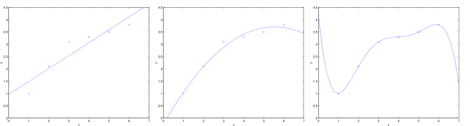
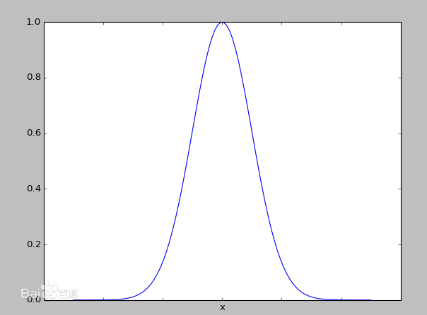

# 欠拟合与过拟合
## 问题
在上一节中，我们利用多项式回归获得更加准确的拟合曲线，从拟合欠佳到拟合合适。然而，又时有可能发生过度拟合，借此，引出两个概念：
- __欠拟合（underfitting）__：拟合程度不高，数据距离拟合曲线较远，如下左图所示。

- __过拟合（overfitting）__：过度拟合，貌似拟合几乎每一个数据，但是丢失了信息规律，如下右图所示，房价随着房屋面积的增加反而降低了。

## 解决--局部加权线性回归（LWR）
为了解决欠拟合和过拟合问题，引入了__局部加权线性回归（Locally Weight linear Regression）__。在一般的线性回归算法中，对于某个输入向量$$x$$，我们这样预测输出$$y$$：
1. 修正$$\theta$$来最小化$$\sum_i(y_i-\theta^Tx^{(i)})^2$$
2. 进行预测：$$\theta^Tx$$

而在局部加权线性回归中：
1. 修正$$\theta$$来最小化$$\sum_iw^{(i)}(y_i-\theta^Tx^{(i)})^2$$
2. 进行预测：$$\theta^Tx$$

在__LWR__中，我们对一个输入$$x$$进行预测时，赋予了$$x$$周围点不同的权值，距离$$x$$越近，权重越高。整个学习过程中误差将会取决于$$x$$周围的误差，而不是整体的误差，这也就是__局部__一词的由来。

通常，$$w^{(i)}$$定义如下，服从高斯分布，在$$x$$周围呈指数型衰减：
$$

w^{(i)} = e^{-\frac{(x^{(i)}-x)^2}{2\tau^2}}

$$

另外，LWR属于非参数（non-parametric）学习算法，所谓的非参数学习算法指的是没有明确的参数（比如上述的$$theta$$取决于当前要预测的$$x$$），每进行一次预测，就需要重新进行训练。而一般的线性回归属于参数（parametric）学习算法，参数在训练后将不再改变。
