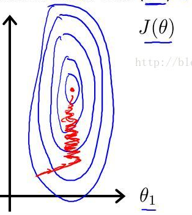
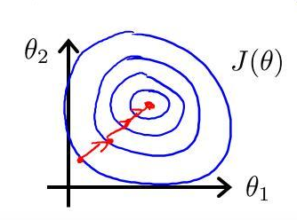

# 特征缩放
## 引子
在前一章节中，对房屋售价进行预测时，我们的特征仅有房屋面积一项，但是，在实际生活中，卧室数目也一定程度上影响了房屋售价。下面，我们有这样一组训练样本：

|房屋面积（英尺）|卧室数量（间）|售价（美元）|
|-------------|------------|---|
|2104|3|399900|
|1600|3|329900|
|2400|3|369000|
|1416|2|232000|
|3000|4|539900|
|1985|4|299900|
|....|...|....|

注意到，房屋面积及卧室数量两个特征在数值上差异巨大，如果直接将该样本送入训练，则代价函数的轮廓会是“扁长的”，在找到最优解前，梯度下降的过程不仅是曲折的，也是非常耗时的：

## 缩放
该问题的出现是因为我们没有同等程度的看待各个特征，即我们没有将各个特征量化到统一的区间。量化的方式有如下两种：

### Standardization
__Standardization__又称为__Z-score normalization__，量化后的特征将服从[标准正态分布](https://zh.wikipedia.org/zh-cn/%E6%AD%A3%E6%80%81%E5%88%86%E5%B8%83)：
$$

z = \frac{x_i-\mu}{\delta}

$$

其中，$$\mu$$，$$\delta$$分别为对应特征$$x_i$$的均值和标准差。量化后的特征将分布在$$[-1,1]$$区间。

### Min-Max Scaling
__Min-Max Scaling__又称为__normalization__，特征量化的公式为：
$$

z = \frac{x_i-min(x_i)}{max(x_i)-min(x_i)}

$$
量化后的特征将分布在$$[0,1]$$区间。

大多数机器学习算法中，会选择Standardization来进行特征缩放，但是，Min-Max Scaling也并非会被弃置一地。在数字图像处理中，像素强度通常就会被量化到$$[0,1]$$区间，在一般的神经网络算法中，也会要求特征被量化到$$[0,1]$$区间。

进行了特征缩放以后，代价函数的轮廓会是“偏圆”的，梯度下降过程更加笔直，性能因此也得到提升：

## 参考文献
- [About Feature Scaling and Normalization](http://sebastianraschka.com/Articles/2014_about_feature_scaling.html#numpy)