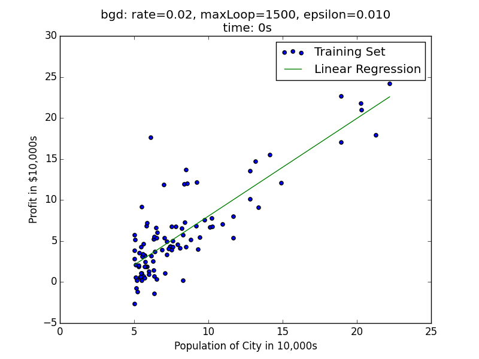
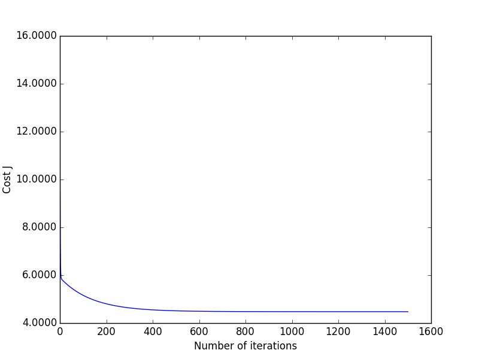
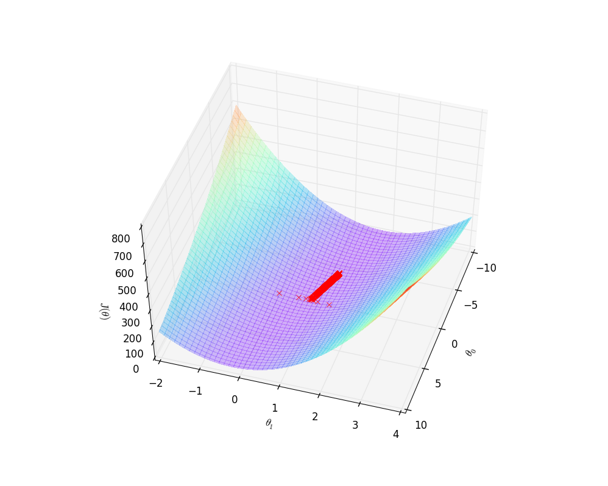
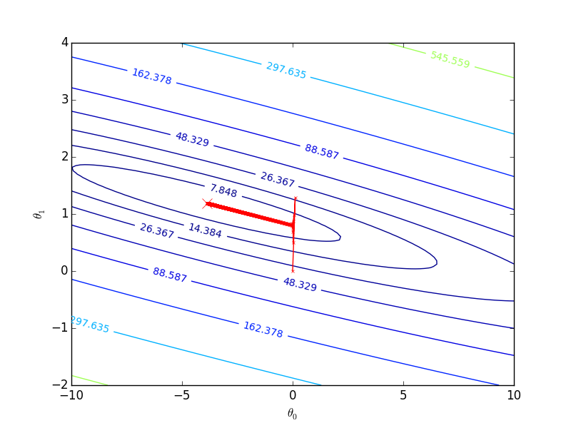
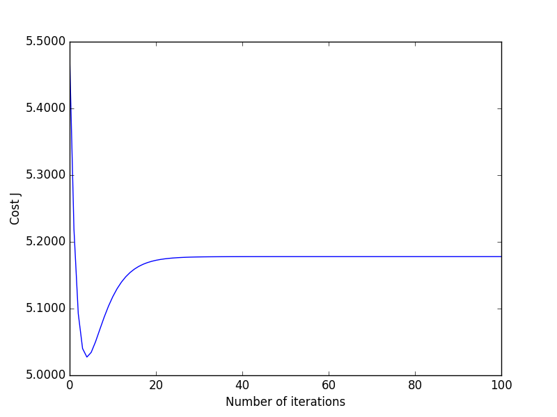
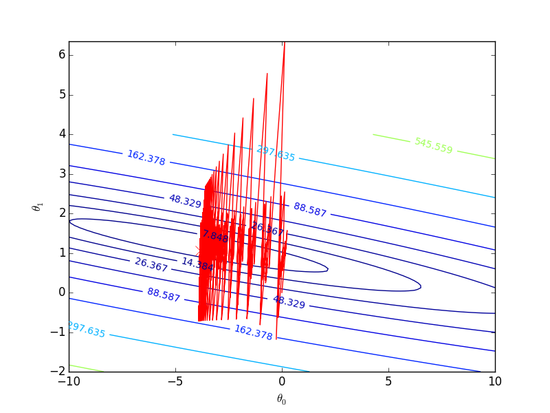

# 回归问题-程序示例
## 回归程序
下面我们将撰写程序，其中提供了__批量梯度下降__和__随机梯度下降__两种学习策略来求解回归方程：

```python
# linear_regression/regression.py
# coding: utf-8
import numpy as np
import matplotlib as plt
import time

def exeTime(func):
    """ 耗时计算装饰器
    """
    def newFunc(*args, **args2):
        t0 = time.time()
        back = func(*args, **args2)
        return back, time.time() - t0
    return newFunc

def loadDataSet(filename):
    """ 读取数据

    从文件中获取数据，在《机器学习实战中》，数据格式如下
    "feature1 TAB feature2 TAB feature3 TAB label"

    Args:
        filename: 文件名

    Returns:
        X: 训练样本集矩阵
        y: 标签集矩阵
    """
    numFeat = len(open(filename).readline().split('\t')) - 1
    X = []
    y = []
    file = open(filename)
    for line in file.readlines():
        lineArr = []
        curLine = line.strip().split('\t')
        for i in range(numFeat):
            lineArr.append(float(curLine[i]))
        X.append(lineArr)
        y.append(float(curLine[-1]))
    return np.mat(X), np.mat(y).T

def h(theta, x):
    """预测函数

    Args:
        theta: 相关系数矩阵
        x: 特征向量

    Returns:
        预测结果
    """
    return (theta.T*x)[0,0]

def J(theta, X, y):
    """代价函数

    Args:
        theta: 相关系数矩阵
        X: 样本集矩阵
        y: 标签集矩阵

    Returns:
        预测误差（代价）
    """
    m = len(X)
    return (X*theta-y).T*(X*theta-y)/(2*m)

@exeTime
def bgd(rate, maxLoop, epsilon, X, y):
    """批量梯度下降法

    Args:
        rate: 学习率
        maxLoop: 最大迭代次数
        epsilon: 收敛精度
        X: 样本矩阵
        y: 标签矩阵

    Returns:
        (theta, errors, thetas), timeConsumed
    """
    m,n = X.shape
    # 初始化theta
    theta = np.zeros((n,1))
    count = 0
    converged = False
    error = float('inf')
    errors = []
    thetas = {}
    for j in range(n):
        thetas[j] = [theta[j,0]]
    while count<=maxLoop:
        if(converged):
            break
        count = count + 1
        for j in range(n):
            deriv = (y-X*theta).T*X[:, j]/m
            theta[j,0] = theta[j,0]+rate*deriv
            thetas[j].append(theta[j,0])
        error = J(theta, X, y)
        errors.append(error[0,0])
        # 如果已经收敛
        if(error < epsilon):
            converged = True
    return theta,errors,thetas

@exeTime
def sgd(rate, maxLoop, epsilon, X, y):
    """随机梯度下降法
    Args:
        rate: 学习率
        maxLoop: 最大迭代次数
        epsilon: 收敛精度
        X: 样本矩阵
        y: 标签矩阵
    Returns:
        (theta, error, thetas), timeConsumed
    """
    m,n = X.shape
    # 初始化theta
    theta = np.zeros((n,1))
    count = 0
    converged = False
    error = float('inf')
    errors = []
    thetas = {}
    for j in range(n):
        thetas[j] = [theta[j,0]]
    while count <= maxLoop:
        if(converged):
            break
        count = count + 1
        errors.append(float('inf'))
        for i in range(m):
            if(converged):
                break
            diff = y[i,0]-h(theta, X[i].T)
            for j in range(n):
                theta[j,0] = theta[j,0] + rate*diff*X[i, j]
                thetas[j].append(theta[j,0])
            error = J(theta, X, y)
            errors[-1] = error[0,0]
            # 如果已经收敛
            if(error < epsilon):
                converged = True
    return theta, errors, thetas

```

> 代码结合注释应该能看懂，借助于Numpy，只是复现了课上的公式。

## 测试程序

### bgd测试程序
```python
# linear_regression/test/bgd.py
# coding: utf-8
import regression
from matplotlib import cm
from mpl_toolkits.mplot3d import axes3d
import matplotlib.pyplot as plt
import matplotlib.ticker as mtick
import numpy as np

if __name__ == "__main__":
    X, y = regression.loadDataSet('data/ex1.txt');

    m,n = X.shape
    X = np.concatenate((np.ones((m,1)), X), axis=1)

    rate = 0.01
    maxLoop = 1500
    epsilon =0.01

    result, timeConsumed = regression.bgd(rate, maxLoop, epsilon, X, y)

    theta, errors, thetas = result

    # 绘制拟合曲线
    fittingFig = plt.figure()
    title = 'bgd: rate=%.2f, maxLoop=%d, epsilon=%.3f \n time: %ds'%(rate,maxLoop,epsilon,timeConsumed)
    ax = fittingFig.add_subplot(111, title=title)
    trainingSet = ax.scatter(X[:, 1].flatten().A[0], y[:,0].flatten().A[0])

    xCopy = X.copy()
    xCopy.sort(0)
    yHat = xCopy*theta
    fittingLine, = ax.plot(xCopy[:,1], yHat, color='g')

    ax.set_xlabel('Population of City in 10,000s')
    ax.set_ylabel('Profit in $10,000s')

    plt.legend([trainingSet, fittingLine], ['Training Set', 'Linear Regression'])
    plt.show()

    # 绘制误差曲线
    errorsFig = plt.figure()
    ax = errorsFig.add_subplot(111)
    ax.yaxis.set_major_formatter(mtick.FormatStrFormatter('%.4f'))

    ax.plot(range(len(errors)), errors)
    ax.set_xlabel('Number of iterations')
    ax.set_ylabel('Cost J')

    plt.show()

    # 绘制能量下降曲面
    size = 100
    theta0Vals = np.linspace(-10,10, size)
    theta1Vals = np.linspace(-2, 4, size)
    JVals = np.zeros((size, size))
    for i in range(size):
        for j in range(size):
            col = np.matrix([[theta0Vals[i]], [theta1Vals[j]]])
            JVals[i,j] = regression.J(col, X, y)

    theta0Vals, theta1Vals = np.meshgrid(theta0Vals, theta1Vals)
    JVals = JVals.T
    contourSurf = plt.figure()
    ax = contourSurf.gca(projection='3d')

    ax.plot_surface(theta0Vals, theta1Vals, JVals,  rstride=2, cstride=2, alpha=0.3,
                cmap=cm.rainbow, linewidth=0, antialiased=False)
    ax.plot(thetas[0], thetas[1], 'rx')
    ax.set_xlabel(r'$\theta_0$')
    ax.set_ylabel(r'$\theta_1$')
    ax.set_zlabel(r'$J(\theta)$')

    plt.show()

    # 绘制能量轮廓
    contourFig = plt.figure()
    ax = contourFig.add_subplot(111)
    ax.set_xlabel(r'$\theta_0$')
    ax.set_ylabel(r'$\theta_1$')

    CS = ax.contour(theta0Vals, theta1Vals, JVals, np.logspace(-2,3,20))
    plt.clabel(CS, inline=1, fontsize=10)

    # 绘制最优解
    ax.plot(theta[0,0], theta[1,0], 'rx', markersize=10, linewidth=2)

    # 绘制梯度下降过程
    ax.plot(thetas[0], thetas[1], 'rx', markersize=3, linewidth=1)
    ax.plot(thetas[0], thetas[1], 'r-')

    plt.show()

```

__拟合状况__：


可以看到，bgd运行的并不慢，这是因为在regression程序中，我们采用了__向量形式__计算$$\theta$$，计算机会通过__并行计算__的手段来优化速度。

__误差随迭代次数的关系__：

__误差函数的下降曲面__：


__梯度下架过程__：


### sgd测试
```python
# coding: utf-8
import regression
from matplotlib import cm
from mpl_toolkits.mplot3d import axes3d
import matplotlib.pyplot as plt
import matplotlib.ticker as mtick
import numpy as np

if __name__ == "__main__":
    X, y = regression.loadDataSet('data/ex1.txt');

    m,n = X.shape
    X = np.concatenate((np.ones((m,1)), X), axis=1)

    rate = 0.01
    maxLoop = 100
    epsilon =0.01

    result, timeConsumed = regression.sgd(rate, maxLoop, epsilon, X, y)

    theta, errors, thetas = result

    # 绘制拟合曲线
    fittingFig = plt.figure()
    title = 'sgd: rate=%.2f, maxLoop=%d, epsilon=%.3f \n time: %ds'%(rate,maxLoop,epsilon,timeConsumed)
    ax = fittingFig.add_subplot(111, title=title)
    trainingSet = ax.scatter(X[:, 1].flatten().A[0], y[:,0].flatten().A[0])

    xCopy = X.copy()
    xCopy.sort(0)
    yHat = xCopy*theta
    fittingLine, = ax.plot(xCopy[:,1], yHat, color='g')

    ax.set_xlabel('Population of City in 10,000s')
    ax.set_ylabel('Profit in $10,000s')

    plt.legend([trainingSet, fittingLine], ['Training Set', 'Linear Regression'])
    plt.show()

    # 绘制误差曲线
    errorsFig = plt.figure()
    ax = errorsFig.add_subplot(111)
    ax.yaxis.set_major_formatter(mtick.FormatStrFormatter('%.4f'))

    ax.plot(range(len(errors)), errors)
    ax.set_xlabel('Number of iterations')
    ax.set_ylabel('Cost J')

    plt.show()

    # 绘制能量下降曲面
    size = 100
    theta0Vals = np.linspace(-10,10, size)
    theta1Vals = np.linspace(-2, 4, size)
    JVals = np.zeros((size, size))
    for i in range(size):
        for j in range(size):
            col = np.matrix([[theta0Vals[i]], [theta1Vals[j]]])
            JVals[i,j] = regression.J(col, X, y)

    theta0Vals, theta1Vals = np.meshgrid(theta0Vals, theta1Vals)
    JVals = JVals.T
    contourSurf = plt.figure()
    ax = contourSurf.gca(projection='3d')

    ax.plot_surface(theta0Vals, theta1Vals, JVals,  rstride=8, cstride=8, alpha=0.3,
                cmap=cm.rainbow, linewidth=0, antialiased=False)
    ax.plot(thetas[0], thetas[1], 'rx')
    ax.set_xlabel(r'$\theta_0$')
    ax.set_ylabel(r'$\theta_1$')
    ax.set_zlabel(r'$J(\theta)$')

    plt.show()

    # 绘制能量轮廓
    contourFig = plt.figure()
    ax = contourFig.add_subplot(111)
    ax.set_xlabel(r'$\theta_0$')
    ax.set_ylabel(r'$\theta_1$')

    CS = ax.contour(theta0Vals, theta1Vals, JVals, np.logspace(-2,3,20))
    plt.clabel(CS, inline=1, fontsize=10)

    # 绘制最优解
    ax.plot(theta[0,0], theta[1,0], 'rx', markersize=10, linewidth=2)

    # 绘制梯度下降过程
    ax.plot(thetas[0], thetas[1], 'r', linewidth=1)

    plt.show()

```

__拟合状况__：


__误差随迭代次数的关系__：


__梯度下降过程__：


在学习率为$$0.01$$时，随机梯度下降法出现了非常明显的抖动，同时，随机梯度下降法的速度优势也并未在此得到体现，一是样本容量不大，二是其自身很难通过并行计算去优化速度。
