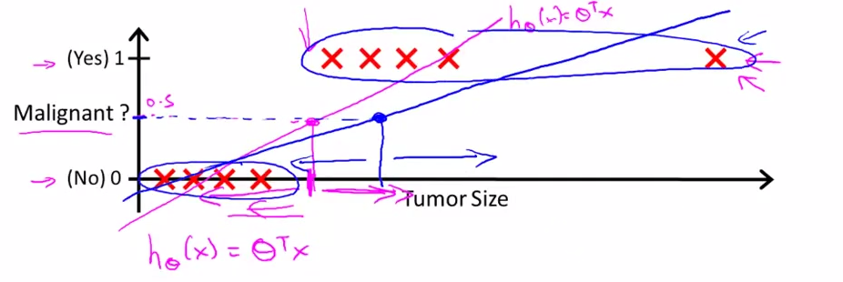

0/1 分类问题
============

利用线性回归中的预测函数 $$h_\theta (x)$$，我们定义阈值函数来完成 0/1 分类：

$$

h_\theta (x) \gt 0.5 => y=1 \\
h_\theta (x) \leq 0.5 => y=0

$$

下面两幅图展示了线性预测。在第一幅图中，拟合曲线成功的区分了 0、1 两类，在第二幅图中，如果我们新增了一个输入（右上的 **X** 所示），此时拟合曲线发生变化，由第一幅图中的**紫色线**旋转到第二幅图的**蓝色线**，导致本应被视作 1 类的 X 被误分为了 0 类：

</img>

</img>

