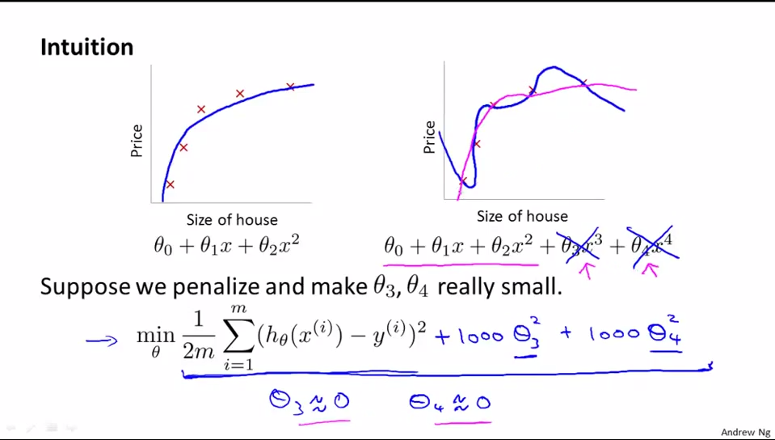

利用正规化解决过拟合问题
=================

在之前的文章中，我们认识了**过拟合**问题,通常，我们有如下策略来解决过拟合问题：

1. 减少特征数，显然这只是权宜之计，因为特征意味着信息，放弃特征也就等同于丢弃信息，恩，舍不得，要知道，特征的获取往往也是艰苦卓绝的。

2. 不放弃特征，而是拉伸曲线使之更加平滑以解决过拟合问题，为了拉伸曲线，也就要弱化一些高阶项（曲线曲折的罪魁祸首），由于高阶项中的特征无法更改，因此特征是无法弱化的，我们能弱化的只有高阶项中的系数 $$\theta_i$$，并且，我们把这种弱化称之为是对参数 $$\theta$$ 的惩罚（penalize）。**Regularization（正规化）**正是完成这样一种惩罚的“侩子手”，如下例所示，我们将 $$\theta_3$$ 及 $$\theta_4$$ 减小到趋近于 0，原本过拟合的曲线就变得更加平滑，趋近于一条二次曲线（在本例中，二次曲线显然更能反映住房面积和房价的关系），也就能够更好的根据住房面积来预测房价（要知道，预测才是我们的最终目的，而非拟合）。

</img>

线性回归中的正规化
---------------

在线性回归中，我们的预测代价如下评估：

$$

J(\theta)=\frac{1}{2m}\sum\limits_{i=1}^m(h_\theta(x^{(i)})-y^{(i)})^2

$$

为了在最小化 $$J(\theta)$$ 的过程中，也能尽可能使 $$\theta$$ 变小，我们将上式更改为:

$$

\begin{align*}
J(\theta) &= \frac{1}{2m}\sum\limits_{i=1}^m(h_\theta(x^{(i)})-y^{(i)})^2+\lambda\sum\limits_{i=1}^{n}\theta_j^2 \\
&= \frac{1}{2m}(X\theta-y)^T(X\theta-y)+\lambda\sum\limits_{i=1}^{n}\theta_j^2
\end{align*}

$$

其中，参数 $$\lambda$$ 主要是完成以下两个任务:

1. 保证对数据的拟合良好
2. 保证 $$\theta$$ 足够小，避免过拟合问题。

>$$\lambda$$ 越大，要使 $$J(\theta)$$ 变小，惩罚力度就要变大，这样 $$\theta$$ 会被惩罚得越惨（越小），即要避免过拟合，我们显然应当增大 $$\lambda$$ 的值。

那么，梯度下降也发生相应变化：

Repeat{

$$

\begin{align*}
\theta_0 &=\theta_0-\alpha\frac{1}{m}\sum\limits_{i=1}^{m}[h_\theta(x^{(i)})-y^{(i)}]x_0^{(i)} \\

\theta_j &=\theta_j-\alpha[\frac{1}{m}\sum\limits_{i=1}^{m}[h_\theta(x^{(i)})-y^{(i)}]x_j^{(i)}+\frac{\lambda}{m}\theta_j] \quad (1) \\

\theta &= \theta-\alpha*(\frac{1}{m} X^T(y-X\theta) + \frac{\lambda}{m}\theta_{j}) \quad j \neq 0

\end{align*}

$$

}

其中，**（1）**式等价于：

$$

\theta_j=\theta_j(1-\alpha\frac{\lambda}{m})-\alpha\frac{1}{m}\sum\limits_{i=1}^{m}[h_\theta(x^{(i)})-y^{(i)}]x_j^{(i)}

$$

由于 $$1-\alpha\frac{\lambda}{m}\lt1$$，故而梯度下降中每次更新 $$\theta$$，同时也会去减小 $$\theta$$ 值，达到了 Regularization 的目的。

在Normal Equation中，使 $$J(\theta)$$ 最小化的 $$\theta$$值为：

$$

\theta=(X^TX+\lambda\left[\begin{array}{ccccc}0 &\cdots &\cdots &\cdots &0 \\ 0 &1 &\cdots &\cdots &0\\ \vdots & \vdots & 1 &\cdots & 0\\ \vdots &\vdots &\cdots &\ddots & \vdots \\ 0 & 0 &\cdots &\cdots &1 \end{array}\right])^{-1}X^Ty

$$

逻辑回归中的正规化
----------------

代价评估如下：

$$

\begin{align*}
J(\theta) &=\frac{1}{m}\sum\limits_{i=1}^{m}y^{(i)}logh_0(x^{(i)})+(1-y^{(i)})log(1-h_\theta(x^{(i)}))+\frac{\lambda}{2m}\sum\limits_{j=1}^{n}\theta_j^2 \\
&=  \frac{1}{m}\big((\,log\,(g(X\theta))^Ty+(\,log\,(1-g(X\theta))^T(1-y)\big) + \frac{\lambda}{2m}\sum_{j=1}^{n}\theta_{j}^{2}

\end{align*}

$$

梯度下降如下:

Repeat{
$$

\begin{align*}
\theta_0 &=\theta_0-\alpha\frac{1}{m}\sum\limits_{i=1}^{m}[h_\theta(x^{(i)})-y^{(i)}]x_0^{(i)} \\

\theta_j &=\theta_j-\alpha[\frac{1}{m}\sum\limits_{i=1}^{m}[h_\theta(x^{(i)})-y^{(i)}]x_j^{(i)}+\frac{\lambda}{m}\theta_j] \\

\theta &= \theta - \alpha*(\frac{1}{m} X^T(y-g(X\theta)) + \frac{\lambda}{m}\theta_{j}) \quad j \neq 0
\end{align*}

$$

}

> 注意，逻辑回归和线性回归预测函数 $$h_\theta(x)$$ 二者是不同的。
