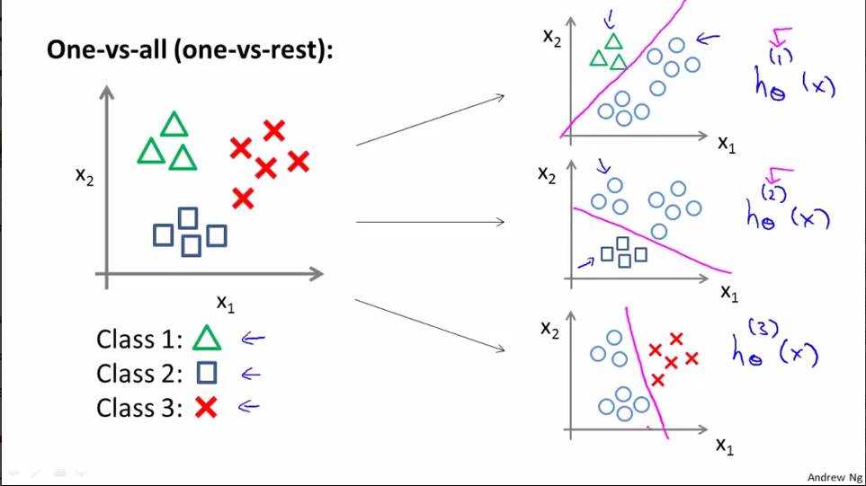

多分类问题
============

通常采用**One-vs-All**，或者说是**One-vs-the Rest**方法来实现多分类，其将**多分类问题**转化为了**多次二分类**问题，具体过程如下：

1. 轮流选中某一类型$$i$$，将其视为正类型（positive class），即“1”分类，其余剩下样本都看做是负类型（negative class），即“0”分类。

2. 获得$$i$$类型的逻辑回归分类器$$h_\theta^{(i)}(x)$$,即我们的每一步都确定了一个新的类型（获得了该类型与其他类型的决策边界）。

假定输入向量$$x$$。则分别计算$$h_\theta^{(i)}(x)$$,因为我们每个$$i$$类型都是视作正类型，即$$ h_\theta^{(i)}(x)$$越趋近于1，$$x$$越接近是第$$i$$类：

