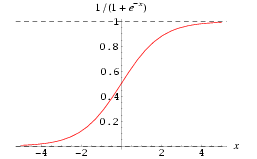
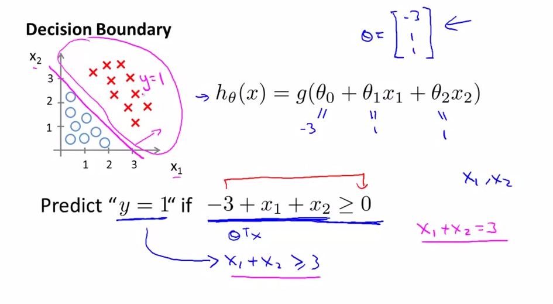
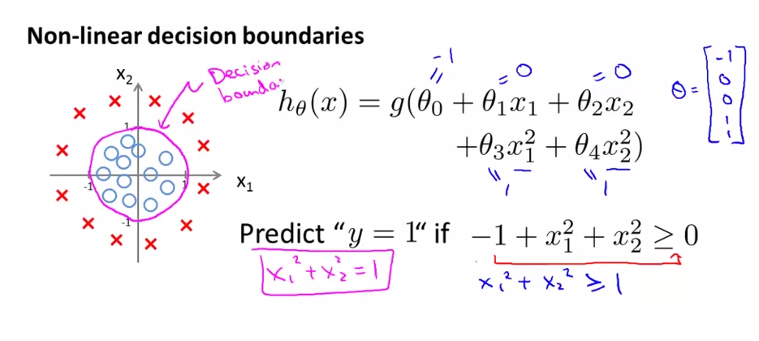
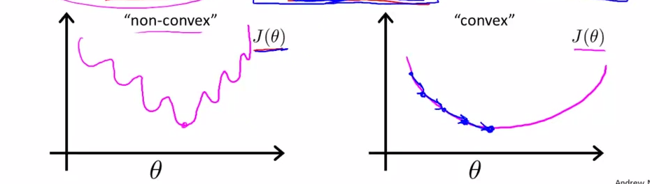
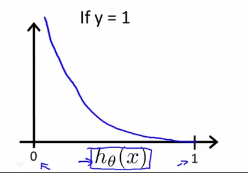
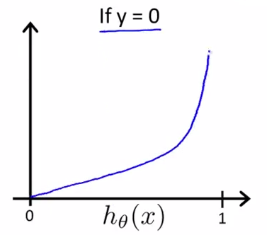

逻辑回归
============

上一节我们知道，使用线性回归来处理 0/1 分类问题总是困难重重的，因此，人们定义了逻辑回归来完成 0/1 分类问题，逻辑一词也代表了**是（1）**和**非（0）**。

Sigmoid预测函数
-------------

在逻辑回归中，定义预测函数为：

$$

h_\theta (x) = g(z)

$$

其中，$$z=\theta^Tx$$ 是**分类边界**，且 $$g(z)=\frac{1}{1+e^{-z}}$$。

$$g(z)$$ 称之为 Sigmoid Function，亦称 Logic Function，其函数图像如下：

</img>

可以看到，预测函数 $$h_\theta(x)$$ 被很好地限制在了 0、1 之间，并且，sigmoid 是一个非常好的阈值函数：阈值为 $$0.5$$，大于 $$0.5$$ 为 1 类，反之为 0 类。函数曲线过渡光滑自然，关于 $$0.5$$ 中心对称也极具美感。

决策边界
-------------

决策边界，顾名思义，就是用来**划清界限**的边界，边界的形态可以不定，可以是点，可以是线，也可以是平面。Andrew Ng 在公开课中强调：**“决策边界是预测函数 $$h_\theta(x)$$ 的属性，而不是训练集属性”**，这是因为能作出“划清”类间界限的只有 $$h_\theta(x)$$，而训练集只是用来训练和调节参数的。

- **线性决策边界**：

$$

h_\theta(x) = g(\theta_0x_0+\theta_1x_1+\theta_2x_2)

$$

</img>

- **非线性决策边界**：

$$

h_\theta(x) = g(\theta_0x_0+\theta_1x_1+\theta_2x_2+\theta_3x_1^2+\theta_4x_2^2)

$$

</img>

预测代价函数
-------------

对于分类任务来说，我们就是要反复调节参数 $$\theta$$，亦即反复转动决策边界来作出更精确的预测。假定我们有代价函数 $$J(\theta)$$，其用来评估某个 $$\theta$$ 值时的预测精度，当找到代价函数的最小值时，就能作出最准确的预测。通常，代价函数具备越少的极小值，就越容易找到其最小值，也就越容易达到最准确的预测。

下面两幅图中，左图这样犬牙差互的代价曲线（非凸函数）显然会使我们在做梯度下降的时候陷入迷茫，任何一个极小值都有可能被错认为最小值，但无法获得最优预测精度。但在右图的代价曲线中，就像滑梯一样，我们就很容易达到最小值：

</img>

逻辑回归定义的代价函数为：

$$

J(\theta)=\frac{1}{m}\sum\limits_{i=1}^mCost(h_\theta(x^{(i)}),y^{(i)})

$$

为保证代价函数呈凸形曲线，则定义 $$Cost(h_\theta(x^{(i)}),y^{(i)})$$：

$$

Cost(h_\theta(x),y)=
\begin{cases}
-log(h_\theta(x)),&\mbox{if $y=1$}\\
-log(1-h_\theta(x)),&\mbox{if $y=0$}
\end{cases}

$$

该函数等价于：

$$

\begin{align*}
Cost(h_\theta(x),y) &=-ylog(h_\theta(x))-(1-y)log(1-h_\theta(x)) \\
&= (\,log\,(g(X\theta))^Ty+(\,log\,(1-g(X\theta))^T(1-y)
\end{align*}

$$

代价函数随预测值 $$h_\theta(x)$$ 的变化如下：

</img>
</img>

可以看到，当 $$h_\theta(x) \approx y$$ 时，$$cost \approx 0$$，预测正确。

最小化代价函数
-------------

与线性回归一样，也使用梯度下降法来最小化代价函数：

- **批量梯度下降法**

$$

\begin{align*}
&\mbox{重复直到收敛（Repeat until convergence）：} \\
& \quad \mbox{for $i=1$ to  m}: \\
& \quad \quad \mbox{for $j=1$ to  n}: \\
& \quad \quad \quad \theta_j = \theta_j+\frac{1}{m}\sum_{i=1}^m(y_i-h_\theta(x^{(i)}))x_j^{(i)}
\end{align*}

$$

通过矩阵型表示

$$

\begin{align*}
&\mbox{重复直到收敛（Repeat until convergence）:} \\
& \quad \theta = \theta+\alpha*\frac{1}{m} X^T(y-g(X\theta))
\end{align*}

$$

- **随机梯度下降法**

$$

\begin{align*}
&\mbox{重复直到收敛（Repeat until convergence）:} \\
& \quad \mbox{for $i=1$ to m}: \\
& \quad \quad \theta = \theta+\alpha*(y_i-h_\theta(x^{(i)}))x_j^{(i)}
\end{align*}

$$
