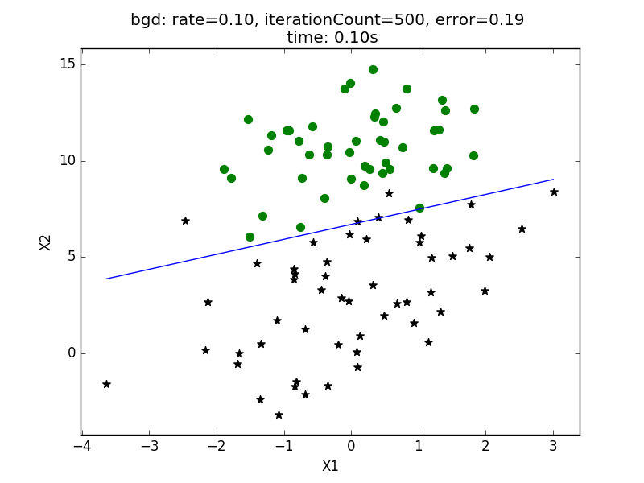
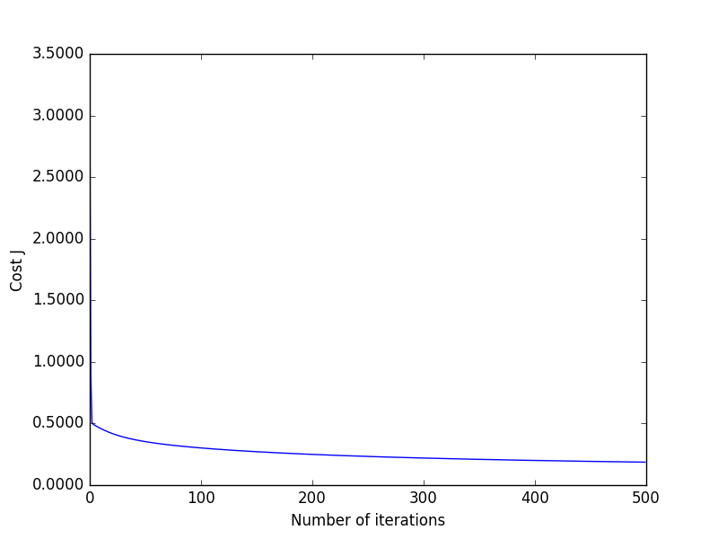
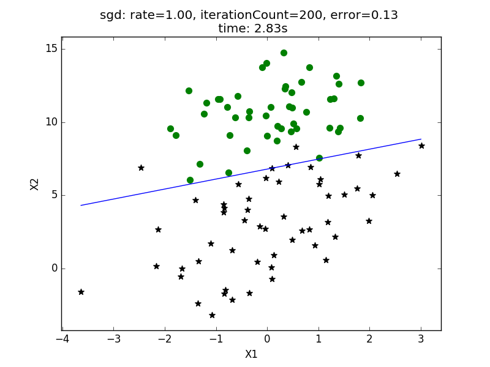
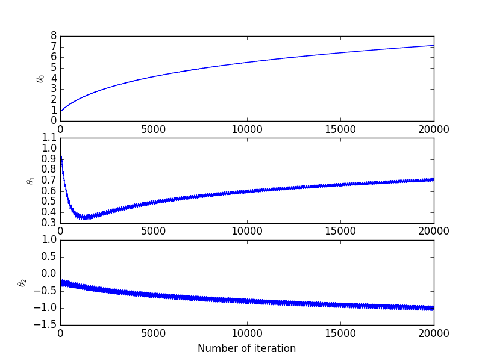

程序示例--线性决策边界
============

回归模块
--------

在逻辑回归模块 `logical_regression.py` 中，实现了批量梯度下降法（bgd）以及随机梯度下降法（sgd），同时，支持正规化方程

```python
# coding: utf-8
# logical_regression/logical_regression.py
import numpy as np
import matplotlib as plt
import time

def exeTime(func):
    """耗时计算装饰器

    Args:
        func 待装饰函数
    Returns:
        newFunc 装饰后的函数
    """
    def newFunc(*args, **args2):
        t0 = time.time()
        back = func(*args, **args2)
        return back, time.time() - t0
    return newFunc

def loadDataSet(filename):
    """读取数据集
    数据以TAB进行分割

    Args:
        filename 文件名
    Returns:
        X 训练样本集矩阵
        y 标签集矩阵
    """
    numFeat = len(open(filename).readline().split('\t')) - 1
    X = []
    y = []
    file = open(filename)
    for line in file.readlines():
        lineArr = []
        curLine = line.strip().split('\t')
        for i in range(numFeat):
            lineArr.append(float(curLine[i]))
        X.append([1.0, float(lineArr[0]), float(lineArr[1])])
        y.append(float(curLine[-1]))
    return np.mat(X), np.mat(y).T

def sigmoid(z):
    """sigmoid函数
    """
    return 1.0/(1.0+np.exp(-z))

def J(theta, X, y, theLambda=0):
    """预测代价函数
    """
    m, n = X.shape
    h = sigmoid(X.dot(theta))
    J = (-1.0/m)*(np.log(h).T.dot(y)+np.log(1-h).T.dot(1-y)) + (theLambda/(2.0*m))*np.sum(np.square(theta[1:]))
    if np.isnan(J[0]):
        return(np.inf)
    return J.flatten()[0,0]

@exeTime
def gradient(X, y, options):
    """随机梯度下降法
    Args:
        X 样本矩阵
        y 标签矩阵
        rate 学习率
        options.theLambda 正规参数
        options.maxLoop 最大迭代次数
        options.epsilon 收敛精度
        options.method
            - 'sgd' 随机梯度下降法
            - 'bgd' 批量梯度下降法
    Returns:
        (thetas, errors), timeConsumed
    """
    m,n = X.shape
    # 初始化参数矩阵
    theta = np.ones((n,1))
    count = 0 # 迭代次数
    # 初始化误差无限大
    error = float('inf')
    # 保存误差变化状况
    errors = []
    # 保存参数的变化状况
    thetas = []
    rate = options.get('rate', 0.01)
    epsilon = options.get('epsilon', 0.1)
    maxLoop = options.get('maxLoop', 1000)
    theLambda = options.get('theLambda', 0)
    method = options['method']
    def _sgd(theta):
        converged = False
        for i in range(maxLoop):
            if converged:
                break
            for j in range(m):
                h = sigmoid(X[j] *theta)
                diff = h - y[j]
                theta = theta - rate*(1.0/m)*X[j].T*diff
                error = J(theta, X, y)
                errors.append(error)
                if error < epsilon:
                    converged = True
                    break
                thetas.append(theta)
        return thetas, errors, i+1
    def _bgd(theta):
        for i in range(maxLoop):
            h = sigmoid(X.dot(theta))
            diff = h - y
            # theta0 should not be regularized
            theta = theta - rate*((1.0/m)*X.T*diff + (theLambda/m)*np.r_[[[0]], theta[1:]])
            error = J(theta, X, y, theLambda)
            errors.append(error)
            if error < epsilon:
                break
            thetas.append(theta)
        return thetas, errors, i+1
    methods = {
        'sgd': _sgd,
        'bgd': _bgd
    }
    return methods[method](theta)
```

测试
---------------

```python
# coding: utf-8
# logical_regression/test_linear_boundry.py
import numpy as np
import logical_regression as regression
import matplotlib.pyplot as plt
import matplotlib.ticker as mtick


if __name__ == "__main__":
    X, y = regression.loadDataSet('data/linear.txt')
    m, n = X.shape
    options = [{
        'rate': 0.1,
        'epsilon': 0.01,
        'maxLoop': 500,
        'method': 'bgd'
    },{
        'rate': 1,
        'epsilon': 0.01,
        'maxLoop': 200,
        'method': 'sgd'
    }]
    for option in options:
        result, timeConsumed = regression.gradient(X, y, option)
        thetas, errors, iterationCount = result
        theta = thetas[-1]
        print theta, errors[-1], iterationCount
        # 绘制数据点
        fittingFig = plt.figure()
        title = '%s: rate=%.2f, iterationCount=%d, error=%.2f \n time: %.2fs' % (
            option['method'], option['rate'], iterationCount, errors[-1], timeConsumed)
        ax = fittingFig.add_subplot(111, title=title)
        ax.set_xlabel('X1')
        ax.set_ylabel('X2')
        for i in range(m):
            x = X[i].A[0]
            if y[i] == 1:
                ax.scatter(x[1], x[2], marker='*', color='black', s=50)
            else:
                ax.scatter(x[1], x[2], marker='o', color='green', s=50)
        # 绘制决策边界
        x1Min = X[:, 1].min()
        x1Max = X[:, 1].max()
        x2Min = X[:, 2].min()
        x2Max = X[:, 2].max()
        xx1, xx2 = np.meshgrid(np.linspace(x1Min, x1Max),
                                   np.linspace(x2Min, x2Max))
        h = regression.sigmoid(np.c_[np.ones((xx1.ravel().shape[0],1)), xx1.ravel(), xx2.ravel()].dot(theta))
        h = h.reshape(xx1.shape)
        plt.contour(xx1, xx2, h, [0.5], colors='b', linewidth=.5)
        plt.show()

        # 绘制误差曲线
        errorsFig = plt.figure()
        ax = errorsFig.add_subplot(111)
        ax.yaxis.set_major_formatter(mtick.FormatStrFormatter('%.4f'))

        ax.plot(range(len(errors)), errors)
        ax.set_xlabel('Number of iterations')
        ax.set_ylabel('Cost J')
        plt.show()

        # 绘制theta的变化情况
        thetasFig, ax = plt.subplots(len(thetas[0]))
        thetas = np.asarray(thetas)
        for idx, sp in enumerate(ax):
            thetaList = thetas[:, idx]
            sp.plot(range(len(thetaList)), thetaList)
            sp.set_xlabel('Number of iteration')
            sp.set_ylabel(r'$\theta_%d$'%idx)
        plt.show()
```

批量梯度下降法获得的决策边界如下，测试中，迭代次数为 **500** 次，学习率为 **0.1**：

<div style="text-align: center">
</img>
</div>

批量梯度下降法中，代价函数随迭代次数变化状况如下：

<div style="text-align: center">
</img>
</div>

随机梯度下降法获得决策边界如下，测试中，迭代次数为 **200** 次，学习率为 **1** ：

<div style="text-align: center">
</img>
</div>

随机梯度下降法中，参数 $$\theta$$ 的变化情况如下图所示：

<div style="text-align: center">
</img>
</div>
