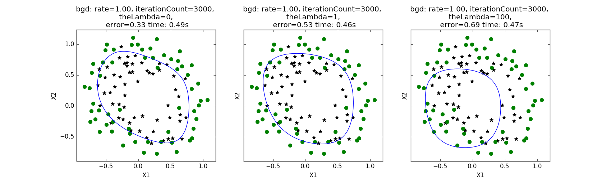

程序示例--非线性决策边界
======================

我们首先对数据进行了多项式拟合，再分别使用$$\lambda=0,\lambda=1,\lambda=100$$的批量梯度下降法（sgd）完成了训练，获得了非线性决策边界：

```python
# coding: utf-8
# logical_regression/test_non_linear_boundry.py
import numpy as np
import logical_regression as regression
import matplotlib.pyplot as plt
import matplotlib.ticker as mtick
from sklearn.preprocessing import PolynomialFeatures

if __name__ == "__main__":
    X, y = regression.loadDataSet('data/non_linear.txt')
    poly = PolynomialFeatures(6)
    XX = poly.fit_transform(X[:,1:3])
    m, n = XX.shape
    options = [{
        'rate': 1,
        'epsilon': 0.01,
        'theLambda': theLambda,
        'maxLoop': 3000,
        'method': 'bgd'
    } for theLambda in [0, 1.0, 100.0]]
    figures, axes = plt.subplots(1,3, sharey = True, figsize=(17,5))
    for idx, option in enumerate(options):
        result, timeConsumed = regression.gradient(XX, y, option)
        thetas, errors, iterationCount = result
        theta = thetas[-1]
        print theta, errors[-1], iterationCount
        ax = axes[idx]
        # 绘制数据点
        title = '%s: rate=%.2f, iterationCount=%d, \n theLambda=%d, \n error=%.2f time: %.2fs' % (
            option['method'], option['rate'], iterationCount, option['theLambda'], errors[-1], timeConsumed)
        ax.set_title(title)
        ax.set_xlabel('X1')
        ax.set_ylabel('X2')
        for i in range(m):
            x = X[i].A[0]
            if y[i] == 1:
                ax.scatter(x[1], x[2], marker='*', color='black', s=50)
            else:
                ax.scatter(x[1], x[2], marker='o', color='green', s=50)
        # 绘制决策边界
        x1Min = X[:, 1].min()
        x1Max = X[:, 1].max()
        x2Min = X[:, 2].min()
        x2Max = X[:, 2].max()
        xx1, xx2 = np.meshgrid(np.linspace(x1Min, x1Max),
                                   np.linspace(x2Min, x2Max))
        h = regression.sigmoid(poly.fit_transform(np.c_[xx1.ravel(), xx2.ravel()]).dot(theta))
        h = h.reshape(xx1.shape)
        ax.contour(xx1, xx2, h, [0.5], colors='b', linewidth=.5)
    plt.show()
```

程序运行结果如下：


